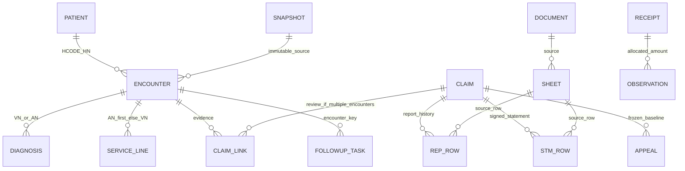

# Data Dictionary — HIS → REP → STM

โรงพยาบาล 10929 · รุ่น 0.1.0 · จัดทำ 1 ตุลาคม 2569 (FY2570)

## ขอบเขตและหลักฐาน

- metadata HOSxP: JSON ที่ผู้ใช้ให้มา 6,109 ตาราง ไม่มี foreign key ที่ยืนยันใน metadata
- Dictionary ต้นทางครอบคลุมเฉพาะ 24 datasets ที่ query registry อ่านในรุ่นแรก ไม่เปิดอ่านตาราง staff, รหัสผ่าน หรือ payload ส่งเบิกทั้งหมด
- schema REP–STM, HIS และ follow-up ตรวจจาก `information_schema` ของฐาน PostgreSQL จริง
- source PK ยืนยันตาม metadata; uniqueness, cardinality, ค่า cost, codebook และเหตุการณ์ส่งจริงใน HIS ยังรอ Session และการตรวจข้อมูลจริงภายในโรงพยาบาล
- หน้าสาธิตใช้ IDs ขึ้นต้น DEMO และไม่เชื่อมฐานข้อมูลจริง

## หน่วยวิเคราะห์และคีย์

| ระดับ | ตัวตั้ง / business key | กติกา |
|---|---|---|
| คนในทะเบียน | patient.hos_guid (PK), HCODE + HN (business key) | เก็บ registry count แยกจากผู้มารับบริการ ตรวจ HN ซ้ำ |
| คนที่มาบริการในช่วง | DISTINCT HN จาก encounter | ไม่ใช้จำนวนทะเบียนทั้งฐานแทนผู้มารับบริการ |
| OPD | ovst.hos_guid; HCODE + VN | VN ว่าง/ซ้ำพักตรวจ; visit ที่เชื่อม AN แสดงแยก |
| IPD | ipt.an; HCODE + AN | ผู้ป่วยยังนอนอยู่มี service_date NULL และแสดงแยกจากจำหน่าย |
| โรค | ovstdiag VN / iptdiag AN | หลายแถวต่อ encounter ไม่ใช้เป็นตัวตั้ง visit/admission |
| บุคคลประกอบ identity | person.person_id; patient_hn + cid | ไม่รวมบุคคลจาก CID อย่างเดียวเมื่อข้อมูลขัดกัน |
| รายการรักษา | opitemrece.hos_guid | มี AN ให้เชื่อม IPD ก่อน; ไม่มี AN ใช้ VN; ไม่มีคู่เก็บเป็น issue |
| เคลม | HCODE + IP/OP + payer_family + TRAN_ID | หนึ่ง encounter มีหลายองค์ประกอบเคลมได้ |
| ฉบับเอกสาร | logical_key + content fingerprint | ประวัติทั้งหมดอยู่; ฉบับล่าสุดที่ไม่ขัดแย้งใช้ในรายงาน |
| รายการ REP/STM | sheet_id + source_row | ลำดับชีต 0-based; Excel row 1-based; unique ป้องกันส่งซ้ำ |

## ความสัมพันธ์: metadata, proposed, verified

PK จาก JSON คือ metadata evidence เท่านั้น ทุก join ด้าน HIS เป็น **ความสัมพันธ์ที่เสนอจาก schema/reference SQL** และต้องตรวจด้วย profile ก่อนรับรอง KPI. FK ที่ระบุในตาราง PostgreSQL เป็นข้อบังคับจริงของระบบปลายทาง และไม่ได้รับรอง FK ใน HIS.

## การแปลงและความหมายกลาง

IDs เป็น text ตั้งแต่ HIS SELECT และ parser; JSON numeric identity ที่เสี่ยงทำศูนย์หายเป็น issue. Money ใช้ Decimal → numeric → API decimal string; UI ปัดสองทศนิยมเฉพาะแสดงผล. ไม่กำหนดยอดเป็นบวก: adjustment ติดลบต้องรวมตามเครื่องหมาย. NULL คือไม่มี/ไม่ทราบ, ศูนย์คือทราบว่าเป็นศูนย์; ตัวหารศูนย์หรือ unknown ให้ `—`.

HIS วันบริการเป็น date ค.ศ.; เวลาที่ไม่มี zone ใช้ Asia/Bangkok ก่อนเก็บ timestamptz. Excel วันที่ พ.ศ./ค.ศ. และ serial แปลงตาม cell type ด้วย parser เดิม. OPD ปีงบประมาณจากวันบริการ IPD จากวันจำหน่าย; ยังนอนหรือวันที่ขาดแสดง “ยังจัดปีไม่ได้”. วัน capture/report ไม่แทนเวลาส่งจริง.

`opitemrece.income` เป็น **รหัสหมวด char(2)**; `an_stat.income`/`vn_stat.income` เป็นยอดสรุป. `cost` ไม่คูณ qty จนกว่าจะมี `ITEM_COST_SEMANTICS=unit|line` พร้อมหลักฐาน review. unitcost ปัจจุบัน × qty เป็น estimated เท่านั้น. paid_money/uc_money/remain_money ไม่ใช่เงินโอน สปสช. โดยอัตโนมัติ.

## การเงินที่ต้องแยก

| ฟิลด์ | ที่มา / สูตร | ข้อจำกัด |
|---|---|---|
| his_charge_amount | SUM lines เมื่อ dataset ครบและยอดแต่ละรายการไม่ขาด; มิฉะนั้นใช้สรุป HIS ที่ระบุ basis | ไม่ใช่ต้นทุน |
| submitted_amount | หลักฐาน reviewed ของรอบล่าสุดต่อ component_key | รอหลักฐานส่งจริง; timestamp เท่ากันหลายรอบเป็น unknown |
| rule_expected_amount | กฎ applicability_verified + source/ฉบับ/ช่วงใช้/ผู้ตรวจ | ยังไม่ติดตั้งอัตราปัจจุบันโดยเดา |
| rep_expected_amount | REP ล่าสุดที่ไม่ tie และยอมรับ | ฐานต้องตรง mapping |
| rep_nhso_amount | ส่วน สปสช. | เทียบ STM บนส่วนผู้จ่ายเดียวกัน |
| stm_net_amount | SUM signed current STM ต่อเคลมก่อนรวม encounter | มี ambiguity ให้ NULL ไม่เอาคู่ที่เดาเข้ายอด |
| cash_received_amount | reviewed CASH_RECEIPT จัดสรรไม่เกิน total receipt | ไม่ใช้ STM เป็นหลักฐานโอน |
| observed_item_cost | raw cost หรือ raw cost×qty ตามนิยามที่ตรวจ | รายงานพร้อม count และ coverage |
| estimated_item_cost | current master unitcost×qty | ไม่ถือเป็น actual ย้อนหลัง |
| cost_coverage_rate | COUNT observed cost / COUNT lines | อัตราตามจำนวนรายการ ไม่ใช่ coverage มูลค่าต้นทุน |
| appeal_incremental_amount | DELTA หรือ REPLACEMENT−frozen baseline | แถวผลต้องใหม่/claim เดียว/ไม่เคยจัดสรรผลซ้ำ |

## เจ้าของนิยามและการตรวจรับ

ทีม HIS/เวชระเบียนรับผิดชอบ identity, encounter, diagnosis, procedures และ codebook; ทีมเรียกเก็บรับผิดชอบสิทธิ กฎ วันส่งและผลอุทธรณ์; ทีมการเงินรับผิดชอบ receipt และ allocation; ผู้ดูแลข้อมูลรับผิดชอบ manifest, mapping, coverage และ backup. เป็นบทบาทที่เสนอ ยังไม่อ้างว่ามีผู้รับผิดชอบรายบุคคลได้รับรองแล้ว. ทุกฟิลด์มี owner-role, privacy, transformation, acceptance และช่วงเวลาใน machine dictionary.

ข้อมูลชื่อ HN AN VN CID การรักษา หมายเหตุและ source payload เป็นข้อมูลภายในที่เชื่อมผู้ป่วยได้ ใช้ session 10929 ตามกติกาที่ตกลง; ห้ามส่ง clinical rows ไป GitHub. ตัวอย่างในคู่มือเป็นข้อมูลจำลองเท่านั้น.

## รายละเอียดทุกฟิลด์ในขอบเขตรุ่นแรก

อ้างอิง machine dictionary: `financial/dictionary.json` ซึ่งมี owner, privacy, transform, default, precision, acceptance และ time basis ต่อฟิลด์ ตาราง `hosxp.*` เป็นชื่ออธิบายต้นทาง ไม่ใช่ schema ใหม่ใน PostgreSQL

### `hosxp.patient` — ต้นทาง dataset patient

หน่วยแถว: PK metadata hos_guid; ความสัมพันธ์ตาม query registry ยังต้อง profile จริง

ความเชื่อถือ: metadata เท่านั้น; JSON ไม่มี FK ยืนยัน

| ฟิลด์ | ชนิด / NULL | ความหมาย | คีย์ / ที่มา | หน่วย |
|---|---|---|---|---|
| hos_guid | varchar(38) / NOT NULL | GUID ของแถวต้นทาง | PK metadata; patient.hos_guid | ตามชนิดข้อมูล |
| hn | varchar(9) / NOT NULL | เลขทะเบียนผู้ป่วย | —; patient.hn | ตามชนิดข้อมูล |
| pname | varchar(25) / NULL | คำนำหน้าชื่อ | —; patient.pname | ตามชนิดข้อมูล |
| fname | varchar(100) / NULL | ชื่อผู้ป่วย | —; patient.fname | ตามชนิดข้อมูล |
| lname | varchar(100) / NULL | นามสกุลผู้ป่วย | —; patient.lname | ตามชนิดข้อมูล |
| birthday | date / NULL | วันเกิดทะเบียน patient | —; patient.birthday | ตามชนิดข้อมูล |
| deathday | date / NULL | วันที่เสียชีวิตทะเบียน | —; patient.deathday | ตามชนิดข้อมูล |
| sex | char(1) / NULL | รหัสเพศตาม HIS | —; patient.sex | ตามชนิดข้อมูล |
| cid | varchar(13) / NULL | เลขประจำตัวบุคคล | —; patient.cid | ตามชนิดข้อมูล |
| last_update | timestamp without time zone / NULL | เวลาปรับต้นทางล่าสุด | —; patient.last_update | ตามชนิดข้อมูล |
| death | char(1) / NULL | สถานะเสียชีวิตทะเบียน ต้องตรวจ codebook | —; patient.death | ตามชนิดข้อมูล |

### `hosxp.person` — ต้นทาง dataset person

หน่วยแถว: PK metadata person_id; ความสัมพันธ์ตาม query registry ยังต้อง profile จริง

ความเชื่อถือ: metadata เท่านั้น; JSON ไม่มี FK ยืนยัน

| ฟิลด์ | ชนิด / NULL | ความหมาย | คีย์ / ที่มา | หน่วย |
|---|---|---|---|---|
| person_id | integer / NOT NULL | รหัสแถวต้นทาง hosxp.person | PK metadata; person.person_id | ตามชนิดข้อมูล |
| cid | varchar(13) / NULL | เลขประจำตัวบุคคล | —; person.cid | ตามชนิดข้อมูล |
| sex | char(1) / NULL | รหัสเพศตาม HIS | —; person.sex | ตามชนิดข้อมูล |
| birthdate | date / NULL | วันเกิดทะเบียน person | —; person.birthdate | ตามชนิดข้อมูล |
| last_update | timestamp without time zone / NULL | เวลาปรับต้นทางล่าสุด | —; person.last_update | ตามชนิดข้อมูล |
| patient_hn | varchar(9) / NULL | HN ที่บุคคลอ้างถึง | —; person.patient_hn | ตามชนิดข้อมูล |

### `hosxp.ipt` — ต้นทาง dataset ip

หน่วยแถว: PK metadata an; ความสัมพันธ์ตาม query registry ยังต้อง profile จริง

ความเชื่อถือ: metadata เท่านั้น; JSON ไม่มี FK ยืนยัน

| ฟิลด์ | ชนิด / NULL | ความหมาย | คีย์ / ที่มา | หน่วย |
|---|---|---|---|---|
| an | varchar(9) / NOT NULL | เลข admission ผู้ป่วยใน | PK metadata; ipt.an | ตามชนิดข้อมูล |
| dchdate | date / NULL | วันจำหน่าย | —; ipt.dchdate | ตามชนิดข้อมูล |
| dchstts | char(2) / NULL | รหัสสถานะจำหน่าย | —; ipt.dchstts | ตามชนิดข้อมูล |
| dchtime | time without time zone / NULL | เวลาจำหน่าย | —; ipt.dchtime | ตามชนิดข้อมูล |
| dchtype | char(2) / NULL | รหัสประเภทจำหน่าย | —; ipt.dchtype | ตามชนิดข้อมูล |
| hn | varchar(9) / NULL | เลขทะเบียนผู้ป่วย | —; ipt.hn | ตามชนิดข้อมูล |
| pttype | char(2) / NULL | รหัสสิทธิ ณ encounter | —; ipt.pttype | ตามชนิดข้อมูล |
| regdate | date / NULL | วันรับไว้ IPD | —; ipt.regdate | ตามชนิดข้อมูล |
| regtime | time without time zone / NULL | เวลารับไว้ | —; ipt.regtime | ตามชนิดข้อมูล |
| vn | varchar(13) / NULL | เลข visit ผู้ป่วยนอก | —; ipt.vn | ตามชนิดข้อมูล |
| ward | varchar(4) / NULL | หอผู้ป่วย | —; ipt.ward | ตามชนิดข้อมูล |
| drg | varchar(5) / NULL | กลุ่ม DRG | —; ipt.drg | ตามชนิดข้อมูล |
| mdc | char(2) / NULL | กลุ่มโรคหลัก DRG | —; ipt.mdc | ตามชนิดข้อมูล |
| rw | numeric(15,5) / NULL | Relative weight ตามต้นทาง | —; ipt.rw | ตามชนิดข้อมูล |
| first_ward | varchar(4) / NULL | หอผู้ป่วยแรก | —; ipt.first_ward | ตามชนิดข้อมูล |
| adjrw | numeric(15,5) / NULL | Adjusted relative weight ตามรุ่น grouper | —; ipt.adjrw | ตามชนิดข้อมูล |
| hos_guid | varchar(38) / NULL | GUID ของแถวต้นทาง | —; ipt.hos_guid | ตามชนิดข้อมูล |
| grouper_version | varchar(15) / NULL | รุ่น grouper | —; ipt.grouper_version | ตามชนิดข้อมูล |
| grouper_err | integer / NULL | รหัสผิดพลาด grouper | —; ipt.grouper_err | ตามชนิดข้อมูล |

### `hosxp.ovst` — ต้นทาง dataset op

หน่วยแถว: PK metadata hos_guid; ความสัมพันธ์ตาม query registry ยังต้อง profile จริง

ความเชื่อถือ: metadata เท่านั้น; JSON ไม่มี FK ยืนยัน

| ฟิลด์ | ชนิด / NULL | ความหมาย | คีย์ / ที่มา | หน่วย |
|---|---|---|---|---|
| hos_guid | varchar(38) / NOT NULL | GUID ของแถวต้นทาง | PK metadata; ovst.hos_guid | ตามชนิดข้อมูล |
| vn | varchar(13) / NULL | เลข visit ผู้ป่วยนอก | —; ovst.vn | ตามชนิดข้อมูล |
| hn | varchar(9) / NULL | เลขทะเบียนผู้ป่วย | —; ovst.hn | ตามชนิดข้อมูล |
| an | varchar(9) / NULL | เลข admission ผู้ป่วยใน | —; ovst.an | ตามชนิดข้อมูล |
| vstdate | date / NULL | วันที่บริการ | —; ovst.vstdate | ตามชนิดข้อมูล |
| vsttime | time without time zone / NULL | เวลาบริการไทย | —; ovst.vsttime | ตามชนิดข้อมูล |
| doctor | varchar(7) / NULL | รหัสแพทย์ของ encounter | —; ovst.doctor | ตามชนิดข้อมูล |
| ovstist | char(5) / NULL | รหัสประเภทการมา OPD | —; ovst.ovstist | ตามชนิดข้อมูล |
| ovstost | varchar(4) / NULL | รหัสจำหน่าย OPD | —; ovst.ovstost | ตามชนิดข้อมูล |
| pttype | char(2) / NULL | รหัสสิทธิ ณ encounter | —; ovst.pttype | ตามชนิดข้อมูล |
| last_dep | char(3) / NULL | แผนกสุดท้าย OPD | —; ovst.last_dep | ตามชนิดข้อมูล |
| main_dep | char(3) / NULL | แผนกหลัก OPD | —; ovst.main_dep | ตามชนิดข้อมูล |

### `hosxp.iptdiag` — ต้นทาง dataset ip_diag

หน่วยแถว: PK metadata ipt_diag_id; ความสัมพันธ์ตาม query registry ยังต้อง profile จริง

ความเชื่อถือ: metadata เท่านั้น; JSON ไม่มี FK ยืนยัน

| ฟิลด์ | ชนิด / NULL | ความหมาย | คีย์ / ที่มา | หน่วย |
|---|---|---|---|---|
| ipt_diag_id | integer / NOT NULL | รหัสแถวต้นทาง hosxp.iptdiag | PK metadata; iptdiag.ipt_diag_id | ตามชนิดข้อมูล |
| an | varchar(9) / NULL | เลข admission ผู้ป่วยใน | —; iptdiag.an | ตามชนิดข้อมูล |
| diagtype | char(2) / NULL | ชนิดวินิจฉัย ต้องตรวจ codebook | —; iptdiag.diagtype | ตามชนิดข้อมูล |
| icd10 | varchar(9) / NULL | รหัสวินิจฉัย ICD-10 | —; iptdiag.icd10 | ตามชนิดข้อมูล |
| hn | varchar(9) / NULL | เลขทะเบียนผู้ป่วย | —; iptdiag.hn | ตามชนิดข้อมูล |
| diag_no | integer / NULL | ลำดับวินิจฉัย | —; iptdiag.diag_no | ตามชนิดข้อมูล |

### `hosxp.ovstdiag` — ต้นทาง dataset op_diag

หน่วยแถว: PK metadata ovst_diag_id; ความสัมพันธ์ตาม query registry ยังต้อง profile จริง

ความเชื่อถือ: metadata เท่านั้น; JSON ไม่มี FK ยืนยัน

| ฟิลด์ | ชนิด / NULL | ความหมาย | คีย์ / ที่มา | หน่วย |
|---|---|---|---|---|
| ovst_diag_id | integer / NOT NULL | รหัสแถวต้นทาง hosxp.ovstdiag | PK metadata; ovstdiag.ovst_diag_id | ตามชนิดข้อมูล |
| vn | varchar(13) / NULL | เลข visit ผู้ป่วยนอก | —; ovstdiag.vn | ตามชนิดข้อมูล |
| icd10 | varchar(9) / NULL | รหัสวินิจฉัย ICD-10 | —; ovstdiag.icd10 | ตามชนิดข้อมูล |
| hn | varchar(9) / NULL | เลขทะเบียนผู้ป่วย | —; ovstdiag.hn | ตามชนิดข้อมูล |
| diagtype | char(2) / NULL | ชนิดวินิจฉัย ต้องตรวจ codebook | —; ovstdiag.diagtype | ตามชนิดข้อมูล |
| diag_no | integer / NULL | ลำดับวินิจฉัย | —; ovstdiag.diag_no | ตามชนิดข้อมูล |

### `hosxp.iptoprt` — ต้นทาง dataset ip_procedure

หน่วยแถว: PK metadata iptoprt_id; ความสัมพันธ์ตาม query registry ยังต้อง profile จริง

ความเชื่อถือ: metadata เท่านั้น; JSON ไม่มี FK ยืนยัน

| ฟิลด์ | ชนิด / NULL | ความหมาย | คีย์ / ที่มา | หน่วย |
|---|---|---|---|---|
| iptoprt_id | integer / NOT NULL | รหัสแถวต้นทาง hosxp.iptoprt | PK metadata; iptoprt.iptoprt_id | ตามชนิดข้อมูล |
| an | varchar(9) / NULL | เลข admission ผู้ป่วยใน | —; iptoprt.an | ตามชนิดข้อมูล |
| icd9 | varchar(9) / NULL | รหัสหัตถการ IPD | —; iptoprt.icd9 | ตามชนิดข้อมูล |
| priority | integer / NULL | ลำดับความสำคัญหัตถการ | —; iptoprt.priority | ตามชนิดข้อมูล |

### `hosxp.ovstoprt` — ต้นทาง dataset op_procedure

หน่วยแถว: PK metadata ovst_oprt_id; ความสัมพันธ์ตาม query registry ยังต้อง profile จริง

ความเชื่อถือ: metadata เท่านั้น; JSON ไม่มี FK ยืนยัน

| ฟิลด์ | ชนิด / NULL | ความหมาย | คีย์ / ที่มา | หน่วย |
|---|---|---|---|---|
| ovst_oprt_id | integer / NOT NULL | รหัสแถวต้นทาง hosxp.ovstoprt | PK metadata; ovstoprt.ovst_oprt_id | ตามชนิดข้อมูล |
| vn | varchar(13) / NOT NULL | เลข visit ผู้ป่วยนอก | —; ovstoprt.vn | ตามชนิดข้อมูล |
| icd9cm | varchar(7) / NOT NULL | รหัสหัตถการ OPD | —; ovstoprt.icd9cm | ตามชนิดข้อมูล |

### `hosxp.opitemrece` — ต้นทาง dataset lines

หน่วยแถว: PK metadata hos_guid; ความสัมพันธ์ตาม query registry ยังต้อง profile จริง

ความเชื่อถือ: metadata เท่านั้น; JSON ไม่มี FK ยืนยัน

| ฟิลด์ | ชนิด / NULL | ความหมาย | คีย์ / ที่มา | หน่วย |
|---|---|---|---|---|
| hos_guid | varchar(38) / NOT NULL | GUID ของแถวต้นทาง | PK metadata; opitemrece.hos_guid | ตามชนิดข้อมูล |
| vn | varchar(13) / NULL | เลข visit ผู้ป่วยนอก | —; opitemrece.vn | ตามชนิดข้อมูล |
| hn | varchar(9) / NULL | เลขทะเบียนผู้ป่วย | —; opitemrece.hn | ตามชนิดข้อมูล |
| an | varchar(9) / NULL | เลข admission ผู้ป่วยใน | —; opitemrece.an | ตามชนิดข้อมูล |
| icode | varchar(7) / NULL | รหัสยา / รายการ HIS | —; opitemrece.icode | ตามชนิดข้อมูล |
| qty | numeric(22,5) / NULL | จำนวนที่ใช้ตามต้นทาง | —; opitemrece.qty | จำนวนตามต้นทาง |
| unitprice | numeric(12,3) / NULL | ราคาเรียกเก็บต่อหน่วย | —; opitemrece.unitprice | บาท (เก็บ signed precision ต้นทาง) |
| vstdate | date / NULL | วันที่บริการ | —; opitemrece.vstdate | ตามชนิดข้อมูล |
| dep_code | char(3) / NULL | รหัสแผนกของรายการ | —; opitemrece.dep_code | ตามชนิดข้อมูล |
| income | char(2) / NULL | รหัสหมวดรายได้ char(2) ไม่ใช่จำนวนเงิน | —; opitemrece.income | ตามชนิดข้อมูล |
| paidst | char(2) / NULL | สถานะการชำระตาม codebook HIS | —; opitemrece.paidst | ตามชนิดข้อมูล |
| last_modified | timestamp without time zone / NULL | เวลาปรับรายการล่าสุด | —; opitemrece.last_modified | ตามชนิดข้อมูล |
| sum_price | numeric(15,3) / NULL | ค่าเรียกเก็บรวมของรายการ HIS | —; opitemrece.sum_price | บาท (เก็บ signed precision ต้นทาง) |
| cost | numeric(15,3) / NULL | cost HIS ความหมายต่อหน่วย/รายการยังไม่ยืนยัน | —; opitemrece.cost | บาท (เก็บ signed precision ต้นทาง) |

### `hosxp.an_stat` — ต้นทาง dataset ip_finance

หน่วยแถว: PK metadata an; ความสัมพันธ์ตาม query registry ยังต้อง profile จริง

ความเชื่อถือ: metadata เท่านั้น; JSON ไม่มี FK ยืนยัน

| ฟิลด์ | ชนิด / NULL | ความหมาย | คีย์ / ที่มา | หน่วย |
|---|---|---|---|---|
| an | varchar(9) / NOT NULL | เลข admission ผู้ป่วยใน | PK metadata; an_stat.an | ตามชนิดข้อมูล |
| hn | varchar(9) / NULL | เลขทะเบียนผู้ป่วย | —; an_stat.hn | ตามชนิดข้อมูล |
| income | numeric(15,3) / NULL | จำนวนเงินสรุปหรือรหัสหมวดรายได้ ขึ้นกับตาราง | —; an_stat.income | ตามชนิดข้อมูล |
| paid_money | numeric(22,3) / NULL | ยอดตาม HIS ยังไม่ตีความเป็นเงินโอน สปสช. | —; an_stat.paid_money | บาท (เก็บ signed precision ต้นทาง) |
| remain_money | numeric(22,3) / NULL | ยอดตาม HIS ยังไม่ยืนยันความหมายลูกหนี้ | —; an_stat.remain_money | บาท (เก็บ signed precision ต้นทาง) |
| uc_money | numeric(22,3) / NULL | ยอดตามฟิลด์ HIS ยังไม่ตีความเป็นชดเชย | —; an_stat.uc_money | บาท (เก็บ signed precision ต้นทาง) |
| discount_money | numeric(15,3) / NULL | ส่วนลดตาม HIS | —; an_stat.discount_money | บาท (เก็บ signed precision ต้นทาง) |

### `hosxp.vn_stat` — ต้นทาง dataset op_finance

หน่วยแถว: PK metadata vn; ความสัมพันธ์ตาม query registry ยังต้อง profile จริง

ความเชื่อถือ: metadata เท่านั้น; JSON ไม่มี FK ยืนยัน

| ฟิลด์ | ชนิด / NULL | ความหมาย | คีย์ / ที่มา | หน่วย |
|---|---|---|---|---|
| vn | varchar(13) / NOT NULL | เลข visit ผู้ป่วยนอก | PK metadata; vn_stat.vn | ตามชนิดข้อมูล |
| hn | varchar(9) / NULL | เลขทะเบียนผู้ป่วย | —; vn_stat.hn | ตามชนิดข้อมูล |
| income | numeric(15,3) / NULL | จำนวนเงินสรุปหรือรหัสหมวดรายได้ ขึ้นกับตาราง | —; vn_stat.income | ตามชนิดข้อมูล |
| paid_money | numeric(15,3) / NULL | ยอดตาม HIS ยังไม่ตีความเป็นเงินโอน สปสช. | —; vn_stat.paid_money | บาท (เก็บ signed precision ต้นทาง) |
| remain_money | numeric(15,3) / NULL | ยอดตาม HIS ยังไม่ยืนยันความหมายลูกหนี้ | —; vn_stat.remain_money | บาท (เก็บ signed precision ต้นทาง) |
| uc_money | numeric(15,3) / NULL | ยอดตามฟิลด์ HIS ยังไม่ตีความเป็นชดเชย | —; vn_stat.uc_money | บาท (เก็บ signed precision ต้นทาง) |
| discount_money | numeric(15,3) / NULL | ส่วนลดตาม HIS | —; vn_stat.discount_money | บาท (เก็บ signed precision ต้นทาง) |

### `hosxp.ipt_pttype` — ต้นทาง dataset rights

หน่วยแถว: PK metadata ipt_pttype_id; ความสัมพันธ์ตาม query registry ยังต้อง profile จริง

ความเชื่อถือ: metadata เท่านั้น; JSON ไม่มี FK ยืนยัน

| ฟิลด์ | ชนิด / NULL | ความหมาย | คีย์ / ที่มา | หน่วย |
|---|---|---|---|---|
| ipt_pttype_id | integer / NOT NULL | รหัสแถวต้นทาง hosxp.ipt_pttype | PK metadata; ipt_pttype.ipt_pttype_id | ตามชนิดข้อมูล |
| an | varchar(9) / NULL | เลข admission ผู้ป่วยใน | —; ipt_pttype.an | ตามชนิดข้อมูล |
| pttype | char(2) / NULL | รหัสสิทธิ ณ encounter | —; ipt_pttype.pttype | ตามชนิดข้อมูล |
| hospmain | varchar(9) / NULL | หน่วยบริการหลักตามสิทธิ | —; ipt_pttype.hospmain | ตามชนิดข้อมูล |
| hospsub | varchar(9) / NULL | หน่วยบริการรองตามสิทธิ | —; ipt_pttype.hospsub | ตามชนิดข้อมูล |
| begin_date | date / NULL | วันเริ่มสิทธิ | —; ipt_pttype.begin_date | ตามชนิดข้อมูล |
| expire_date | date / NULL | วันสิ้นสุดสิทธิ | —; ipt_pttype.expire_date | ตามชนิดข้อมูล |
| auth_datetime | timestamp without time zone / NULL | เวลาการอนุมัติสิทธิ | —; ipt_pttype.auth_datetime | ตามชนิดข้อมูล |
| project_code | varchar(10) / NULL | โครงการสิทธิ | —; ipt_pttype.project_code | ตามชนิดข้อมูล |
| claim_service_type_code | varchar(5) / NULL | ชนิดบริการส่งเบิก | —; ipt_pttype.claim_service_type_code | ตามชนิดข้อมูล |

### `hosxp.ipt_drg_result` — ต้นทาง dataset drg

หน่วยแถว: PK metadata ipt_drg_result_id; ความสัมพันธ์ตาม query registry ยังต้อง profile จริง

ความเชื่อถือ: metadata เท่านั้น; JSON ไม่มี FK ยืนยัน

| ฟิลด์ | ชนิด / NULL | ความหมาย | คีย์ / ที่มา | หน่วย |
|---|---|---|---|---|
| ipt_drg_result_id | integer / NOT NULL | รหัสแถวต้นทาง hosxp.ipt_drg_result | PK metadata; ipt_drg_result.ipt_drg_result_id | ตามชนิดข้อมูล |
| an | varchar(9) / NOT NULL | เลข admission ผู้ป่วยใน | —; ipt_drg_result.an | ตามชนิดข้อมูล |
| drg | varchar(5) / NULL | กลุ่ม DRG | —; ipt_drg_result.drg | ตามชนิดข้อมูล |
| mdc | char(2) / NULL | กลุ่มโรคหลัก DRG | —; ipt_drg_result.mdc | ตามชนิดข้อมูล |
| rw | numeric(15,5) / NULL | Relative weight ตามต้นทาง | —; ipt_drg_result.rw | ตามชนิดข้อมูล |
| grouper_version | varchar(50) / NULL | รุ่น grouper | —; ipt_drg_result.grouper_version | ตามชนิดข้อมูล |
| adjrw | numeric(7,4) / NULL | Adjusted relative weight ตามรุ่น grouper | —; ipt_drg_result.adjrw | ตามชนิดข้อมูล |
| err | integer / NULL | รหัสข้อผิดพลาด | —; ipt_drg_result.err | ตามชนิดข้อมูล |
| warn | integer / NULL | รหัสคำเตือน | —; ipt_drg_result.warn | ตามชนิดข้อมูล |
| update_datetime | timestamp without time zone / NULL | เวลาปรับสถานะ / DRG ล่าสุด | —; ipt_drg_result.update_datetime | ตามชนิดข้อมูล |

### `hosxp.rep_eclaim_detail` — ต้นทาง dataset rep_bridge

หน่วยแถว: PK metadata rep_eclaim_detail_id; ความสัมพันธ์ตาม query registry ยังต้อง profile จริง

ความเชื่อถือ: metadata เท่านั้น; JSON ไม่มี FK ยืนยัน

| ฟิลด์ | ชนิด / NULL | ความหมาย | คีย์ / ที่มา | หน่วย |
|---|---|---|---|---|
| rep_eclaim_detail_id | integer / NOT NULL | รหัสแถวต้นทาง hosxp.rep_eclaim_detail | PK metadata; rep_eclaim_detail.rep_eclaim_detail_id | ตามชนิดข้อมูล |
| rep_eclaim_detail_rep_no | varchar(20) / NULL | เลข REP ใน HIS | —; rep_eclaim_detail.rep_eclaim_detail_rep_no | ตามชนิดข้อมูล |
| vn | varchar(12) / NULL | เลข visit ผู้ป่วยนอก | —; rep_eclaim_detail.vn | ตามชนิดข้อมูล |
| hn | varchar(9) / NULL | เลขทะเบียนผู้ป่วย | —; rep_eclaim_detail.hn | ตามชนิดข้อมูล |
| rep_eclaim_detail_tran_id | varchar(20) / NULL | TRAN_ID text จาก HIS bridge | —; rep_eclaim_detail.rep_eclaim_detail_tran_id | ตามชนิดข้อมูล |
| rep_eclaim_detail_patient_type | varchar(10) / NULL | IP/OP ตาม HIS bridge | —; rep_eclaim_detail.rep_eclaim_detail_patient_type | ตามชนิดข้อมูล |
| rep_eclaim_import_datetime | timestamp without time zone / NULL | เวลานำ REP เข้า HIS ไม่ใช่วันส่งเคลม | —; rep_eclaim_detail.rep_eclaim_import_datetime | ตามชนิดข้อมูล |
| pid | varchar(13) / NULL | เลขประจำตัวตามเอกสารเบิก | —; rep_eclaim_detail.pid | ตามชนิดข้อมูล |
| hcode | varchar(5) / NULL | รหัสสถานพยาบาล | —; rep_eclaim_detail.hcode | ตามชนิดข้อมูล |

### `hosxp.ovst_eclaim` — ต้นทาง dataset submission_op

หน่วยแถว: PK metadata vn; ความสัมพันธ์ตาม query registry ยังต้อง profile จริง

ความเชื่อถือ: metadata เท่านั้น; JSON ไม่มี FK ยืนยัน

| ฟิลด์ | ชนิด / NULL | ความหมาย | คีย์ / ที่มา | หน่วย |
|---|---|---|---|---|
| vn | varchar(12) / NOT NULL | เลข visit ผู้ป่วยนอก | PK metadata; ovst_eclaim.vn | ตามชนิดข้อมูล |
| upload_status_code | integer / NULL | รหัสสถานะส่ง | —; ovst_eclaim.upload_status_code | ตามชนิดข้อมูล |
| upload_datetime | timestamp without time zone / NULL | เวลาที่ต้นทางระบุ upload ต้องตรวจความสำเร็จก่อนเป็นวันส่งจริง | —; ovst_eclaim.upload_datetime | ตามชนิดข้อมูล |
| fdh_ready | char(1) / NULL | สถานะพร้อม FDH | —; ovst_eclaim.fdh_ready | ตามชนิดข้อมูล |

### `hosxp.ovst_nhso_send` — ต้นทาง dataset submission_nhso

หน่วยแถว: PK metadata vn; ความสัมพันธ์ตาม query registry ยังต้อง profile จริง

ความเชื่อถือ: metadata เท่านั้น; JSON ไม่มี FK ยืนยัน

| ฟิลด์ | ชนิด / NULL | ความหมาย | คีย์ / ที่มา | หน่วย |
|---|---|---|---|---|
| vn | varchar(13) / NOT NULL | เลข visit ผู้ป่วยนอก | PK metadata; ovst_nhso_send.vn | ตามชนิดข้อมูล |
| send_date | date / NULL | วันที่ส่งตามต้นทาง รอจับคู่หลักฐาน | —; ovst_nhso_send.send_date | ตามชนิดข้อมูล |
| send_time | time without time zone / NULL | เวลาส่งตามต้นทาง | —; ovst_nhso_send.send_time | ตามชนิดข้อมูล |
| send_done | char(1) / NULL | สถานะส่งสำเร็จต้องตรวจ codebook | —; ovst_nhso_send.send_done | ตามชนิดข้อมูล |
| data_ok | char(1) / NULL | สถานะข้อมูลครบของต้นทาง | —; ovst_nhso_send.data_ok | ตามชนิดข้อมูล |
| reply_error | char(1) / NULL | ข้อผิดพลาดตอบกลับ | —; ovst_nhso_send.reply_error | ตามชนิดข้อมูล |
| nhso_error_code | varchar(100) / NULL | รหัสข้อผิดพลาด สปสช. | —; ovst_nhso_send.nhso_error_code | ตามชนิดข้อมูล |
| update_datetime | timestamp without time zone / NULL | เวลาปรับสถานะ / DRG ล่าสุด | —; ovst_nhso_send.update_datetime | ตามชนิดข้อมูล |

### `hosxp.fdh_claim_status` — ต้นทาง dataset fdh

หน่วยแถว: PK metadata fdh_claim_status_id; ความสัมพันธ์ตาม query registry ยังต้อง profile จริง

ความเชื่อถือ: metadata เท่านั้น; JSON ไม่มี FK ยืนยัน

| ฟิลด์ | ชนิด / NULL | ความหมาย | คีย์ / ที่มา | หน่วย |
|---|---|---|---|---|
| fdh_claim_status_id | integer / NOT NULL | รหัสแถวต้นทาง hosxp.fdh_claim_status | PK metadata; fdh_claim_status.fdh_claim_status_id | ตามชนิดข้อมูล |
| vn | varchar(13) / NULL | เลข visit ผู้ป่วยนอก | —; fdh_claim_status.vn | ตามชนิดข้อมูล |
| hn | varchar(9) / NULL | เลขทะเบียนผู้ป่วย | —; fdh_claim_status.hn | ตามชนิดข้อมูล |
| fdh_claim_status_datetime | timestamp without time zone / NULL | เวลาสถานะ FDH | —; fdh_claim_status.fdh_claim_status_datetime | ตามชนิดข้อมูล |
| transaction_uid | varchar(100) / NULL | รหัส transaction FDH | —; fdh_claim_status.transaction_uid | ตามชนิดข้อมูล |
| fdh_act_amt | numeric(12,2) / NULL | ยอด FDH ยังไม่ตีความเป็นเงินรับ | —; fdh_claim_status.fdh_act_amt | ตามชนิดข้อมูล |
| fdh_stm_period | varchar(255) / NULL | งวด STM ที่ FDH อ้างถึง | —; fdh_claim_status.fdh_stm_period | ตามชนิดข้อมูล |

### `hosxp.pttype` — ต้นทาง dataset pttype

หน่วยแถว: PK metadata pttype; ความสัมพันธ์ตาม query registry ยังต้อง profile จริง

ความเชื่อถือ: metadata เท่านั้น; JSON ไม่มี FK ยืนยัน

| ฟิลด์ | ชนิด / NULL | ความหมาย | คีย์ / ที่มา | หน่วย |
|---|---|---|---|---|
| pttype | char(2) / NOT NULL | รหัสสิทธิ ณ encounter | PK metadata; pttype.pttype | ตามชนิดข้อมูล |
| name | varchar(250) / NULL | ชื่อรายการ / บุคคล / กฎ ตามตาราง | —; pttype.name | ตามชนิดข้อมูล |
| nhso_code | char(2) / NULL | รหัสสิทธิส่งออก สปสช. | —; pttype.nhso_code | ตามชนิดข้อมูล |
| export_eclaim | char(1) / NULL | สถานะส่งออก eclaim | —; pttype.export_eclaim | ตามชนิดข้อมูล |
| nhso_subinscl | varchar(3) / NULL | กลุ่มสิทธิย่อยส่งออก | —; pttype.nhso_subinscl | ตามชนิดข้อมูล |
| grouper_version | integer / NULL | รุ่น grouper | —; pttype.grouper_version | ตามชนิดข้อมูล |
| grouper_release | varchar(5) / NULL | รุ่นย่อย grouper | —; pttype.grouper_release | ตามชนิดข้อมูล |

### `hosxp.drugitems` — ต้นทาง dataset drug

หน่วยแถว: PK metadata icode; ความสัมพันธ์ตาม query registry ยังต้อง profile จริง

ความเชื่อถือ: metadata เท่านั้น; JSON ไม่มี FK ยืนยัน

| ฟิลด์ | ชนิด / NULL | ความหมาย | คีย์ / ที่มา | หน่วย |
|---|---|---|---|---|
| icode | varchar(7) / NOT NULL | รหัสยา / รายการ HIS | PK metadata; drugitems.icode | ตามชนิดข้อมูล |
| name | varchar(100) / NULL | ชื่อรายการ / บุคคล / กฎ ตามตาราง | —; drugitems.name | ตามชนิดข้อมูล |
| units | varchar(50) / NULL | หน่วยรายการยา drugitems; query ใช้ alias unit | —; drugitems.units | ตามชนิดข้อมูล |
| unitcost | numeric(15,3) / NULL | ต้นทุนในทะเบียน ณ อ่านพบ ไม่ถือเป็นราคาย้อนหลัง | —; drugitems.unitcost | บาท (เก็บ signed precision ต้นทาง) |
| billcode | varchar(10) / NULL | รหัสเครื่องมือ / เบิกตามต้นทาง | —; drugitems.billcode | ตามชนิดข้อมูล |
| last_update | timestamp without time zone / NULL | เวลาปรับต้นทางล่าสุด | —; drugitems.last_update | ตามชนิดข้อมูล |

### `hosxp.nondrugitems` — ต้นทาง dataset nondrug

หน่วยแถว: PK metadata icode; ความสัมพันธ์ตาม query registry ยังต้อง profile จริง

ความเชื่อถือ: metadata เท่านั้น; JSON ไม่มี FK ยืนยัน

| ฟิลด์ | ชนิด / NULL | ความหมาย | คีย์ / ที่มา | หน่วย |
|---|---|---|---|---|
| icode | varchar(7) / NOT NULL | รหัสยา / รายการ HIS | PK metadata; nondrugitems.icode | ตามชนิดข้อมูล |
| name | varchar(200) / NULL | ชื่อรายการ / บุคคล / กฎ ตามตาราง | —; nondrugitems.name | ตามชนิดข้อมูล |
| unitcost | numeric(15,3) / NULL | ต้นทุนในทะเบียน ณ อ่านพบ ไม่ถือเป็นราคาย้อนหลัง | —; nondrugitems.unitcost | บาท (เก็บ signed precision ต้นทาง) |
| unit | varchar(100) / NULL | หน่วยรายการ | —; nondrugitems.unit | ตามชนิดข้อมูล |
| billcode | varchar(10) / NULL | รหัสเครื่องมือ / เบิกตามต้นทาง | —; nondrugitems.billcode | ตามชนิดข้อมูล |
| last_update | timestamp without time zone / NULL | เวลาปรับต้นทางล่าสุด | —; nondrugitems.last_update | ตามชนิดข้อมูล |

### `hosxp.ward` — ต้นทาง dataset ward

หน่วยแถว: PK metadata ward; ความสัมพันธ์ตาม query registry ยังต้อง profile จริง

ความเชื่อถือ: metadata เท่านั้น; JSON ไม่มี FK ยืนยัน

| ฟิลด์ | ชนิด / NULL | ความหมาย | คีย์ / ที่มา | หน่วย |
|---|---|---|---|---|
| ward | varchar(4) / NOT NULL | หอผู้ป่วย | PK metadata; ward.ward | ตามชนิดข้อมูล |
| name | varchar(250) / NULL | ชื่อรายการ / บุคคล / กฎ ตามตาราง | —; ward.name | ตามชนิดข้อมูล |

### `hosxp.kskdepartment` — ต้นทาง dataset department

หน่วยแถว: PK metadata depcode; ความสัมพันธ์ตาม query registry ยังต้อง profile จริง

ความเชื่อถือ: metadata เท่านั้น; JSON ไม่มี FK ยืนยัน

| ฟิลด์ | ชนิด / NULL | ความหมาย | คีย์ / ที่มา | หน่วย |
|---|---|---|---|---|
| depcode | char(3) / NOT NULL | รหัสแผนก | PK metadata; kskdepartment.depcode | ตามชนิดข้อมูล |
| department | varchar(150) / NULL | แผนกบริการ | —; kskdepartment.department | ตามชนิดข้อมูล |

### `hosxp.dchtype` — ต้นทาง dataset dchtype

หน่วยแถว: PK metadata dchtype; ความสัมพันธ์ตาม query registry ยังต้อง profile จริง

ความเชื่อถือ: metadata เท่านั้น; JSON ไม่มี FK ยืนยัน

| ฟิลด์ | ชนิด / NULL | ความหมาย | คีย์ / ที่มา | หน่วย |
|---|---|---|---|---|
| dchtype | char(2) / NOT NULL | รหัสประเภทจำหน่าย | PK metadata; dchtype.dchtype | ตามชนิดข้อมูล |
| name | varchar(150) / NULL | ชื่อรายการ / บุคคล / กฎ ตามตาราง | —; dchtype.name | ตามชนิดข้อมูล |
| nhso_dchtype | char(2) / NULL | รหัสจำหน่ายที่ส่ง สปสช. | —; dchtype.nhso_dchtype | ตามชนิดข้อมูล |

### `hosxp.dchstts` — ต้นทาง dataset dchstts

หน่วยแถว: PK metadata dchstts; ความสัมพันธ์ตาม query registry ยังต้อง profile จริง

ความเชื่อถือ: metadata เท่านั้น; JSON ไม่มี FK ยืนยัน

| ฟิลด์ | ชนิด / NULL | ความหมาย | คีย์ / ที่มา | หน่วย |
|---|---|---|---|---|
| dchstts | char(2) / NOT NULL | รหัสสถานะจำหน่าย | PK metadata; dchstts.dchstts | ตามชนิดข้อมูล |
| name | varchar(150) / NULL | ชื่อรายการ / บุคคล / กฎ ตามตาราง | —; dchstts.name | ตามชนิดข้อมูล |
| nhso_dchstts | char(2) / NULL | รหัสสถานะที่ส่ง สปสช. | —; dchstts.nhso_dchstts | ตามชนิดข้อมูล |

### `analytics.case_financials` — ยอดต่อ encounter ที่รวมก่อนเชื่อม

หน่วยแถว: หนึ่ง his.cases.id

ความเชื่อถือ: schema ตรวจจาก PostgreSQL จริง; ผล HIS ยังไม่ตรวจรับกับ Session จริง

| ฟิลด์ | ชนิด / NULL | ความหมาย | คีย์ / ที่มา | หน่วย |
|---|---|---|---|---|
| id | bigint / NULL | รหัสแถวภายในระบบ | —; กฎระบบ / หลักฐานที่บันทึก / audit | ตามชนิดข้อมูล |
| snapshot_id | uuid / NULL | รหัส snapshot HIS ที่ใช้ | —; กฎระบบ / หลักฐานที่บันทึก / audit | ตามชนิดข้อมูล |
| hcode | text / NULL | รหัสสถานพยาบาล | —; กฎระบบ / หลักฐานที่บันทึก / audit | ไม่มีหน่วย / รหัส |
| encounter_key | text / NULL | IP:AN หรือ OP:VN ภายในโรงพยาบาล | —; กฎระบบ / หลักฐานที่บันทึก / audit | ไม่มีหน่วย / รหัส |
| care_type | text / NULL | ชนิด encounter IP หรือ OP | —; กฎระบบ / หลักฐานที่บันทึก / audit | ไม่มีหน่วย / รหัส |
| source_record_id | bigint / NULL | แถว snapshot ที่ใช้สร้างข้อมูล | —; กฎระบบ / หลักฐานที่บันทึก / audit | ตามชนิดข้อมูล |
| hn | text / NULL | เลขทะเบียนผู้ป่วย | —; กฎระบบ / หลักฐานที่บันทึก / audit | ไม่มีหน่วย / รหัส |
| cid | text / NULL | เลขประจำตัวบุคคล | —; กฎระบบ / หลักฐานที่บันทึก / audit | ไม่มีหน่วย / รหัส |
| vn | text / NULL | เลข visit ผู้ป่วยนอก | —; กฎระบบ / หลักฐานที่บันทึก / audit | ไม่มีหน่วย / รหัส |
| an | text / NULL | เลข admission ผู้ป่วยใน | —; กฎระบบ / หลักฐานที่บันทึก / audit | ไม่มีหน่วย / รหัส |
| linked_an | text / NULL | AN ที่ OP visit เชื่อมไว้ ไม่รวมซ้ำเป็น OP อิสระ | —; กฎระบบ / หลักฐานที่บันทึก / audit | ไม่มีหน่วย / รหัส |
| name | text / NULL | ชื่อรายการ / บุคคล / กฎ ตามตาราง | —; กฎระบบ / หลักฐานที่บันทึก / audit | ไม่มีหน่วย / รหัส |
| sex | text / NULL | รหัสเพศตาม HIS | —; กฎระบบ / หลักฐานที่บันทึก / audit | ไม่มีหน่วย / รหัส |
| birthday | date / NULL | วันเกิดทะเบียน patient | —; กฎระบบ / หลักฐานที่บันทึก / audit | ตามชนิดข้อมูล |
| age_years | integer / NULL | อายุปี ณ รับบริการ | —; กฎระบบ / หลักฐานที่บันทึก / audit | ตามชนิดข้อมูล |
| age_band | text / NULL | กลุ่มอายุ 0–4/5–14/15–44/45–64/65+ | —; กฎระบบ / หลักฐานที่บันทึก / audit | ไม่มีหน่วย / รหัส |
| admitted_at | timestamp with time zone / NULL | เวลาบริการ OPD / รับไว้ IPD ไทยแปลง timestamptz | —; กฎระบบ / หลักฐานที่บันทึก / audit | ตามชนิดข้อมูล |
| discharged_at | timestamp with time zone / NULL | เวลาจำหน่าย IPD | —; กฎระบบ / หลักฐานที่บันทึก / audit | ตามชนิดข้อมูล |
| service_date | date / NULL | OPD วันบริการ / IPD วันจำหน่าย ตาม mapping | —; กฎระบบ / หลักฐานที่บันทึก / audit | ตามชนิดข้อมูล |
| fiscal_year_be | integer / NULL | ปีงบประมาณ พ.ศ. ตุลาคมถึงกันยายน | —; กฎระบบ / หลักฐานที่บันทึก / audit | ตามชนิดข้อมูล |
| ward | text / NULL | หอผู้ป่วย | —; กฎระบบ / หลักฐานที่บันทึก / audit | ไม่มีหน่วย / รหัส |
| department | text / NULL | แผนกบริการ | —; กฎระบบ / หลักฐานที่บันทึก / audit | ไม่มีหน่วย / รหัส |
| pttype | text / NULL | รหัสสิทธิ ณ encounter | —; กฎระบบ / หลักฐานที่บันทึก / audit | ไม่มีหน่วย / รหัส |
| nhso_code | text / NULL | รหัสสิทธิส่งออก สปสช. | —; กฎระบบ / หลักฐานที่บันทึก / audit | ไม่มีหน่วย / รหัส |
| pdx | text / NULL | โรคหลัก ใช้เฉพาะ primary diagnosis ที่มีคู่เดียว | —; กฎระบบ / หลักฐานที่บันทึก / audit | ไม่มีหน่วย / รหัส |
| drg | text / NULL | กลุ่ม DRG | —; กฎระบบ / หลักฐานที่บันทึก / audit | ไม่มีหน่วย / รหัส |
| grouper_version | text / NULL | รุ่น grouper | —; กฎระบบ / หลักฐานที่บันทึก / audit | ไม่มีหน่วย / รหัส |
| rw | numeric / NULL | Relative weight ตามต้นทาง | —; กฎระบบ / หลักฐานที่บันทึก / audit | ตามชนิดข้อมูล |
| adjrw | numeric / NULL | Adjusted relative weight ตามรุ่น grouper | —; กฎระบบ / หลักฐานที่บันทึก / audit | ตามชนิดข้อมูล |
| los | integer / NULL | วันจำหน่ายลบวันรับไว้ตามวันที่ | —; กฎระบบ / หลักฐานที่บันทึก / audit | วัน |
| dchtype | text / NULL | รหัสประเภทจำหน่าย | —; กฎระบบ / หลักฐานที่บันทึก / audit | ไม่มีหน่วย / รหัส |
| dchstts | text / NULL | รหัสสถานะจำหน่าย | —; กฎระบบ / หลักฐานที่บันทึก / audit | ไม่มีหน่วย / รหัส |
| his_summary_charge | numeric / NULL | ค่าเรียกเก็บสรุป HIS | —; กฎระบบ / หลักฐานที่บันทึก / audit | บาท (เก็บ signed precision ต้นทาง) |
| his_summary_uc | numeric / NULL | uc_money ตาม HIS ยังไม่เทียบเงินชดเชย | —; กฎระบบ / หลักฐานที่บันทึก / audit | ตามชนิดข้อมูล |
| his_summary_paid | numeric / NULL | paid_money ตาม HIS ยังไม่เทียบเงินโอน | —; กฎระบบ / หลักฐานที่บันทึก / audit | ตามชนิดข้อมูล |
| his_summary_remain | numeric / NULL | remain_money ตาม HIS ยังไม่ยืนยันฐานลูกหนี้ | —; กฎระบบ / หลักฐานที่บันทึก / audit | ตามชนิดข้อมูล |
| identity_status | text / NULL | ผลตรวจ uniqueness ทะเบียนผู้ป่วย | —; กฎระบบ / หลักฐานที่บันทึก / audit | ไม่มีหน่วย / รหัส |
| quality | jsonb / NULL | รายละเอียดความผิดปกติที่ตรวจพบ | —; กฎระบบ / หลักฐานที่บันทึก / audit | ตามชนิดข้อมูล |
| line_count | bigint / NULL | line_count ตาม metadata ของ analytics.case_financials; ความหมายทางธุรกิจยังต้องให้เจ้าของข้อมูลยืนยัน | —; กฎระบบ / หลักฐานที่บันทึก / audit | ตามชนิดข้อมูล |
| cost_known_count | bigint / NULL | cost_known_count ตาม metadata ของ analytics.case_financials; ความหมายทางธุรกิจยังต้องให้เจ้าของข้อมูลยืนยัน | —; กฎระบบ / หลักฐานที่บันทึก / audit | ตามชนิดข้อมูล |
| estimated_cost_count | bigint / NULL | estimated_cost_count ตาม metadata ของ analytics.case_financials; ความหมายทางธุรกิจยังต้องให้เจ้าของข้อมูลยืนยัน | —; กฎระบบ / หลักฐานที่บันทึก / audit | ตามชนิดข้อมูล |
| line_charge | numeric / NULL | ผลรวมค่าเรียกเก็บรายการ ไม่รวมเมื่อมี NULL บางรายการ | —; กฎระบบ / หลักฐานที่บันทึก / audit | บาท (เก็บ signed precision ต้นทาง) |
| his_charge_amount | numeric / NULL | ค่าเรียกเก็บ HIS ตามแหล่งที่ coverage ยืนยัน | —; กฎระบบ / หลักฐานที่บันทึก / audit | บาท (เก็บ signed precision ต้นทาง) |
| his_charge_basis | text / NULL | service_lines หรือ his_summary | —; กฎระบบ / หลักฐานที่บันทึก / audit | ไม่มีหน่วย / รหัส |
| observed_item_cost | numeric / NULL | ต้นทุนรายการที่ตรวจความหมาย unit/line แล้ว | —; กฎระบบ / หลักฐานที่บันทึก / audit | บาท (เก็บ signed precision ต้นทาง) |
| estimated_item_cost | numeric / NULL | ต้นทุนประมาณการจากราคาทะเบียนปัจจุบัน | —; กฎระบบ / หลักฐานที่บันทึก / audit | บาท (เก็บ signed precision ต้นทาง) |
| cost_coverage_rate | numeric / NULL | รายการมีต้นทุนยืนยัน / รายการทั้งหมด | —; กฎระบบ / หลักฐานที่บันทึก / audit | สัดส่วน 0–1 |
| linked_claim_count | bigint / NULL | linked_claim_count ตาม metadata ของ analytics.case_financials; ความหมายทางธุรกิจยังต้องให้เจ้าของข้อมูลยืนยัน | —; กฎระบบ / หลักฐานที่บันทึก / audit | ตามชนิดข้อมูล |
| ambiguous_claim_count | bigint / NULL | ambiguous_claim_count ตาม metadata ของ analytics.case_financials; ความหมายทางธุรกิจยังต้องให้เจ้าของข้อมูลยืนยัน | —; กฎระบบ / หลักฐานที่บันทึก / audit | ตามชนิดข้อมูล |
| rep_observed_count | bigint / NULL | rep_observed_count ตาม metadata ของ analytics.case_financials; ความหมายทางธุรกิจยังต้องให้เจ้าของข้อมูลยืนยัน | —; กฎระบบ / หลักฐานที่บันทึก / audit | ตามชนิดข้อมูล |
| rep_accepted_count | bigint / NULL | rep_accepted_count ตาม metadata ของ analytics.case_financials; ความหมายทางธุรกิจยังต้องให้เจ้าของข้อมูลยืนยัน | —; กฎระบบ / หลักฐานที่บันทึก / audit | ตามชนิดข้อมูล |
| rep_expected_amount | numeric / NULL | ชดเชย REP ที่เชื่อมเคสได้ | —; กฎระบบ / หลักฐานที่บันทึก / audit | บาท (เก็บ signed precision ต้นทาง) |
| rep_nhso_amount | numeric / NULL | ชดเชยส่วน สปสช. สำหรับเทียบ STM | —; กฎระบบ / หลักฐานที่บันทึก / audit | บาท (เก็บ signed precision ต้นทาง) |
| stm_net_amount | numeric / NULL | STM สุทธิของเคลมที่จับคู่ไม่คลุมเครือ | —; กฎระบบ / หลักฐานที่บันทึก / audit | บาท (เก็บ signed precision ต้นทาง) |
| statement_rows | numeric / NULL | statement_rows ตาม metadata ของ analytics.case_financials; ความหมายทางธุรกิจยังต้องให้เจ้าของข้อมูลยืนยัน | —; กฎระบบ / หลักฐานที่บันทึก / audit | ตามชนิดข้อมูล |
| submitted_amount | numeric / NULL | ยอดมีหลักฐานส่งล่าสุดต่อองค์ประกอบ | —; กฎระบบ / หลักฐานที่บันทึก / audit | บาท (เก็บ signed precision ต้นทาง) |
| cash_received_amount | numeric / NULL | ยอดเงินรับที่ตรวจหลักฐานและจัดสรรเคส | —; กฎระบบ / หลักฐานที่บันทึก / audit | บาท (เก็บ signed precision ต้นทาง) |
| first_submitted_at | timestamp with time zone / NULL | first_submitted_at ตาม metadata ของ analytics.case_financials; ความหมายทางธุรกิจยังต้องให้เจ้าของข้อมูลยืนยัน | —; กฎระบบ / หลักฐานที่บันทึก / audit | ตามชนิดข้อมูล |
| tracking_status | text / NULL | tracking_status ตาม metadata ของ analytics.case_financials; ความหมายทางธุรกิจยังต้องให้เจ้าของข้อมูลยืนยัน | —; กฎระบบ / หลักฐานที่บันทึก / audit | ไม่มีหน่วย / รหัส |
| coverage | jsonb / NULL | สถานะ/count/ช่วงเวลาที่อ่านแต่ละ dataset | —; กฎระบบ / หลักฐานที่บันทึก / audit | ตามชนิดข้อมูล |
| as_of | timestamp with time zone / NULL | เวลาของข้อมูลที่รายงานใช้ | —; กฎระบบ / หลักฐานที่บันทึก / audit | ตามชนิดข้อมูล |
| task_teams | text / NULL | task_teams ตาม metadata ของ analytics.case_financials; ความหมายทางธุรกิจยังต้องให้เจ้าของข้อมูลยืนยัน | —; กฎระบบ / หลักฐานที่บันทึก / audit | ไม่มีหน่วย / รหัส |
| next_followup_date | date / NULL | next_followup_date ตาม metadata ของ analytics.case_financials; ความหมายทางธุรกิจยังต้องให้เจ้าของข้อมูลยืนยัน | —; กฎระบบ / หลักฐานที่บันทึก / audit | ตามชนิดข้อมูล |
| open_task_count | bigint / NULL | open_task_count ตาม metadata ของ analytics.case_financials; ความหมายทางธุรกิจยังต้องให้เจ้าของข้อมูลยืนยัน | —; กฎระบบ / หลักฐานที่บันทึก / audit | ตามชนิดข้อมูล |

### `analytics.rep_claim_observations` — REP ล่าสุดและ STM สุทธิต่อเคลม

หน่วยแถว: หนึ่ง eclaim.claims.id

ความเชื่อถือ: schema ตรวจจาก PostgreSQL จริง; ผล HIS ยังไม่ตรวจรับกับ Session จริง

| ฟิลด์ | ชนิด / NULL | ความหมาย | คีย์ / ที่มา | หน่วย |
|---|---|---|---|---|
| claim_id | bigint / NULL | รหัสตัวระบุเคลมกลาง | —; กฎระบบ / หลักฐานที่บันทึก / audit | ตามชนิดข้อมูล |
| hcode | text / NULL | รหัสสถานพยาบาล | —; กฎระบบ / หลักฐานที่บันทึก / audit | ไม่มีหน่วย / รหัส |
| payer_family | text / NULL | กลุ่มสิทธิตาม REP/STM | —; กฎระบบ / หลักฐานที่บันทึก / audit | ไม่มีหน่วย / รหัส |
| patient_type | text / NULL | ชนิดเคลม IP หรือ OP | —; กฎระบบ / หลักฐานที่บันทึก / audit | ไม่มีหน่วย / รหัส |
| tran_id | text / NULL | TRAN_ID เคลม รักษาศูนย์นำหน้า | —; กฎระบบ / หลักฐานที่บันทึก / audit | ไม่มีหน่วย / รหัส |
| hn | text / NULL | เลขทะเบียนผู้ป่วย | —; กฎระบบ / หลักฐานที่บันทึก / audit | ไม่มีหน่วย / รหัส |
| an | text / NULL | เลข admission ผู้ป่วยใน | —; กฎระบบ / หลักฐานที่บันทึก / audit | ไม่มีหน่วย / รหัส |
| pid | text / NULL | เลขประจำตัวตามเอกสารเบิก | —; กฎระบบ / หลักฐานที่บันทึก / audit | ไม่มีหน่วย / รหัส |
| rep_row_id | bigint / NULL | รหัสแถวต้นทาง analytics.rep_claim_observations | —; กฎระบบ / หลักฐานที่บันทึก / audit | ตามชนิดข้อมูล |
| rep_no | text / NULL | เลขรอบ REP | —; กฎระบบ / หลักฐานที่บันทึก / audit | ไม่มีหน่วย / รหัส |
| service_date | date / NULL | OPD วันบริการ / IPD วันจำหน่าย ตาม mapping | —; กฎระบบ / หลักฐานที่บันทึก / audit | ตามชนิดข้อมูล |
| category | text / NULL | กลุ่มรายงานปกติ/อุทธรณ์/รูปแบบ | —; กฎระบบ / หลักฐานที่บันทึก / audit | ไม่มีหน่วย / รหัส |
| record_role | text / NULL | หน้าที่แถว reported/result/etc ตาม parser | —; กฎระบบ / หลักฐานที่บันทึก / audit | ไม่มีหน่วย / รหัส |
| error_code | text / NULL | รหัส reject / deny ตามแหล่ง | —; กฎระบบ / หลักฐานที่บันทึก / audit | ไม่มีหน่วย / รหัส |
| billed_amount | numeric / NULL | ยอดเรียกเก็บที่เอกสารรายงาน | —; กฎระบบ / หลักฐานที่บันทึก / audit | บาท (เก็บ signed precision ต้นทาง) |
| expected_amount | numeric / NULL | ยอดชดเชยที่ REP รายงานตาม mapping | —; กฎระบบ / หลักฐานที่บันทึก / audit | บาท (เก็บ signed precision ต้นทาง) |
| nhso_amount | numeric / NULL | ยอดชดเชยส่วน สปสช. | —; กฎระบบ / หลักฐานที่บันทึก / audit | บาท (เก็บ signed precision ต้นทาง) |
| rep_observed | boolean / NULL | rep_observed ตาม metadata ของ analytics.rep_claim_observations; ความหมายทางธุรกิจยังต้องให้เจ้าของข้อมูลยืนยัน | —; กฎระบบ / หลักฐานที่บันทึก / audit | ตามชนิดข้อมูล |
| rep_accepted | boolean / NULL | rep_accepted ตาม metadata ของ analytics.rep_claim_observations; ความหมายทางธุรกิจยังต้องให้เจ้าของข้อมูลยืนยัน | —; กฎระบบ / หลักฐานที่บันทึก / audit | ตามชนิดข้อมูล |
| statement_amount | numeric / NULL | ยอด STM สุทธิรวมแบบมีเครื่องหมาย | —; กฎระบบ / หลักฐานที่บันทึก / audit | บาท (เก็บ signed precision ต้นทาง) |
| statement_rows | bigint / NULL | statement_rows ตาม metadata ของ analytics.rep_claim_observations; ความหมายทางธุรกิจยังต้องให้เจ้าของข้อมูลยืนยัน | —; กฎระบบ / หลักฐานที่บันทึก / audit | ตามชนิดข้อมูล |
| appeal_rows | bigint / NULL | appeal_rows ตาม metadata ของ analytics.rep_claim_observations; ความหมายทางธุรกิจยังต้องให้เจ้าของข้อมูลยืนยัน | —; กฎระบบ / หลักฐานที่บันทึก / audit | ตามชนิดข้อมูล |
| adjustment_rows | bigint / NULL | adjustment_rows ตาม metadata ของ analytics.rep_claim_observations; ความหมายทางธุรกิจยังต้องให้เจ้าของข้อมูลยืนยัน | —; กฎระบบ / หลักฐานที่บันทึก / audit | ตามชนิดข้อมูล |
| statement_known | bigint / NULL | statement_known ตาม metadata ของ analytics.rep_claim_observations; ความหมายทางธุรกิจยังต้องให้เจ้าของข้อมูลยืนยัน | —; กฎระบบ / หลักฐานที่บันทึก / audit | ตามชนิดข้อมูล |

### `eclaim.claims` — ตัวระบุเคลมกลาง

หน่วยแถว: HCODE + IP/OP + สิทธิ + TRAN_ID

ความเชื่อถือ: schema ตรวจจาก PostgreSQL จริง; ผล HIS ยังไม่ตรวจรับกับ Session จริง

| ฟิลด์ | ชนิด / NULL | ความหมาย | คีย์ / ที่มา | หน่วย |
|---|---|---|---|---|
| id | bigint / NOT NULL | รหัสแถวภายในระบบ | PRIMARY KEY; REP/STM approved layout → sheet/source_row | ตามชนิดข้อมูล |
| hcode | text / NOT NULL | รหัสสถานพยาบาล | UNIQUE; REP/STM approved layout → sheet/source_row | ไม่มีหน่วย / รหัส |
| payer_family | text / NOT NULL | กลุ่มสิทธิตาม REP/STM | UNIQUE; REP/STM approved layout → sheet/source_row | ไม่มีหน่วย / รหัส |
| patient_type | text / NOT NULL | ชนิดเคลม IP หรือ OP | UNIQUE; REP/STM approved layout → sheet/source_row | ไม่มีหน่วย / รหัส |
| tran_id | text / NOT NULL | TRAN_ID เคลม รักษาศูนย์นำหน้า | UNIQUE; REP/STM approved layout → sheet/source_row | ไม่มีหน่วย / รหัส |
| hn | text / NULL | เลขทะเบียนผู้ป่วย | —; REP/STM approved layout → sheet/source_row | ไม่มีหน่วย / รหัส |
| an | text / NULL | เลข admission ผู้ป่วยใน | —; REP/STM approved layout → sheet/source_row | ไม่มีหน่วย / รหัส |
| pid | text / NULL | เลขประจำตัวตามเอกสารเบิก | —; REP/STM approved layout → sheet/source_row | ไม่มีหน่วย / รหัส |

### `eclaim.rep_claims` — eclaim.rep_claims ตาม schema

หน่วยแถว: ดู key และความสัมพันธ์ด้านล่าง

ความเชื่อถือ: schema ตรวจจาก PostgreSQL จริง; ผล HIS ยังไม่ตรวจรับกับ Session จริง

| ฟิลด์ | ชนิด / NULL | ความหมาย | คีย์ / ที่มา | หน่วย |
|---|---|---|---|---|
| id | bigint / NOT NULL | รหัสแถวภายในระบบ | PRIMARY KEY; REP/STM approved layout → sheet/source_row | ตามชนิดข้อมูล |
| document_id | bigint / NOT NULL | รหัสฉบับเอกสาร | FOREIGN KEY → ingest.documents.id; REP/STM approved layout → sheet/source_row | ตามชนิดข้อมูล |
| sheet_id | bigint / NOT NULL | รหัสชีตต้นทาง | FOREIGN KEY → ingest.sheets.id; UNIQUE; REP/STM approved layout → sheet/source_row | ตามชนิดข้อมูล |
| claim_id | bigint / NULL | รหัสตัวระบุเคลมกลาง | FOREIGN KEY → eclaim.claims.id; REP/STM approved layout → sheet/source_row | ตามชนิดข้อมูล |
| source_row | bigint / NOT NULL | เลขแถว Excel (1-based) | UNIQUE; REP/STM approved layout → sheet/source_row | ตามชนิดข้อมูล |
| hcode | text / NULL | รหัสสถานพยาบาล | —; REP/STM approved layout → sheet/source_row | ไม่มีหน่วย / รหัส |
| payer_family | text / NULL | กลุ่มสิทธิตาม REP/STM | —; REP/STM approved layout → sheet/source_row | ไม่มีหน่วย / รหัส |
| patient_type | text / NULL | ชนิดเคลม IP หรือ OP | —; REP/STM approved layout → sheet/source_row | ไม่มีหน่วย / รหัส |
| program | text / NULL | program ตาม metadata ของ eclaim.rep_claims; ความหมายทางธุรกิจยังต้องให้เจ้าของข้อมูลยืนยัน | —; REP/STM approved layout → sheet/source_row | ไม่มีหน่วย / รหัส |
| category | text / NULL | กลุ่มรายงานปกติ/อุทธรณ์/รูปแบบ | —; REP/STM approved layout → sheet/source_row | ไม่มีหน่วย / รหัส |
| rep_no | text / NULL | เลขรอบ REP | —; REP/STM approved layout → sheet/source_row | ไม่มีหน่วย / รหัส |
| source_seq | text / NULL | ลำดับรายการที่รายงาน | —; REP/STM approved layout → sheet/source_row | ไม่มีหน่วย / รหัส |
| tran_id | text / NULL | TRAN_ID เคลม รักษาศูนย์นำหน้า | —; REP/STM approved layout → sheet/source_row | ไม่มีหน่วย / รหัส |
| hn | text / NULL | เลขทะเบียนผู้ป่วย | —; REP/STM approved layout → sheet/source_row | ไม่มีหน่วย / รหัส |
| an | text / NULL | เลข admission ผู้ป่วยใน | —; REP/STM approved layout → sheet/source_row | ไม่มีหน่วย / รหัส |
| pid | text / NULL | เลขประจำตัวตามเอกสารเบิก | —; REP/STM approved layout → sheet/source_row | ไม่มีหน่วย / รหัส |
| full_name | text / NULL | full_name ตาม metadata ของ eclaim.rep_claims; ความหมายทางธุรกิจยังต้องให้เจ้าของข้อมูลยืนยัน | —; REP/STM approved layout → sheet/source_row | ไม่มีหน่วย / รหัส |
| admitted_at | timestamp with time zone / NULL | เวลาบริการ OPD / รับไว้ IPD ไทยแปลง timestamptz | —; REP/STM approved layout → sheet/source_row | ตามชนิดข้อมูล |
| discharged_at | timestamp with time zone / NULL | เวลาจำหน่าย IPD | —; REP/STM approved layout → sheet/source_row | ตามชนิดข้อมูล |
| service_date | date / NULL | OPD วันบริการ / IPD วันจำหน่าย ตาม mapping | —; REP/STM approved layout → sheet/source_row | ตามชนิดข้อมูล |
| extra_data | jsonb / NOT NULL | ข้อมูลเฉพาะ layout พร้อมตำแหน่งคอลัมน์ | —; REP/STM approved layout → sheet/source_row | ตามชนิดข้อมูล |
| billed_amount | numeric / NULL | ยอดเรียกเก็บที่เอกสารรายงาน | —; REP/STM approved layout → sheet/source_row | บาท (เก็บ signed precision ต้นทาง) |
| expected_amount | numeric / NULL | ยอดชดเชยที่ REP รายงานตาม mapping | —; REP/STM approved layout → sheet/source_row | บาท (เก็บ signed precision ต้นทาง) |
| nhso_amount | numeric / NULL | ยอดชดเชยส่วน สปสช. | —; REP/STM approved layout → sheet/source_row | บาท (เก็บ signed precision ต้นทาง) |
| compensation_amount | numeric / NULL | ชดเชยรวมตามเอกสาร | —; REP/STM approved layout → sheet/source_row | บาท (เก็บ signed precision ต้นทาง) |
| rw | numeric / NULL | Relative weight ตามต้นทาง | —; REP/STM approved layout → sheet/source_row | ตามชนิดข้อมูล |
| error_code | text / NULL | รหัส reject / deny ตามแหล่ง | —; REP/STM approved layout → sheet/source_row | ไม่มีหน่วย / รหัส |
| seq_no | text / NULL | seq_no ตาม metadata ของ eclaim.rep_claims; ความหมายทางธุรกิจยังต้องให้เจ้าของข้อมูลยืนยัน | —; REP/STM approved layout → sheet/source_row | ไม่มีหน่วย / รหัส |
| invoice_no | text / NULL | invoice_no ตาม metadata ของ eclaim.rep_claims; ความหมายทางธุรกิจยังต้องให้เจ้าของข้อมูลยืนยัน | —; REP/STM approved layout → sheet/source_row | ไม่มีหน่วย / รหัส |
| fiscal_year_be | integer / NULL | ปีงบประมาณ พ.ศ. ตุลาคมถึงกันยายน | —; REP/STM approved layout → sheet/source_row | ตามชนิดข้อมูล |
| deduction_amount | numeric / NULL | รายการหักตาม mapping เก็บเครื่องหมาย | —; REP/STM approved layout → sheet/source_row | บาท (เก็บ signed precision ต้นทาง) |
| net_amount | numeric / NULL | ยอดสุทธิที่ parser ยืนยันตาม layout | —; REP/STM approved layout → sheet/source_row | บาท (เก็บ signed precision ต้นทาง) |
| record_role | text / NULL | หน้าที่แถว reported/result/etc ตาม parser | —; REP/STM approved layout → sheet/source_row | ไม่มีหน่วย / รหัส |

### `eclaim.rep_denial_items` — eclaim.rep_denial_items ตาม schema

หน่วยแถว: ดู key และความสัมพันธ์ด้านล่าง

ความเชื่อถือ: schema ตรวจจาก PostgreSQL จริง; ผล HIS ยังไม่ตรวจรับกับ Session จริง

| ฟิลด์ | ชนิด / NULL | ความหมาย | คีย์ / ที่มา | หน่วย |
|---|---|---|---|---|
| id | bigint / NOT NULL | รหัสแถวภายในระบบ | PRIMARY KEY; REP/STM approved layout → sheet/source_row | ตามชนิดข้อมูล |
| document_id | bigint / NOT NULL | รหัสฉบับเอกสาร | FOREIGN KEY → ingest.documents.id; REP/STM approved layout → sheet/source_row | ตามชนิดข้อมูล |
| sheet_id | bigint / NOT NULL | รหัสชีตต้นทาง | FOREIGN KEY → ingest.sheets.id; UNIQUE; REP/STM approved layout → sheet/source_row | ตามชนิดข้อมูล |
| claim_id | bigint / NULL | รหัสตัวระบุเคลมกลาง | FOREIGN KEY → eclaim.claims.id; REP/STM approved layout → sheet/source_row | ตามชนิดข้อมูล |
| rep_claim_id | bigint / NULL | แถว REP ของรอบที่อ้างถึง | FOREIGN KEY → eclaim.rep_claims.id; REP/STM approved layout → sheet/source_row | ตามชนิดข้อมูล |
| source_row | bigint / NOT NULL | เลขแถว Excel (1-based) | UNIQUE; REP/STM approved layout → sheet/source_row | ตามชนิดข้อมูล |
| hcode | text / NULL | รหัสสถานพยาบาล | —; REP/STM approved layout → sheet/source_row | ไม่มีหน่วย / รหัส |
| payer_family | text / NULL | กลุ่มสิทธิตาม REP/STM | —; REP/STM approved layout → sheet/source_row | ไม่มีหน่วย / รหัส |
| patient_type | text / NULL | ชนิดเคลม IP หรือ OP | —; REP/STM approved layout → sheet/source_row | ไม่มีหน่วย / รหัส |
| program | text / NULL | program ตาม metadata ของ eclaim.rep_denial_items; ความหมายทางธุรกิจยังต้องให้เจ้าของข้อมูลยืนยัน | —; REP/STM approved layout → sheet/source_row | ไม่มีหน่วย / รหัส |
| category | text / NULL | กลุ่มรายงานปกติ/อุทธรณ์/รูปแบบ | —; REP/STM approved layout → sheet/source_row | ไม่มีหน่วย / รหัส |
| rep_no | text / NULL | เลขรอบ REP | —; REP/STM approved layout → sheet/source_row | ไม่มีหน่วย / รหัส |
| source_seq | text / NULL | ลำดับรายการที่รายงาน | —; REP/STM approved layout → sheet/source_row | ไม่มีหน่วย / รหัส |
| tran_id | text / NULL | TRAN_ID เคลม รักษาศูนย์นำหน้า | —; REP/STM approved layout → sheet/source_row | ไม่มีหน่วย / รหัส |
| hn | text / NULL | เลขทะเบียนผู้ป่วย | —; REP/STM approved layout → sheet/source_row | ไม่มีหน่วย / รหัส |
| an | text / NULL | เลข admission ผู้ป่วยใน | —; REP/STM approved layout → sheet/source_row | ไม่มีหน่วย / รหัส |
| pid | text / NULL | เลขประจำตัวตามเอกสารเบิก | —; REP/STM approved layout → sheet/source_row | ไม่มีหน่วย / รหัส |
| full_name | text / NULL | full_name ตาม metadata ของ eclaim.rep_denial_items; ความหมายทางธุรกิจยังต้องให้เจ้าของข้อมูลยืนยัน | —; REP/STM approved layout → sheet/source_row | ไม่มีหน่วย / รหัส |
| admitted_at | timestamp with time zone / NULL | เวลาบริการ OPD / รับไว้ IPD ไทยแปลง timestamptz | —; REP/STM approved layout → sheet/source_row | ตามชนิดข้อมูล |
| discharged_at | timestamp with time zone / NULL | เวลาจำหน่าย IPD | —; REP/STM approved layout → sheet/source_row | ตามชนิดข้อมูล |
| service_date | date / NULL | OPD วันบริการ / IPD วันจำหน่าย ตาม mapping | —; REP/STM approved layout → sheet/source_row | ตามชนิดข้อมูล |
| extra_data | jsonb / NOT NULL | ข้อมูลเฉพาะ layout พร้อมตำแหน่งคอลัมน์ | —; REP/STM approved layout → sheet/source_row | ตามชนิดข้อมูล |
| parent_seq | text / NULL | ลำดับเคลมหลักที่รายการอ้างถึง | —; REP/STM approved layout → sheet/source_row | ไม่มีหน่วย / รหัส |
| item_seq | text / NULL | item_seq ตาม metadata ของ eclaim.rep_denial_items; ความหมายทางธุรกิจยังต้องให้เจ้าของข้อมูลยืนยัน | —; REP/STM approved layout → sheet/source_row | ไม่มีหน่วย / รหัส |
| item_code | text / NULL | รหัสรายการ | —; REP/STM approved layout → sheet/source_row | ไม่มีหน่วย / รหัส |
| tmt_code | text / NULL | tmt_code ตาม metadata ของ eclaim.rep_denial_items; ความหมายทางธุรกิจยังต้องให้เจ้าของข้อมูลยืนยัน | —; REP/STM approved layout → sheet/source_row | ไม่มีหน่วย / รหัส |
| item_name | text / NULL | ชื่อรายการต้นทาง | —; REP/STM approved layout → sheet/source_row | ไม่มีหน่วย / รหัส |
| quantity | numeric / NULL | จำนวนตามต้นทาง | —; REP/STM approved layout → sheet/source_row | จำนวนตามต้นทาง |
| unit_price | numeric / NULL | ราคาเรียกเก็บต่อหน่วยตามต้นทาง | —; REP/STM approved layout → sheet/source_row | บาท (เก็บ signed precision ต้นทาง) |
| billed_amount | numeric / NULL | ยอดเรียกเก็บที่เอกสารรายงาน | —; REP/STM approved layout → sheet/source_row | บาท (เก็บ signed precision ต้นทาง) |
| compensation_amount | numeric / NULL | ชดเชยรวมตามเอกสาร | —; REP/STM approved layout → sheet/source_row | บาท (เก็บ signed precision ต้นทาง) |
| error_code | text / NULL | รหัส reject / deny ตามแหล่ง | —; REP/STM approved layout → sheet/source_row | ไม่มีหน่วย / รหัส |

### `eclaim.rep_drug_items` — eclaim.rep_drug_items ตาม schema

หน่วยแถว: ดู key และความสัมพันธ์ด้านล่าง

ความเชื่อถือ: schema ตรวจจาก PostgreSQL จริง; ผล HIS ยังไม่ตรวจรับกับ Session จริง

| ฟิลด์ | ชนิด / NULL | ความหมาย | คีย์ / ที่มา | หน่วย |
|---|---|---|---|---|
| id | bigint / NOT NULL | รหัสแถวภายในระบบ | PRIMARY KEY; REP/STM approved layout → sheet/source_row | ตามชนิดข้อมูล |
| document_id | bigint / NOT NULL | รหัสฉบับเอกสาร | FOREIGN KEY → ingest.documents.id; REP/STM approved layout → sheet/source_row | ตามชนิดข้อมูล |
| sheet_id | bigint / NOT NULL | รหัสชีตต้นทาง | FOREIGN KEY → ingest.sheets.id; UNIQUE; REP/STM approved layout → sheet/source_row | ตามชนิดข้อมูล |
| claim_id | bigint / NULL | รหัสตัวระบุเคลมกลาง | FOREIGN KEY → eclaim.claims.id; REP/STM approved layout → sheet/source_row | ตามชนิดข้อมูล |
| rep_claim_id | bigint / NULL | แถว REP ของรอบที่อ้างถึง | FOREIGN KEY → eclaim.rep_claims.id; REP/STM approved layout → sheet/source_row | ตามชนิดข้อมูล |
| source_row | bigint / NOT NULL | เลขแถว Excel (1-based) | UNIQUE; REP/STM approved layout → sheet/source_row | ตามชนิดข้อมูล |
| hcode | text / NULL | รหัสสถานพยาบาล | —; REP/STM approved layout → sheet/source_row | ไม่มีหน่วย / รหัส |
| payer_family | text / NULL | กลุ่มสิทธิตาม REP/STM | —; REP/STM approved layout → sheet/source_row | ไม่มีหน่วย / รหัส |
| patient_type | text / NULL | ชนิดเคลม IP หรือ OP | —; REP/STM approved layout → sheet/source_row | ไม่มีหน่วย / รหัส |
| program | text / NULL | program ตาม metadata ของ eclaim.rep_drug_items; ความหมายทางธุรกิจยังต้องให้เจ้าของข้อมูลยืนยัน | —; REP/STM approved layout → sheet/source_row | ไม่มีหน่วย / รหัส |
| category | text / NULL | กลุ่มรายงานปกติ/อุทธรณ์/รูปแบบ | —; REP/STM approved layout → sheet/source_row | ไม่มีหน่วย / รหัส |
| rep_no | text / NULL | เลขรอบ REP | —; REP/STM approved layout → sheet/source_row | ไม่มีหน่วย / รหัส |
| source_seq | text / NULL | ลำดับรายการที่รายงาน | —; REP/STM approved layout → sheet/source_row | ไม่มีหน่วย / รหัส |
| tran_id | text / NULL | TRAN_ID เคลม รักษาศูนย์นำหน้า | —; REP/STM approved layout → sheet/source_row | ไม่มีหน่วย / รหัส |
| hn | text / NULL | เลขทะเบียนผู้ป่วย | —; REP/STM approved layout → sheet/source_row | ไม่มีหน่วย / รหัส |
| an | text / NULL | เลข admission ผู้ป่วยใน | —; REP/STM approved layout → sheet/source_row | ไม่มีหน่วย / รหัส |
| pid | text / NULL | เลขประจำตัวตามเอกสารเบิก | —; REP/STM approved layout → sheet/source_row | ไม่มีหน่วย / รหัส |
| full_name | text / NULL | full_name ตาม metadata ของ eclaim.rep_drug_items; ความหมายทางธุรกิจยังต้องให้เจ้าของข้อมูลยืนยัน | —; REP/STM approved layout → sheet/source_row | ไม่มีหน่วย / รหัส |
| admitted_at | timestamp with time zone / NULL | เวลาบริการ OPD / รับไว้ IPD ไทยแปลง timestamptz | —; REP/STM approved layout → sheet/source_row | ตามชนิดข้อมูล |
| discharged_at | timestamp with time zone / NULL | เวลาจำหน่าย IPD | —; REP/STM approved layout → sheet/source_row | ตามชนิดข้อมูล |
| service_date | date / NULL | OPD วันบริการ / IPD วันจำหน่าย ตาม mapping | —; REP/STM approved layout → sheet/source_row | ตามชนิดข้อมูล |
| extra_data | jsonb / NOT NULL | ข้อมูลเฉพาะ layout พร้อมตำแหน่งคอลัมน์ | —; REP/STM approved layout → sheet/source_row | ตามชนิดข้อมูล |
| parent_seq | text / NULL | ลำดับเคลมหลักที่รายการอ้างถึง | —; REP/STM approved layout → sheet/source_row | ไม่มีหน่วย / รหัส |
| item_seq | text / NULL | item_seq ตาม metadata ของ eclaim.rep_drug_items; ความหมายทางธุรกิจยังต้องให้เจ้าของข้อมูลยืนยัน | —; REP/STM approved layout → sheet/source_row | ไม่มีหน่วย / รหัส |
| item_code | text / NULL | รหัสรายการ | —; REP/STM approved layout → sheet/source_row | ไม่มีหน่วย / รหัส |
| tmt_code | text / NULL | tmt_code ตาม metadata ของ eclaim.rep_drug_items; ความหมายทางธุรกิจยังต้องให้เจ้าของข้อมูลยืนยัน | —; REP/STM approved layout → sheet/source_row | ไม่มีหน่วย / รหัส |
| item_name | text / NULL | ชื่อรายการต้นทาง | —; REP/STM approved layout → sheet/source_row | ไม่มีหน่วย / รหัส |
| quantity | numeric / NULL | จำนวนตามต้นทาง | —; REP/STM approved layout → sheet/source_row | จำนวนตามต้นทาง |
| unit_price | numeric / NULL | ราคาเรียกเก็บต่อหน่วยตามต้นทาง | —; REP/STM approved layout → sheet/source_row | บาท (เก็บ signed precision ต้นทาง) |
| billed_amount | numeric / NULL | ยอดเรียกเก็บที่เอกสารรายงาน | —; REP/STM approved layout → sheet/source_row | บาท (เก็บ signed precision ต้นทาง) |
| compensation_amount | numeric / NULL | ชดเชยรวมตามเอกสาร | —; REP/STM approved layout → sheet/source_row | บาท (เก็บ signed precision ต้นทาง) |
| error_code | text / NULL | รหัส reject / deny ตามแหล่ง | —; REP/STM approved layout → sheet/source_row | ไม่มีหน่วย / รหัส |

### `eclaim.rep_instrument_items` — eclaim.rep_instrument_items ตาม schema

หน่วยแถว: ดู key และความสัมพันธ์ด้านล่าง

ความเชื่อถือ: schema ตรวจจาก PostgreSQL จริง; ผล HIS ยังไม่ตรวจรับกับ Session จริง

| ฟิลด์ | ชนิด / NULL | ความหมาย | คีย์ / ที่มา | หน่วย |
|---|---|---|---|---|
| id | bigint / NOT NULL | รหัสแถวภายในระบบ | PRIMARY KEY; REP/STM approved layout → sheet/source_row | ตามชนิดข้อมูล |
| document_id | bigint / NOT NULL | รหัสฉบับเอกสาร | FOREIGN KEY → ingest.documents.id; REP/STM approved layout → sheet/source_row | ตามชนิดข้อมูล |
| sheet_id | bigint / NOT NULL | รหัสชีตต้นทาง | FOREIGN KEY → ingest.sheets.id; UNIQUE; REP/STM approved layout → sheet/source_row | ตามชนิดข้อมูล |
| claim_id | bigint / NULL | รหัสตัวระบุเคลมกลาง | FOREIGN KEY → eclaim.claims.id; REP/STM approved layout → sheet/source_row | ตามชนิดข้อมูล |
| rep_claim_id | bigint / NULL | แถว REP ของรอบที่อ้างถึง | FOREIGN KEY → eclaim.rep_claims.id; REP/STM approved layout → sheet/source_row | ตามชนิดข้อมูล |
| source_row | bigint / NOT NULL | เลขแถว Excel (1-based) | UNIQUE; REP/STM approved layout → sheet/source_row | ตามชนิดข้อมูล |
| hcode | text / NULL | รหัสสถานพยาบาล | —; REP/STM approved layout → sheet/source_row | ไม่มีหน่วย / รหัส |
| payer_family | text / NULL | กลุ่มสิทธิตาม REP/STM | —; REP/STM approved layout → sheet/source_row | ไม่มีหน่วย / รหัส |
| patient_type | text / NULL | ชนิดเคลม IP หรือ OP | —; REP/STM approved layout → sheet/source_row | ไม่มีหน่วย / รหัส |
| program | text / NULL | program ตาม metadata ของ eclaim.rep_instrument_items; ความหมายทางธุรกิจยังต้องให้เจ้าของข้อมูลยืนยัน | —; REP/STM approved layout → sheet/source_row | ไม่มีหน่วย / รหัส |
| category | text / NULL | กลุ่มรายงานปกติ/อุทธรณ์/รูปแบบ | —; REP/STM approved layout → sheet/source_row | ไม่มีหน่วย / รหัส |
| rep_no | text / NULL | เลขรอบ REP | —; REP/STM approved layout → sheet/source_row | ไม่มีหน่วย / รหัส |
| source_seq | text / NULL | ลำดับรายการที่รายงาน | —; REP/STM approved layout → sheet/source_row | ไม่มีหน่วย / รหัส |
| tran_id | text / NULL | TRAN_ID เคลม รักษาศูนย์นำหน้า | —; REP/STM approved layout → sheet/source_row | ไม่มีหน่วย / รหัส |
| hn | text / NULL | เลขทะเบียนผู้ป่วย | —; REP/STM approved layout → sheet/source_row | ไม่มีหน่วย / รหัส |
| an | text / NULL | เลข admission ผู้ป่วยใน | —; REP/STM approved layout → sheet/source_row | ไม่มีหน่วย / รหัส |
| pid | text / NULL | เลขประจำตัวตามเอกสารเบิก | —; REP/STM approved layout → sheet/source_row | ไม่มีหน่วย / รหัส |
| full_name | text / NULL | full_name ตาม metadata ของ eclaim.rep_instrument_items; ความหมายทางธุรกิจยังต้องให้เจ้าของข้อมูลยืนยัน | —; REP/STM approved layout → sheet/source_row | ไม่มีหน่วย / รหัส |
| admitted_at | timestamp with time zone / NULL | เวลาบริการ OPD / รับไว้ IPD ไทยแปลง timestamptz | —; REP/STM approved layout → sheet/source_row | ตามชนิดข้อมูล |
| discharged_at | timestamp with time zone / NULL | เวลาจำหน่าย IPD | —; REP/STM approved layout → sheet/source_row | ตามชนิดข้อมูล |
| service_date | date / NULL | OPD วันบริการ / IPD วันจำหน่าย ตาม mapping | —; REP/STM approved layout → sheet/source_row | ตามชนิดข้อมูล |
| extra_data | jsonb / NOT NULL | ข้อมูลเฉพาะ layout พร้อมตำแหน่งคอลัมน์ | —; REP/STM approved layout → sheet/source_row | ตามชนิดข้อมูล |
| parent_seq | text / NULL | ลำดับเคลมหลักที่รายการอ้างถึง | —; REP/STM approved layout → sheet/source_row | ไม่มีหน่วย / รหัส |
| item_seq | text / NULL | item_seq ตาม metadata ของ eclaim.rep_instrument_items; ความหมายทางธุรกิจยังต้องให้เจ้าของข้อมูลยืนยัน | —; REP/STM approved layout → sheet/source_row | ไม่มีหน่วย / รหัส |
| item_code | text / NULL | รหัสรายการ | —; REP/STM approved layout → sheet/source_row | ไม่มีหน่วย / รหัส |
| tmt_code | text / NULL | tmt_code ตาม metadata ของ eclaim.rep_instrument_items; ความหมายทางธุรกิจยังต้องให้เจ้าของข้อมูลยืนยัน | —; REP/STM approved layout → sheet/source_row | ไม่มีหน่วย / รหัส |
| item_name | text / NULL | ชื่อรายการต้นทาง | —; REP/STM approved layout → sheet/source_row | ไม่มีหน่วย / รหัส |
| quantity | numeric / NULL | จำนวนตามต้นทาง | —; REP/STM approved layout → sheet/source_row | จำนวนตามต้นทาง |
| unit_price | numeric / NULL | ราคาเรียกเก็บต่อหน่วยตามต้นทาง | —; REP/STM approved layout → sheet/source_row | บาท (เก็บ signed precision ต้นทาง) |
| billed_amount | numeric / NULL | ยอดเรียกเก็บที่เอกสารรายงาน | —; REP/STM approved layout → sheet/source_row | บาท (เก็บ signed precision ต้นทาง) |
| compensation_amount | numeric / NULL | ชดเชยรวมตามเอกสาร | —; REP/STM approved layout → sheet/source_row | บาท (เก็บ signed precision ต้นทาง) |
| error_code | text / NULL | รหัส reject / deny ตามแหล่ง | —; REP/STM approved layout → sheet/source_row | ไม่มีหน่วย / รหัส |

### `eclaim.rep_summaries` — eclaim.rep_summaries ตาม schema

หน่วยแถว: ดู key และความสัมพันธ์ด้านล่าง

ความเชื่อถือ: schema ตรวจจาก PostgreSQL จริง; ผล HIS ยังไม่ตรวจรับกับ Session จริง

| ฟิลด์ | ชนิด / NULL | ความหมาย | คีย์ / ที่มา | หน่วย |
|---|---|---|---|---|
| id | bigint / NOT NULL | รหัสแถวภายในระบบ | PRIMARY KEY; REP/STM approved layout → sheet/source_row | ตามชนิดข้อมูล |
| document_id | bigint / NOT NULL | รหัสฉบับเอกสาร | FOREIGN KEY → ingest.documents.id; REP/STM approved layout → sheet/source_row | ตามชนิดข้อมูล |
| sheet_id | bigint / NOT NULL | รหัสชีตต้นทาง | FOREIGN KEY → ingest.sheets.id; UNIQUE; REP/STM approved layout → sheet/source_row | ตามชนิดข้อมูล |
| source_row | bigint / NOT NULL | เลขแถว Excel (1-based) | UNIQUE; REP/STM approved layout → sheet/source_row | ตามชนิดข้อมูล |
| hcode | text / NULL | รหัสสถานพยาบาล | —; REP/STM approved layout → sheet/source_row | ไม่มีหน่วย / รหัส |
| payer_family | text / NULL | กลุ่มสิทธิตาม REP/STM | —; REP/STM approved layout → sheet/source_row | ไม่มีหน่วย / รหัส |
| patient_type | text / NULL | ชนิดเคลม IP หรือ OP | —; REP/STM approved layout → sheet/source_row | ไม่มีหน่วย / รหัส |
| program | text / NULL | program ตาม metadata ของ eclaim.rep_summaries; ความหมายทางธุรกิจยังต้องให้เจ้าของข้อมูลยืนยัน | —; REP/STM approved layout → sheet/source_row | ไม่มีหน่วย / รหัส |
| category | text / NULL | กลุ่มรายงานปกติ/อุทธรณ์/รูปแบบ | —; REP/STM approved layout → sheet/source_row | ไม่มีหน่วย / รหัส |
| rep_no | text / NULL | เลขรอบ REP | —; REP/STM approved layout → sheet/source_row | ไม่มีหน่วย / รหัส |
| passed_count | bigint / NULL | passed_count ตาม metadata ของ eclaim.rep_summaries; ความหมายทางธุรกิจยังต้องให้เจ้าของข้อมูลยืนยัน | —; REP/STM approved layout → sheet/source_row | ตามชนิดข้อมูล |
| total_count | bigint / NULL | total_count ตาม metadata ของ eclaim.rep_summaries; ความหมายทางธุรกิจยังต้องให้เจ้าของข้อมูลยืนยัน | —; REP/STM approved layout → sheet/source_row | ตามชนิดข้อมูล |
| failed_count | bigint / NULL | failed_count ตาม metadata ของ eclaim.rep_summaries; ความหมายทางธุรกิจยังต้องให้เจ้าของข้อมูลยืนยัน | —; REP/STM approved layout → sheet/source_row | ตามชนิดข้อมูล |
| billed_amount | numeric / NULL | ยอดเรียกเก็บที่เอกสารรายงาน | —; REP/STM approved layout → sheet/source_row | บาท (เก็บ signed precision ต้นทาง) |
| compensation_amount | numeric / NULL | ชดเชยรวมตามเอกสาร | —; REP/STM approved layout → sheet/source_row | บาท (เก็บ signed precision ต้นทาง) |
| net_amount | numeric / NULL | ยอดสุทธิที่ parser ยืนยันตาม layout | —; REP/STM approved layout → sheet/source_row | บาท (เก็บ signed precision ต้นทาง) |
| extra_data | jsonb / NOT NULL | ข้อมูลเฉพาะ layout พร้อมตำแหน่งคอลัมน์ | —; REP/STM approved layout → sheet/source_row | ตามชนิดข้อมูล |

### `eclaim.rep_zero_pay_items` — eclaim.rep_zero_pay_items ตาม schema

หน่วยแถว: ดู key และความสัมพันธ์ด้านล่าง

ความเชื่อถือ: schema ตรวจจาก PostgreSQL จริง; ผล HIS ยังไม่ตรวจรับกับ Session จริง

| ฟิลด์ | ชนิด / NULL | ความหมาย | คีย์ / ที่มา | หน่วย |
|---|---|---|---|---|
| id | bigint / NOT NULL | รหัสแถวภายในระบบ | PRIMARY KEY; REP/STM approved layout → sheet/source_row | ตามชนิดข้อมูล |
| document_id | bigint / NOT NULL | รหัสฉบับเอกสาร | FOREIGN KEY → ingest.documents.id; REP/STM approved layout → sheet/source_row | ตามชนิดข้อมูล |
| sheet_id | bigint / NOT NULL | รหัสชีตต้นทาง | FOREIGN KEY → ingest.sheets.id; UNIQUE; REP/STM approved layout → sheet/source_row | ตามชนิดข้อมูล |
| claim_id | bigint / NULL | รหัสตัวระบุเคลมกลาง | FOREIGN KEY → eclaim.claims.id; REP/STM approved layout → sheet/source_row | ตามชนิดข้อมูล |
| rep_claim_id | bigint / NULL | แถว REP ของรอบที่อ้างถึง | FOREIGN KEY → eclaim.rep_claims.id; REP/STM approved layout → sheet/source_row | ตามชนิดข้อมูล |
| source_row | bigint / NOT NULL | เลขแถว Excel (1-based) | UNIQUE; REP/STM approved layout → sheet/source_row | ตามชนิดข้อมูล |
| hcode | text / NULL | รหัสสถานพยาบาล | —; REP/STM approved layout → sheet/source_row | ไม่มีหน่วย / รหัส |
| payer_family | text / NULL | กลุ่มสิทธิตาม REP/STM | —; REP/STM approved layout → sheet/source_row | ไม่มีหน่วย / รหัส |
| patient_type | text / NULL | ชนิดเคลม IP หรือ OP | —; REP/STM approved layout → sheet/source_row | ไม่มีหน่วย / รหัส |
| program | text / NULL | program ตาม metadata ของ eclaim.rep_zero_pay_items; ความหมายทางธุรกิจยังต้องให้เจ้าของข้อมูลยืนยัน | —; REP/STM approved layout → sheet/source_row | ไม่มีหน่วย / รหัส |
| category | text / NULL | กลุ่มรายงานปกติ/อุทธรณ์/รูปแบบ | —; REP/STM approved layout → sheet/source_row | ไม่มีหน่วย / รหัส |
| rep_no | text / NULL | เลขรอบ REP | —; REP/STM approved layout → sheet/source_row | ไม่มีหน่วย / รหัส |
| source_seq | text / NULL | ลำดับรายการที่รายงาน | —; REP/STM approved layout → sheet/source_row | ไม่มีหน่วย / รหัส |
| tran_id | text / NULL | TRAN_ID เคลม รักษาศูนย์นำหน้า | —; REP/STM approved layout → sheet/source_row | ไม่มีหน่วย / รหัส |
| hn | text / NULL | เลขทะเบียนผู้ป่วย | —; REP/STM approved layout → sheet/source_row | ไม่มีหน่วย / รหัส |
| an | text / NULL | เลข admission ผู้ป่วยใน | —; REP/STM approved layout → sheet/source_row | ไม่มีหน่วย / รหัส |
| pid | text / NULL | เลขประจำตัวตามเอกสารเบิก | —; REP/STM approved layout → sheet/source_row | ไม่มีหน่วย / รหัส |
| full_name | text / NULL | full_name ตาม metadata ของ eclaim.rep_zero_pay_items; ความหมายทางธุรกิจยังต้องให้เจ้าของข้อมูลยืนยัน | —; REP/STM approved layout → sheet/source_row | ไม่มีหน่วย / รหัส |
| admitted_at | timestamp with time zone / NULL | เวลาบริการ OPD / รับไว้ IPD ไทยแปลง timestamptz | —; REP/STM approved layout → sheet/source_row | ตามชนิดข้อมูล |
| discharged_at | timestamp with time zone / NULL | เวลาจำหน่าย IPD | —; REP/STM approved layout → sheet/source_row | ตามชนิดข้อมูล |
| service_date | date / NULL | OPD วันบริการ / IPD วันจำหน่าย ตาม mapping | —; REP/STM approved layout → sheet/source_row | ตามชนิดข้อมูล |
| extra_data | jsonb / NOT NULL | ข้อมูลเฉพาะ layout พร้อมตำแหน่งคอลัมน์ | —; REP/STM approved layout → sheet/source_row | ตามชนิดข้อมูล |
| parent_seq | text / NULL | ลำดับเคลมหลักที่รายการอ้างถึง | —; REP/STM approved layout → sheet/source_row | ไม่มีหน่วย / รหัส |
| item_seq | text / NULL | item_seq ตาม metadata ของ eclaim.rep_zero_pay_items; ความหมายทางธุรกิจยังต้องให้เจ้าของข้อมูลยืนยัน | —; REP/STM approved layout → sheet/source_row | ไม่มีหน่วย / รหัส |
| item_code | text / NULL | รหัสรายการ | —; REP/STM approved layout → sheet/source_row | ไม่มีหน่วย / รหัส |
| tmt_code | text / NULL | tmt_code ตาม metadata ของ eclaim.rep_zero_pay_items; ความหมายทางธุรกิจยังต้องให้เจ้าของข้อมูลยืนยัน | —; REP/STM approved layout → sheet/source_row | ไม่มีหน่วย / รหัส |
| item_name | text / NULL | ชื่อรายการต้นทาง | —; REP/STM approved layout → sheet/source_row | ไม่มีหน่วย / รหัส |
| quantity | numeric / NULL | จำนวนตามต้นทาง | —; REP/STM approved layout → sheet/source_row | จำนวนตามต้นทาง |
| unit_price | numeric / NULL | ราคาเรียกเก็บต่อหน่วยตามต้นทาง | —; REP/STM approved layout → sheet/source_row | บาท (เก็บ signed precision ต้นทาง) |
| billed_amount | numeric / NULL | ยอดเรียกเก็บที่เอกสารรายงาน | —; REP/STM approved layout → sheet/source_row | บาท (เก็บ signed precision ต้นทาง) |
| compensation_amount | numeric / NULL | ชดเชยรวมตามเอกสาร | —; REP/STM approved layout → sheet/source_row | บาท (เก็บ signed precision ต้นทาง) |
| error_code | text / NULL | รหัส reject / deny ตามแหล่ง | —; REP/STM approved layout → sheet/source_row | ไม่มีหน่วย / รหัส |

### `eclaim.stm_claims` — eclaim.stm_claims ตาม schema

หน่วยแถว: ดู key และความสัมพันธ์ด้านล่าง

ความเชื่อถือ: schema ตรวจจาก PostgreSQL จริง; ผล HIS ยังไม่ตรวจรับกับ Session จริง

| ฟิลด์ | ชนิด / NULL | ความหมาย | คีย์ / ที่มา | หน่วย |
|---|---|---|---|---|
| id | bigint / NOT NULL | รหัสแถวภายในระบบ | PRIMARY KEY; REP/STM approved layout → sheet/source_row | ตามชนิดข้อมูล |
| document_id | bigint / NOT NULL | รหัสฉบับเอกสาร | FOREIGN KEY → ingest.documents.id; REP/STM approved layout → sheet/source_row | ตามชนิดข้อมูล |
| sheet_id | bigint / NOT NULL | รหัสชีตต้นทาง | FOREIGN KEY → ingest.sheets.id; UNIQUE; REP/STM approved layout → sheet/source_row | ตามชนิดข้อมูล |
| claim_id | bigint / NULL | รหัสตัวระบุเคลมกลาง | FOREIGN KEY → eclaim.claims.id; REP/STM approved layout → sheet/source_row | ตามชนิดข้อมูล |
| source_row | bigint / NOT NULL | เลขแถว Excel (1-based) | UNIQUE; REP/STM approved layout → sheet/source_row | ตามชนิดข้อมูล |
| hcode | text / NULL | รหัสสถานพยาบาล | —; REP/STM approved layout → sheet/source_row | ไม่มีหน่วย / รหัส |
| payer_family | text / NULL | กลุ่มสิทธิตาม REP/STM | —; REP/STM approved layout → sheet/source_row | ไม่มีหน่วย / รหัส |
| patient_type | text / NULL | ชนิดเคลม IP หรือ OP | —; REP/STM approved layout → sheet/source_row | ไม่มีหน่วย / รหัส |
| program | text / NULL | program ตาม metadata ของ eclaim.stm_claims; ความหมายทางธุรกิจยังต้องให้เจ้าของข้อมูลยืนยัน | —; REP/STM approved layout → sheet/source_row | ไม่มีหน่วย / รหัส |
| category | text / NULL | กลุ่มรายงานปกติ/อุทธรณ์/รูปแบบ | —; REP/STM approved layout → sheet/source_row | ไม่มีหน่วย / รหัส |
| rep_no | text / NULL | เลขรอบ REP | —; REP/STM approved layout → sheet/source_row | ไม่มีหน่วย / รหัส |
| source_seq | text / NULL | ลำดับรายการที่รายงาน | —; REP/STM approved layout → sheet/source_row | ไม่มีหน่วย / รหัส |
| tran_id | text / NULL | TRAN_ID เคลม รักษาศูนย์นำหน้า | —; REP/STM approved layout → sheet/source_row | ไม่มีหน่วย / รหัส |
| hn | text / NULL | เลขทะเบียนผู้ป่วย | —; REP/STM approved layout → sheet/source_row | ไม่มีหน่วย / รหัส |
| an | text / NULL | เลข admission ผู้ป่วยใน | —; REP/STM approved layout → sheet/source_row | ไม่มีหน่วย / รหัส |
| pid | text / NULL | เลขประจำตัวตามเอกสารเบิก | —; REP/STM approved layout → sheet/source_row | ไม่มีหน่วย / รหัส |
| full_name | text / NULL | full_name ตาม metadata ของ eclaim.stm_claims; ความหมายทางธุรกิจยังต้องให้เจ้าของข้อมูลยืนยัน | —; REP/STM approved layout → sheet/source_row | ไม่มีหน่วย / รหัส |
| admitted_at | timestamp with time zone / NULL | เวลาบริการ OPD / รับไว้ IPD ไทยแปลง timestamptz | —; REP/STM approved layout → sheet/source_row | ตามชนิดข้อมูล |
| discharged_at | timestamp with time zone / NULL | เวลาจำหน่าย IPD | —; REP/STM approved layout → sheet/source_row | ตามชนิดข้อมูล |
| service_date | date / NULL | OPD วันบริการ / IPD วันจำหน่าย ตาม mapping | —; REP/STM approved layout → sheet/source_row | ตามชนิดข้อมูล |
| extra_data | jsonb / NOT NULL | ข้อมูลเฉพาะ layout พร้อมตำแหน่งคอลัมน์ | —; REP/STM approved layout → sheet/source_row | ตามชนิดข้อมูล |
| billed_amount | numeric / NULL | ยอดเรียกเก็บที่เอกสารรายงาน | —; REP/STM approved layout → sheet/source_row | บาท (เก็บ signed precision ต้นทาง) |
| expected_amount | numeric / NULL | ยอดชดเชยที่ REP รายงานตาม mapping | —; REP/STM approved layout → sheet/source_row | บาท (เก็บ signed precision ต้นทาง) |
| nhso_amount | numeric / NULL | ยอดชดเชยส่วน สปสช. | —; REP/STM approved layout → sheet/source_row | บาท (เก็บ signed precision ต้นทาง) |
| compensation_amount | numeric / NULL | ชดเชยรวมตามเอกสาร | —; REP/STM approved layout → sheet/source_row | บาท (เก็บ signed precision ต้นทาง) |
| rw | numeric / NULL | Relative weight ตามต้นทาง | —; REP/STM approved layout → sheet/source_row | ตามชนิดข้อมูล |
| error_code | text / NULL | รหัส reject / deny ตามแหล่ง | —; REP/STM approved layout → sheet/source_row | ไม่มีหน่วย / รหัส |
| seq_no | text / NULL | seq_no ตาม metadata ของ eclaim.stm_claims; ความหมายทางธุรกิจยังต้องให้เจ้าของข้อมูลยืนยัน | —; REP/STM approved layout → sheet/source_row | ไม่มีหน่วย / รหัส |
| invoice_no | text / NULL | invoice_no ตาม metadata ของ eclaim.stm_claims; ความหมายทางธุรกิจยังต้องให้เจ้าของข้อมูลยืนยัน | —; REP/STM approved layout → sheet/source_row | ไม่มีหน่วย / รหัส |
| fiscal_year_be | integer / NULL | ปีงบประมาณ พ.ศ. ตุลาคมถึงกันยายน | —; REP/STM approved layout → sheet/source_row | ตามชนิดข้อมูล |
| deduction_amount | numeric / NULL | รายการหักตาม mapping เก็บเครื่องหมาย | —; REP/STM approved layout → sheet/source_row | บาท (เก็บ signed precision ต้นทาง) |
| net_amount | numeric / NULL | ยอดสุทธิที่ parser ยืนยันตาม layout | —; REP/STM approved layout → sheet/source_row | บาท (เก็บ signed precision ต้นทาง) |

### `eclaim.stm_period_summaries` — eclaim.stm_period_summaries ตาม schema

หน่วยแถว: ดู key และความสัมพันธ์ด้านล่าง

ความเชื่อถือ: schema ตรวจจาก PostgreSQL จริง; ผล HIS ยังไม่ตรวจรับกับ Session จริง

| ฟิลด์ | ชนิด / NULL | ความหมาย | คีย์ / ที่มา | หน่วย |
|---|---|---|---|---|
| id | bigint / NOT NULL | รหัสแถวภายในระบบ | PRIMARY KEY; REP/STM approved layout → sheet/source_row | ตามชนิดข้อมูล |
| document_id | bigint / NOT NULL | รหัสฉบับเอกสาร | FOREIGN KEY → ingest.documents.id; REP/STM approved layout → sheet/source_row | ตามชนิดข้อมูล |
| sheet_id | bigint / NOT NULL | รหัสชีตต้นทาง | FOREIGN KEY → ingest.sheets.id; UNIQUE; REP/STM approved layout → sheet/source_row | ตามชนิดข้อมูล |
| source_row | bigint / NOT NULL | เลขแถว Excel (1-based) | UNIQUE; REP/STM approved layout → sheet/source_row | ตามชนิดข้อมูล |
| hcode | text / NULL | รหัสสถานพยาบาล | —; REP/STM approved layout → sheet/source_row | ไม่มีหน่วย / รหัส |
| payer_family | text / NULL | กลุ่มสิทธิตาม REP/STM | —; REP/STM approved layout → sheet/source_row | ไม่มีหน่วย / รหัส |
| patient_type | text / NULL | ชนิดเคลม IP หรือ OP | —; REP/STM approved layout → sheet/source_row | ไม่มีหน่วย / รหัส |
| program | text / NULL | program ตาม metadata ของ eclaim.stm_period_summaries; ความหมายทางธุรกิจยังต้องให้เจ้าของข้อมูลยืนยัน | —; REP/STM approved layout → sheet/source_row | ไม่มีหน่วย / รหัส |
| category | text / NULL | กลุ่มรายงานปกติ/อุทธรณ์/รูปแบบ | —; REP/STM approved layout → sheet/source_row | ไม่มีหน่วย / รหัส |
| rep_no | text / NULL | เลขรอบ REP | —; REP/STM approved layout → sheet/source_row | ไม่มีหน่วย / รหัส |
| passed_count | bigint / NULL | passed_count ตาม metadata ของ eclaim.stm_period_summaries; ความหมายทางธุรกิจยังต้องให้เจ้าของข้อมูลยืนยัน | —; REP/STM approved layout → sheet/source_row | ตามชนิดข้อมูล |
| total_count | bigint / NULL | total_count ตาม metadata ของ eclaim.stm_period_summaries; ความหมายทางธุรกิจยังต้องให้เจ้าของข้อมูลยืนยัน | —; REP/STM approved layout → sheet/source_row | ตามชนิดข้อมูล |
| failed_count | bigint / NULL | failed_count ตาม metadata ของ eclaim.stm_period_summaries; ความหมายทางธุรกิจยังต้องให้เจ้าของข้อมูลยืนยัน | —; REP/STM approved layout → sheet/source_row | ตามชนิดข้อมูล |
| billed_amount | numeric / NULL | ยอดเรียกเก็บที่เอกสารรายงาน | —; REP/STM approved layout → sheet/source_row | บาท (เก็บ signed precision ต้นทาง) |
| compensation_amount | numeric / NULL | ชดเชยรวมตามเอกสาร | —; REP/STM approved layout → sheet/source_row | บาท (เก็บ signed precision ต้นทาง) |
| net_amount | numeric / NULL | ยอดสุทธิที่ parser ยืนยันตาม layout | —; REP/STM approved layout → sheet/source_row | บาท (เก็บ signed precision ต้นทาง) |
| extra_data | jsonb / NOT NULL | ข้อมูลเฉพาะ layout พร้อมตำแหน่งคอลัมน์ | —; REP/STM approved layout → sheet/source_row | ตามชนิดข้อมูล |

### `eclaim.stm_rep_summaries` — eclaim.stm_rep_summaries ตาม schema

หน่วยแถว: ดู key และความสัมพันธ์ด้านล่าง

ความเชื่อถือ: schema ตรวจจาก PostgreSQL จริง; ผล HIS ยังไม่ตรวจรับกับ Session จริง

| ฟิลด์ | ชนิด / NULL | ความหมาย | คีย์ / ที่มา | หน่วย |
|---|---|---|---|---|
| id | bigint / NOT NULL | รหัสแถวภายในระบบ | PRIMARY KEY; REP/STM approved layout → sheet/source_row | ตามชนิดข้อมูล |
| document_id | bigint / NOT NULL | รหัสฉบับเอกสาร | FOREIGN KEY → ingest.documents.id; REP/STM approved layout → sheet/source_row | ตามชนิดข้อมูล |
| sheet_id | bigint / NOT NULL | รหัสชีตต้นทาง | FOREIGN KEY → ingest.sheets.id; UNIQUE; REP/STM approved layout → sheet/source_row | ตามชนิดข้อมูล |
| source_row | bigint / NOT NULL | เลขแถว Excel (1-based) | UNIQUE; REP/STM approved layout → sheet/source_row | ตามชนิดข้อมูล |
| hcode | text / NULL | รหัสสถานพยาบาล | —; REP/STM approved layout → sheet/source_row | ไม่มีหน่วย / รหัส |
| payer_family | text / NULL | กลุ่มสิทธิตาม REP/STM | —; REP/STM approved layout → sheet/source_row | ไม่มีหน่วย / รหัส |
| patient_type | text / NULL | ชนิดเคลม IP หรือ OP | —; REP/STM approved layout → sheet/source_row | ไม่มีหน่วย / รหัส |
| program | text / NULL | program ตาม metadata ของ eclaim.stm_rep_summaries; ความหมายทางธุรกิจยังต้องให้เจ้าของข้อมูลยืนยัน | —; REP/STM approved layout → sheet/source_row | ไม่มีหน่วย / รหัส |
| category | text / NULL | กลุ่มรายงานปกติ/อุทธรณ์/รูปแบบ | —; REP/STM approved layout → sheet/source_row | ไม่มีหน่วย / รหัส |
| rep_no | text / NULL | เลขรอบ REP | —; REP/STM approved layout → sheet/source_row | ไม่มีหน่วย / รหัส |
| passed_count | bigint / NULL | passed_count ตาม metadata ของ eclaim.stm_rep_summaries; ความหมายทางธุรกิจยังต้องให้เจ้าของข้อมูลยืนยัน | —; REP/STM approved layout → sheet/source_row | ตามชนิดข้อมูล |
| total_count | bigint / NULL | total_count ตาม metadata ของ eclaim.stm_rep_summaries; ความหมายทางธุรกิจยังต้องให้เจ้าของข้อมูลยืนยัน | —; REP/STM approved layout → sheet/source_row | ตามชนิดข้อมูล |
| failed_count | bigint / NULL | failed_count ตาม metadata ของ eclaim.stm_rep_summaries; ความหมายทางธุรกิจยังต้องให้เจ้าของข้อมูลยืนยัน | —; REP/STM approved layout → sheet/source_row | ตามชนิดข้อมูล |
| billed_amount | numeric / NULL | ยอดเรียกเก็บที่เอกสารรายงาน | —; REP/STM approved layout → sheet/source_row | บาท (เก็บ signed precision ต้นทาง) |
| compensation_amount | numeric / NULL | ชดเชยรวมตามเอกสาร | —; REP/STM approved layout → sheet/source_row | บาท (เก็บ signed precision ต้นทาง) |
| net_amount | numeric / NULL | ยอดสุทธิที่ parser ยืนยันตาม layout | —; REP/STM approved layout → sheet/source_row | บาท (เก็บ signed precision ต้นทาง) |
| extra_data | jsonb / NOT NULL | ข้อมูลเฉพาะ layout พร้อมตำแหน่งคอลัมน์ | —; REP/STM approved layout → sheet/source_row | ตามชนิดข้อมูล |

### `followup.appeals` — ฐานและผลอุทธรณ์

หน่วยแถว: หนึ่งคำอุทธรณ์ต่อเคลม ไม่ใช่ทุกไฟล์ APPEAL

ความเชื่อถือ: schema ตรวจจาก PostgreSQL จริง; ผล HIS ยังไม่ตรวจรับกับ Session จริง

| ฟิลด์ | ชนิด / NULL | ความหมาย | คีย์ / ที่มา | หน่วย |
|---|---|---|---|---|
| id | uuid / NOT NULL | รหัสแถวภายในระบบ | PRIMARY KEY; กฎระบบ / หลักฐานที่บันทึก / audit | ตามชนิดข้อมูล |
| hcode | text / NOT NULL | รหัสสถานพยาบาล | —; กฎระบบ / หลักฐานที่บันทึก / audit | ไม่มีหน่วย / รหัส |
| encounter_key | text / NOT NULL | IP:AN หรือ OP:VN ภายในโรงพยาบาล | —; กฎระบบ / หลักฐานที่บันทึก / audit | ไม่มีหน่วย / รหัส |
| claim_id | bigint / NULL | รหัสตัวระบุเคลมกลาง | FOREIGN KEY → eclaim.claims.id; กฎระบบ / หลักฐานที่บันทึก / audit | ตามชนิดข้อมูล |
| reason | text / NOT NULL | เหตุผลติดตาม / อุทธรณ์ | —; กฎระบบ / หลักฐานที่บันทึก / audit | ไม่มีหน่วย / รหัส |
| status | text / NOT NULL | สถานะตาม state machine ของตาราง | —; กฎระบบ / หลักฐานที่บันทึก / audit | ไม่มีหน่วย / รหัส |
| baseline_amount | numeric / NULL | STM สุทธิที่ตรึงก่อนเปิดอุทธรณ์ของเคลม | —; กฎระบบ / หลักฐานที่บันทึก / audit | บาท (เก็บ signed precision ต้นทาง) |
| baseline_rows | jsonb / NOT NULL | แถวและยอดฐานที่ตรึงไว้ | —; กฎระบบ / หลักฐานที่บันทึก / audit | ตามชนิดข้อมูล |
| opened_at | timestamp with time zone / NOT NULL | เวลาสร้างอุทธรณ์ | —; กฎระบบ / หลักฐานที่บันทึก / audit | ตามชนิดข้อมูล |
| sent_at | timestamp with time zone / NULL | เวลาส่งอุทธรณ์ตามหลักฐาน | —; กฎระบบ / หลักฐานที่บันทึก / audit | ตามชนิดข้อมูล |
| outcome | text / NULL | ผลพิจารณาที่ตรวจหลักฐาน | —; กฎระบบ / หลักฐานที่บันทึก / audit | ไม่มีหน่วย / รหัส |
| incremental_amount | numeric / NULL | เพิ่ม/ลดจากอุทธรณ์ โดยไม่รวมฐานเดิมซ้ำ | —; กฎระบบ / หลักฐานที่บันทึก / audit | บาท (เก็บ signed precision ต้นทาง) |
| result_rows | jsonb / NOT NULL | IDs แถว STM ที่ยืนยันเป็นผลอุทธรณ์ | —; กฎระบบ / หลักฐานที่บันทึก / audit | ตามชนิดข้อมูล |
| effect_type | text / NULL | DELTA หรือ REPLACEMENT | —; กฎระบบ / หลักฐานที่บันทึก / audit | ไม่มีหน่วย / รหัส |
| source_ref | text / NULL | เลขที่หรืออ้างอิงหลักฐาน | —; กฎระบบ / หลักฐานที่บันทึก / audit | ไม่มีหน่วย / รหัส |
| actor_ref | text / NOT NULL | SHA-256 Session ผู้ทำรายการ ไม่ใช่ตัวบุคคลยืนยัน | —; กฎระบบ / หลักฐานที่บันทึก / audit | ไม่มีหน่วย / รหัส |
| updated_at | timestamp with time zone / NOT NULL | เวลาที่แก้ไขล่าสุด | —; กฎระบบ / หลักฐานที่บันทึก / audit | ตามชนิดข้อมูล |

### `followup.audit_events` — followup.audit_events ตาม schema

หน่วยแถว: ดู key และความสัมพันธ์ด้านล่าง

ความเชื่อถือ: schema ตรวจจาก PostgreSQL จริง; ผล HIS ยังไม่ตรวจรับกับ Session จริง

| ฟิลด์ | ชนิด / NULL | ความหมาย | คีย์ / ที่มา | หน่วย |
|---|---|---|---|---|
| id | bigint / NOT NULL | รหัสแถวภายในระบบ | PRIMARY KEY; กฎระบบ / หลักฐานที่บันทึก / audit | ตามชนิดข้อมูล |
| actor_ref | text / NOT NULL | SHA-256 Session ผู้ทำรายการ ไม่ใช่ตัวบุคคลยืนยัน | —; กฎระบบ / หลักฐานที่บันทึก / audit | ไม่มีหน่วย / รหัส |
| event | text / NOT NULL | ชื่อเหตุการณ์ audit | —; กฎระบบ / หลักฐานที่บันทึก / audit | ไม่มีหน่วย / รหัส |
| object_id | text / NULL | รหัสสิ่งที่ทำรายการ | —; กฎระบบ / หลักฐานที่บันทึก / audit | ไม่มีหน่วย / รหัส |
| detail | jsonb / NOT NULL | หลักฐานประเด็นที่ตรวจพบ | —; กฎระบบ / หลักฐานที่บันทึก / audit | ตามชนิดข้อมูล |
| created_at | timestamp with time zone / NOT NULL | เวลาที่ระบบสร้างแถว | —; กฎระบบ / หลักฐานที่บันทึก / audit | ตามชนิดข้อมูล |

### `followup.claim_links` — คู่ HIS–claim พร้อมหลักฐาน

หน่วยแถว: หนึ่งเคลม–encounter ใน snapshot

ความเชื่อถือ: schema ตรวจจาก PostgreSQL จริง; ผล HIS ยังไม่ตรวจรับกับ Session จริง

| ฟิลด์ | ชนิด / NULL | ความหมาย | คีย์ / ที่มา | หน่วย |
|---|---|---|---|---|
| id | bigint / NOT NULL | รหัสแถวภายในระบบ | PRIMARY KEY; กฎระบบ / หลักฐานที่บันทึก / audit | ตามชนิดข้อมูล |
| snapshot_id | uuid / NOT NULL | รหัส snapshot HIS ที่ใช้ | FOREIGN KEY → his.snapshots.id; UNIQUE; กฎระบบ / หลักฐานที่บันทึก / audit | ตามชนิดข้อมูล |
| case_id | bigint / NOT NULL | รหัส encounter ใน snapshot | FOREIGN KEY → his.cases.id; UNIQUE; กฎระบบ / หลักฐานที่บันทึก / audit | ตามชนิดข้อมูล |
| claim_id | bigint / NOT NULL | รหัสตัวระบุเคลมกลาง | FOREIGN KEY → eclaim.claims.id; UNIQUE; กฎระบบ / หลักฐานที่บันทึก / audit | ตามชนิดข้อมูล |
| status | text / NOT NULL | สถานะตาม state machine ของตาราง | —; กฎระบบ / หลักฐานที่บันทึก / audit | ไม่มีหน่วย / รหัส |
| method | text / NOT NULL | วิธีจับคู่ตามหลักฐาน | —; กฎระบบ / หลักฐานที่บันทึก / audit | ไม่มีหน่วย / รหัส |
| evidence | jsonb / NOT NULL | หลักฐานและ candidate count ของการจับคู่ | —; กฎระบบ / หลักฐานที่บันทึก / audit | ตามชนิดข้อมูล |
| created_at | timestamp with time zone / NOT NULL | เวลาที่ระบบสร้างแถว | —; กฎระบบ / หลักฐานที่บันทึก / audit | ตามชนิดข้อมูล |

### `followup.instrument_catalog` — ทะเบียนเครื่องมือจาก SQL ตัวอย่าง

หน่วยแถว: icode + source_ref

ความเชื่อถือ: schema ตรวจจาก PostgreSQL จริง; ผล HIS ยังไม่ตรวจรับกับ Session จริง

| ฟิลด์ | ชนิด / NULL | ความหมาย | คีย์ / ที่มา | หน่วย |
|---|---|---|---|---|
| id | bigint / NOT NULL | รหัสแถวภายในระบบ | PRIMARY KEY; กฎระบบ / หลักฐานที่บันทึก / audit | ตามชนิดข้อมูล |
| icode | text / NOT NULL | รหัสยา / รายการ HIS | UNIQUE; กฎระบบ / หลักฐานที่บันทึก / audit | ไม่มีหน่วย / รหัส |
| billcode | text / NULL | รหัสเครื่องมือ / เบิกตามต้นทาง | —; กฎระบบ / หลักฐานที่บันทึก / audit | ไม่มีหน่วย / รหัส |
| item_name | text / NULL | ชื่อรายการต้นทาง | —; กฎระบบ / หลักฐานที่บันทึก / audit | ไม่มีหน่วย / รหัส |
| category | text / NULL | กลุ่มรายงานปกติ/อุทธรณ์/รูปแบบ | —; กฎระบบ / หลักฐานที่บันทึก / audit | ไม่มีหน่วย / รหัส |
| legacy_rate | numeric / NULL | อัตราจาก SQL ตัวอย่างปีเก่า ห้ามใช้เป็นอัตราปัจจุบัน | —; กฎระบบ / หลักฐานที่บันทึก / audit | บาท (เก็บ signed precision ต้นทาง) |
| source_ref | text / NOT NULL | เลขที่หรืออ้างอิงหลักฐาน | UNIQUE; กฎระบบ / หลักฐานที่บันทึก / audit | ไม่มีหน่วย / รหัส |
| source_year | integer / NULL | ปีของเอกสารต้นทาง | —; กฎระบบ / หลักฐานที่บันทึก / audit | ตามชนิดข้อมูล |
| verification | text / NOT NULL | ระดับการตรวจยืนยัน | —; กฎระบบ / หลักฐานที่บันทึก / audit | ไม่มีหน่วย / รหัส |

### `followup.job_files` — followup.job_files ตาม schema

หน่วยแถว: ดู key และความสัมพันธ์ด้านล่าง

ความเชื่อถือ: schema ตรวจจาก PostgreSQL จริง; ผล HIS ยังไม่ตรวจรับกับ Session จริง

| ฟิลด์ | ชนิด / NULL | ความหมาย | คีย์ / ที่มา | หน่วย |
|---|---|---|---|---|
| id | uuid / NOT NULL | รหัสแถวภายในระบบ | PRIMARY KEY; กฎระบบ / หลักฐานที่บันทึก / audit | ตามชนิดข้อมูล |
| job_id | uuid / NOT NULL | รหัสงานที่อ่าน / นำเข้า | FOREIGN KEY → followup.jobs.id; UNIQUE; กฎระบบ / หลักฐานที่บันทึก / audit | ตามชนิดข้อมูล |
| source | text / NOT NULL | ชนิดต้นทาง REP หรือ STM | —; กฎระบบ / หลักฐานที่บันทึก / audit | ไม่มีหน่วย / รหัส |
| filename | text / NOT NULL | ชื่อไฟล์ต้นทาง | UNIQUE; กฎระบบ / หลักฐานที่บันทึก / audit | ไม่มีหน่วย / รหัส |
| storage_path | text / NOT NULL | ตำแหน่งไฟล์ที่รับเข้าคิว | —; กฎระบบ / หลักฐานที่บันทึก / audit | ไม่มีหน่วย / รหัส |
| sha256 | text / NOT NULL | SHA-256 ไฟล์ไบนารี | UNIQUE; กฎระบบ / หลักฐานที่บันทึก / audit | ไม่มีหน่วย / รหัส |
| byte_size | bigint / NOT NULL | ขนาดไฟล์ | —; กฎระบบ / หลักฐานที่บันทึก / audit | ตามชนิดข้อมูล |
| status | text / NOT NULL | สถานะตาม state machine ของตาราง | —; กฎระบบ / หลักฐานที่บันทึก / audit | ไม่มีหน่วย / รหัส |
| profile | jsonb / NOT NULL | profile ตาม metadata ของ followup.job_files; ความหมายทางธุรกิจยังต้องให้เจ้าของข้อมูลยืนยัน | —; กฎระบบ / หลักฐานที่บันทึก / audit | ตามชนิดข้อมูล |

### `followup.jobs` — followup.jobs ตาม schema

หน่วยแถว: ดู key และความสัมพันธ์ด้านล่าง

ความเชื่อถือ: schema ตรวจจาก PostgreSQL จริง; ผล HIS ยังไม่ตรวจรับกับ Session จริง

| ฟิลด์ | ชนิด / NULL | ความหมาย | คีย์ / ที่มา | หน่วย |
|---|---|---|---|---|
| id | uuid / NOT NULL | รหัสแถวภายในระบบ | PRIMARY KEY; กฎระบบ / หลักฐานที่บันทึก / audit | ตามชนิดข้อมูล |
| kind | text / NOT NULL | ชนิดงาน / record group | —; กฎระบบ / หลักฐานที่บันทึก / audit | ไม่มีหน่วย / รหัส |
| actor_ref | text / NOT NULL | SHA-256 Session ผู้ทำรายการ ไม่ใช่ตัวบุคคลยืนยัน | —; กฎระบบ / หลักฐานที่บันทึก / audit | ไม่มีหน่วย / รหัส |
| status | text / NOT NULL | สถานะตาม state machine ของตาราง | —; กฎระบบ / หลักฐานที่บันทึก / audit | ไม่มีหน่วย / รหัส |
| payload | jsonb / NOT NULL | ข้อมูลต้นทางที่ normalize แล้ว / คำสั่งงานตามตาราง | —; กฎระบบ / หลักฐานที่บันทึก / audit | ตามชนิดข้อมูล |
| progress | jsonb / NOT NULL | ความคืบหน้าที่บันทึกจากงานจริง | —; กฎระบบ / หลักฐานที่บันทึก / audit | ตามชนิดข้อมูล |
| result | jsonb / NOT NULL | ผลตรวจจบงาน | —; กฎระบบ / หลักฐานที่บันทึก / audit | ตามชนิดข้อมูล |
| error_code | text / NULL | รหัส reject / deny ตามแหล่ง | —; กฎระบบ / หลักฐานที่บันทึก / audit | ไม่มีหน่วย / รหัส |
| owner_id | uuid / NULL | worker ที่ถือ lease | —; กฎระบบ / หลักฐานที่บันทึก / audit | ตามชนิดข้อมูล |
| lease_until | timestamp with time zone / NULL | เวลา lease หมดอายุ | —; กฎระบบ / หลักฐานที่บันทึก / audit | ตามชนิดข้อมูล |
| pause_requested | boolean / NOT NULL | คำขอพักระหว่าง batch | —; กฎระบบ / หลักฐานที่บันทึก / audit | ตามชนิดข้อมูล |
| created_at | timestamp with time zone / NOT NULL | เวลาที่ระบบสร้างแถว | —; กฎระบบ / หลักฐานที่บันทึก / audit | ตามชนิดข้อมูล |
| updated_at | timestamp with time zone / NOT NULL | เวลาที่แก้ไขล่าสุด | —; กฎระบบ / หลักฐานที่บันทึก / audit | ตามชนิดข้อมูล |

### `followup.observations` — หลักฐานเหตุการณ์การเงิน

หน่วยแถว: หนึ่ง UUID เหตุการณ์ มี source_ref

ความเชื่อถือ: schema ตรวจจาก PostgreSQL จริง; ผล HIS ยังไม่ตรวจรับกับ Session จริง

| ฟิลด์ | ชนิด / NULL | ความหมาย | คีย์ / ที่มา | หน่วย |
|---|---|---|---|---|
| id | uuid / NOT NULL | รหัสแถวภายในระบบ | PRIMARY KEY; กฎระบบ / หลักฐานที่บันทึก / audit | ตามชนิดข้อมูล |
| hcode | text / NOT NULL | รหัสสถานพยาบาล | UNIQUE; กฎระบบ / หลักฐานที่บันทึก / audit | ไม่มีหน่วย / รหัส |
| encounter_key | text / NOT NULL | IP:AN หรือ OP:VN ภายในโรงพยาบาล | UNIQUE; กฎระบบ / หลักฐานที่บันทึก / audit | ไม่มีหน่วย / รหัส |
| claim_id | bigint / NULL | รหัสตัวระบุเคลมกลาง | FOREIGN KEY → eclaim.claims.id; กฎระบบ / หลักฐานที่บันทึก / audit | ตามชนิดข้อมูล |
| event_type | text / NOT NULL | SUBMISSION/APPEAL_SENT/CASH_RECEIPT/DEADLINE | UNIQUE; กฎระบบ / หลักฐานที่บันทึก / audit | ไม่มีหน่วย / รหัส |
| occurred_at | timestamp with time zone / NOT NULL | เวลาเหตุการณ์จริงตามหลักฐาน | —; กฎระบบ / หลักฐานที่บันทึก / audit | ตามชนิดข้อมูล |
| amount | numeric / NULL | ยอดมีเครื่องหมายตามหลักฐาน | —; กฎระบบ / หลักฐานที่บันทึก / audit | บาท (เก็บ signed precision ต้นทาง) |
| source_ref | text / NOT NULL | เลขที่หรืออ้างอิงหลักฐาน | UNIQUE; กฎระบบ / หลักฐานที่บันทึก / audit | ไม่มีหน่วย / รหัส |
| verification | text / NOT NULL | ระดับการตรวจยืนยัน | —; กฎระบบ / หลักฐานที่บันทึก / audit | ไม่มีหน่วย / รหัส |
| actor_ref | text / NOT NULL | SHA-256 Session ผู้ทำรายการ ไม่ใช่ตัวบุคคลยืนยัน | —; กฎระบบ / หลักฐานที่บันทึก / audit | ไม่มีหน่วย / รหัส |
| recorded_at | timestamp with time zone / NOT NULL | เวลาที่บันทึกหลักฐานเข้าระบบ | —; กฎระบบ / หลักฐานที่บันทึก / audit | ตามชนิดข้อมูล |
| metadata | jsonb / NOT NULL | ข้อมูลประกอบที่มีนิยามตามตาราง | —; กฎระบบ / หลักฐานที่บันทึก / audit | ตามชนิดข้อมูล |

### `followup.receipts` — ยอดรวมหลักฐานโอน / ใบรับ

หน่วยแถว: HCODE + source_ref

ความเชื่อถือ: schema ตรวจจาก PostgreSQL จริง; ผล HIS ยังไม่ตรวจรับกับ Session จริง

| ฟิลด์ | ชนิด / NULL | ความหมาย | คีย์ / ที่มา | หน่วย |
|---|---|---|---|---|
| hcode | text / NOT NULL | รหัสสถานพยาบาล | PRIMARY KEY; กฎระบบ / หลักฐานที่บันทึก / audit | ไม่มีหน่วย / รหัส |
| source_ref | text / NOT NULL | เลขที่หรืออ้างอิงหลักฐาน | PRIMARY KEY; กฎระบบ / หลักฐานที่บันทึก / audit | ไม่มีหน่วย / รหัส |
| total_amount | numeric / NOT NULL | ยอดเงินรวมใบรับเพื่อจำกัดการจัดสรร | —; กฎระบบ / หลักฐานที่บันทึก / audit | บาท (เก็บ signed precision ต้นทาง) |
| occurred_at | timestamp with time zone / NOT NULL | เวลาเหตุการณ์จริงตามหลักฐาน | —; กฎระบบ / หลักฐานที่บันทึก / audit | ตามชนิดข้อมูล |
| actor_ref | text / NOT NULL | SHA-256 Session ผู้ทำรายการ ไม่ใช่ตัวบุคคลยืนยัน | —; กฎระบบ / หลักฐานที่บันทึก / audit | ไม่มีหน่วย / รหัส |
| created_at | timestamp with time zone / NOT NULL | เวลาที่ระบบสร้างแถว | —; กฎระบบ / หลักฐานที่บันทึก / audit | ตามชนิดข้อมูล |

### `followup.rule_packs` — กฎเบิกแบบมีรุ่น

หน่วยแถว: ชื่อ + รุ่น + ช่วงใช้

ความเชื่อถือ: schema ตรวจจาก PostgreSQL จริง; ผล HIS ยังไม่ตรวจรับกับ Session จริง

| ฟิลด์ | ชนิด / NULL | ความหมาย | คีย์ / ที่มา | หน่วย |
|---|---|---|---|---|
| id | uuid / NOT NULL | รหัสแถวภายในระบบ | PRIMARY KEY; กฎระบบ / หลักฐานที่บันทึก / audit | ตามชนิดข้อมูล |
| name | text / NOT NULL | ชื่อรายการ / บุคคล / กฎ ตามตาราง | UNIQUE; กฎระบบ / หลักฐานที่บันทึก / audit | ไม่มีหน่วย / รหัส |
| version | text / NOT NULL | รุ่นของโครงสร้าง / กฎ | UNIQUE; กฎระบบ / หลักฐานที่บันทึก / audit | ไม่มีหน่วย / รหัส |
| care_type | text / NOT NULL | ชนิด encounter IP หรือ OP | —; กฎระบบ / หลักฐานที่บันทึก / audit | ไม่มีหน่วย / รหัส |
| payer_code | text / NOT NULL | รหัสสิทธิของกฎ ต้องตรง nhso_code | —; กฎระบบ / หลักฐานที่บันทึก / audit | ไม่มีหน่วย / รหัส |
| effective_from | date / NOT NULL | วันเริ่มใช้กฎ | —; กฎระบบ / หลักฐานที่บันทึก / audit | ตามชนิดข้อมูล |
| effective_to | date / NOT NULL | วันสิ้นสุดใช้กฎ | —; กฎระบบ / หลักฐานที่บันทึก / audit | ตามชนิดข้อมูล |
| verification | text / NOT NULL | ระดับการตรวจยืนยัน | —; กฎระบบ / หลักฐานที่บันทึก / audit | ไม่มีหน่วย / รหัส |
| authority_url | text / NOT NULL | แหล่งประกาศทางการ | —; กฎระบบ / หลักฐานที่บันทึก / audit | ไม่มีหน่วย / รหัส |
| authority_clause | text / NULL | ข้อ/หน้าที่รองรับกฎ | —; กฎระบบ / หลักฐานที่บันทึก / audit | ไม่มีหน่วย / รหัส |
| review_reference | text / NULL | หลักฐานผู้รับผิดชอบตรวจการใช้กฎ | —; กฎระบบ / หลักฐานที่บันทึก / audit | ไม่มีหน่วย / รหัส |
| definition | jsonb / NOT NULL | นิยามกฎและสูตรที่มีรุ่น | —; กฎระบบ / หลักฐานที่บันทึก / audit | ตามชนิดข้อมูล |
| created_at | timestamp with time zone / NOT NULL | เวลาที่ระบบสร้างแถว | —; กฎระบบ / หลักฐานที่บันทึก / audit | ตามชนิดข้อมูล |

### `followup.schema_versions` — followup.schema_versions ตาม schema

หน่วยแถว: ดู key และความสัมพันธ์ด้านล่าง

ความเชื่อถือ: schema ตรวจจาก PostgreSQL จริง; ผล HIS ยังไม่ตรวจรับกับ Session จริง

| ฟิลด์ | ชนิด / NULL | ความหมาย | คีย์ / ที่มา | หน่วย |
|---|---|---|---|---|
| version | text / NOT NULL | รุ่นของโครงสร้าง / กฎ | PRIMARY KEY; กฎระบบ / หลักฐานที่บันทึก / audit | ไม่มีหน่วย / รหัส |
| installed_at | timestamp with time zone / NOT NULL | เวลาติดตั้ง schema | —; กฎระบบ / หลักฐานที่บันทึก / audit | ตามชนิดข้อมูล |

### `followup.task_history` — followup.task_history ตาม schema

หน่วยแถว: ดู key และความสัมพันธ์ด้านล่าง

ความเชื่อถือ: schema ตรวจจาก PostgreSQL จริง; ผล HIS ยังไม่ตรวจรับกับ Session จริง

| ฟิลด์ | ชนิด / NULL | ความหมาย | คีย์ / ที่มา | หน่วย |
|---|---|---|---|---|
| id | bigint / NOT NULL | รหัสแถวภายในระบบ | PRIMARY KEY; กฎระบบ / หลักฐานที่บันทึก / audit | ตามชนิดข้อมูล |
| task_id | uuid / NOT NULL | รหัสแถวต้นทาง followup.task_history | FOREIGN KEY → followup.tasks.id; กฎระบบ / หลักฐานที่บันทึก / audit | ตามชนิดข้อมูล |
| status | text / NOT NULL | สถานะตาม state machine ของตาราง | —; กฎระบบ / หลักฐานที่บันทึก / audit | ไม่มีหน่วย / รหัส |
| team | text / NOT NULL | ทีมรับผิดชอบงาน | —; กฎระบบ / หลักฐานที่บันทึก / audit | ไม่มีหน่วย / รหัส |
| due_date | date / NULL | วันที่ติดตามถัดไป ไม่ใช่ deadline ตามกฎ | —; กฎระบบ / หลักฐานที่บันทึก / audit | ตามชนิดข้อมูล |
| note | text / NOT NULL | หมายเหตุปฏิบัติงาน หลีกเลี่ยงข้อมูลผู้ป่วยเกินจำเป็น | —; กฎระบบ / หลักฐานที่บันทึก / audit | ไม่มีหน่วย / รหัส |
| actor_ref | text / NOT NULL | SHA-256 Session ผู้ทำรายการ ไม่ใช่ตัวบุคคลยืนยัน | —; กฎระบบ / หลักฐานที่บันทึก / audit | ไม่มีหน่วย / รหัส |
| changed_at | timestamp with time zone / NOT NULL | changed_at ตาม metadata ของ followup.task_history; ความหมายทางธุรกิจยังต้องให้เจ้าของข้อมูลยืนยัน | —; กฎระบบ / หลักฐานที่บันทึก / audit | ตามชนิดข้อมูล |

### `followup.tasks` — งานและผู้รับผิดชอบ

หน่วยแถว: HCODE + encounter + reason

ความเชื่อถือ: schema ตรวจจาก PostgreSQL จริง; ผล HIS ยังไม่ตรวจรับกับ Session จริง

| ฟิลด์ | ชนิด / NULL | ความหมาย | คีย์ / ที่มา | หน่วย |
|---|---|---|---|---|
| id | uuid / NOT NULL | รหัสแถวภายในระบบ | PRIMARY KEY; กฎระบบ / หลักฐานที่บันทึก / audit | ตามชนิดข้อมูล |
| hcode | text / NOT NULL | รหัสสถานพยาบาล | UNIQUE; กฎระบบ / หลักฐานที่บันทึก / audit | ไม่มีหน่วย / รหัส |
| encounter_key | text / NOT NULL | IP:AN หรือ OP:VN ภายในโรงพยาบาล | UNIQUE; กฎระบบ / หลักฐานที่บันทึก / audit | ไม่มีหน่วย / รหัส |
| reason | text / NOT NULL | เหตุผลติดตาม / อุทธรณ์ | UNIQUE; กฎระบบ / หลักฐานที่บันทึก / audit | ไม่มีหน่วย / รหัส |
| status | text / NOT NULL | สถานะตาม state machine ของตาราง | —; กฎระบบ / หลักฐานที่บันทึก / audit | ไม่มีหน่วย / รหัส |
| team | text / NOT NULL | ทีมรับผิดชอบงาน | —; กฎระบบ / หลักฐานที่บันทึก / audit | ไม่มีหน่วย / รหัส |
| due_date | date / NULL | วันที่ติดตามถัดไป ไม่ใช่ deadline ตามกฎ | —; กฎระบบ / หลักฐานที่บันทึก / audit | ตามชนิดข้อมูล |
| note | text / NOT NULL | หมายเหตุปฏิบัติงาน หลีกเลี่ยงข้อมูลผู้ป่วยเกินจำเป็น | —; กฎระบบ / หลักฐานที่บันทึก / audit | ไม่มีหน่วย / รหัส |
| actor_ref | text / NOT NULL | SHA-256 Session ผู้ทำรายการ ไม่ใช่ตัวบุคคลยืนยัน | —; กฎระบบ / หลักฐานที่บันทึก / audit | ไม่มีหน่วย / รหัส |
| created_at | timestamp with time zone / NOT NULL | เวลาที่ระบบสร้างแถว | —; กฎระบบ / หลักฐานที่บันทึก / audit | ตามชนิดข้อมูล |
| updated_at | timestamp with time zone / NOT NULL | เวลาที่แก้ไขล่าสุด | —; กฎระบบ / หลักฐานที่บันทึก / audit | ตามชนิดข้อมูล |

### `his.batches` — his.batches ตาม schema

หน่วยแถว: ดู key และความสัมพันธ์ด้านล่าง

ความเชื่อถือ: schema ตรวจจาก PostgreSQL จริง; ผล HIS ยังไม่ตรวจรับกับ Session จริง

| ฟิลด์ | ชนิด / NULL | ความหมาย | คีย์ / ที่มา | หน่วย |
|---|---|---|---|---|
| id | uuid / NOT NULL | รหัสแถวภายในระบบ | PRIMARY KEY; HIS query registry → snapshot | ตามชนิดข้อมูล |
| snapshot_id | uuid / NOT NULL | รหัส snapshot HIS ที่ใช้ | FOREIGN KEY → his.snapshots.id; HIS query registry → snapshot | ตามชนิดข้อมูล |
| dataset | text / NOT NULL | dataset ตาม metadata ของ his.batches; ความหมายทางธุรกิจยังต้องให้เจ้าของข้อมูลยืนยัน | —; HIS query registry → snapshot | ไม่มีหน่วย / รหัส |
| payload_hash | text / NOT NULL | SHA-256 payload สำหรับตรวจ UUID collision | —; HIS query registry → snapshot | ไม่มีหน่วย / รหัส |
| records | bigint / NOT NULL | จำนวนแถวใน batch | —; HIS query registry → snapshot | จำนวนตามต้นทาง |
| committed_at | timestamp with time zone / NOT NULL | เวลาที่บันทึก batch สำเร็จ | —; HIS query registry → snapshot | ตามชนิดข้อมูล |

### `his.case_lines` — รายการรักษา / ต้นทุน

หน่วยแถว: หนึ่ง opitemrece.hos_guid ใน snapshot

ความเชื่อถือ: schema ตรวจจาก PostgreSQL จริง; ผล HIS ยังไม่ตรวจรับกับ Session จริง

| ฟิลด์ | ชนิด / NULL | ความหมาย | คีย์ / ที่มา | หน่วย |
|---|---|---|---|---|
| id | bigint / NOT NULL | รหัสแถวภายในระบบ | PRIMARY KEY; HIS query registry → snapshot | ตามชนิดข้อมูล |
| snapshot_id | uuid / NOT NULL | รหัส snapshot HIS ที่ใช้ | FOREIGN KEY → his.snapshots.id; UNIQUE; HIS query registry → snapshot | ตามชนิดข้อมูล |
| source_record_id | bigint / NOT NULL | แถว snapshot ที่ใช้สร้างข้อมูล | FOREIGN KEY → his.records.id; UNIQUE; HIS query registry → snapshot | ตามชนิดข้อมูล |
| case_id | bigint / NULL | รหัส encounter ใน snapshot | FOREIGN KEY → his.cases.id; HIS query registry → snapshot | ตามชนิดข้อมูล |
| icode | text / NULL | รหัสยา / รายการ HIS | —; HIS query registry → snapshot | ไม่มีหน่วย / รหัส |
| billcode | text / NULL | รหัสเครื่องมือ / เบิกตามต้นทาง | —; HIS query registry → snapshot | ไม่มีหน่วย / รหัส |
| item_name | text / NULL | ชื่อรายการต้นทาง | —; HIS query registry → snapshot | ไม่มีหน่วย / รหัส |
| unit | text / NULL | หน่วยรายการ | —; HIS query registry → snapshot | ไม่มีหน่วย / รหัส |
| quantity | numeric / NULL | จำนวนตามต้นทาง | —; HIS query registry → snapshot | จำนวนตามต้นทาง |
| unit_price | numeric / NULL | ราคาเรียกเก็บต่อหน่วยตามต้นทาง | —; HIS query registry → snapshot | บาท (เก็บ signed precision ต้นทาง) |
| charge_amount | numeric / NULL | ค่าเรียกเก็บของรายการ HIS | —; HIS query registry → snapshot | บาท (เก็บ signed precision ต้นทาง) |
| raw_cost | numeric / NULL | cost ต้นทาง ไม่คูณ qty จนยืนยัน | —; HIS query registry → snapshot | บาท (เก็บ signed precision ต้นทาง) |
| observed_item_cost | numeric / NULL | ต้นทุนรายการที่ตรวจความหมาย unit/line แล้ว | —; HIS query registry → snapshot | บาท (เก็บ signed precision ต้นทาง) |
| estimated_item_cost | numeric / NULL | ต้นทุนประมาณการจากราคาทะเบียนปัจจุบัน | —; HIS query registry → snapshot | บาท (เก็บ signed precision ต้นทาง) |
| estimate_as_of | timestamp with time zone / NULL | วันที่ราคาประมาณการอ้างถึง | —; HIS query registry → snapshot | ตามชนิดข้อมูล |
| service_date | date / NULL | OPD วันบริการ / IPD วันจำหน่าย ตาม mapping | —; HIS query registry → snapshot | ตามชนิดข้อมูล |
| department | text / NULL | แผนกบริการ | —; HIS query registry → snapshot | ไม่มีหน่วย / รหัส |
| cost_method | text / NOT NULL | วิธีต้นทุนที่ใช้กับรายการ | —; HIS query registry → snapshot | ไม่มีหน่วย / รหัส |

### `his.cases` — ตัวตั้ง encounter

หน่วยแถว: หนึ่ง snapshot + IP:AN หรือ OP:VN

ความเชื่อถือ: schema ตรวจจาก PostgreSQL จริง; ผล HIS ยังไม่ตรวจรับกับ Session จริง

| ฟิลด์ | ชนิด / NULL | ความหมาย | คีย์ / ที่มา | หน่วย |
|---|---|---|---|---|
| id | bigint / NOT NULL | รหัสแถวภายในระบบ | PRIMARY KEY; HIS query registry → snapshot | ตามชนิดข้อมูล |
| snapshot_id | uuid / NOT NULL | รหัส snapshot HIS ที่ใช้ | FOREIGN KEY → his.snapshots.id; UNIQUE; HIS query registry → snapshot | ตามชนิดข้อมูล |
| hcode | text / NOT NULL | รหัสสถานพยาบาล | —; HIS query registry → snapshot | ไม่มีหน่วย / รหัส |
| encounter_key | text / NOT NULL | IP:AN หรือ OP:VN ภายในโรงพยาบาล | UNIQUE; HIS query registry → snapshot | ไม่มีหน่วย / รหัส |
| care_type | text / NOT NULL | ชนิด encounter IP หรือ OP | —; HIS query registry → snapshot | ไม่มีหน่วย / รหัส |
| source_record_id | bigint / NOT NULL | แถว snapshot ที่ใช้สร้างข้อมูล | FOREIGN KEY → his.records.id; HIS query registry → snapshot | ตามชนิดข้อมูล |
| hn | text / NULL | เลขทะเบียนผู้ป่วย | —; HIS query registry → snapshot | ไม่มีหน่วย / รหัส |
| cid | text / NULL | เลขประจำตัวบุคคล | —; HIS query registry → snapshot | ไม่มีหน่วย / รหัส |
| vn | text / NULL | เลข visit ผู้ป่วยนอก | —; HIS query registry → snapshot | ไม่มีหน่วย / รหัส |
| an | text / NULL | เลข admission ผู้ป่วยใน | —; HIS query registry → snapshot | ไม่มีหน่วย / รหัส |
| linked_an | text / NULL | AN ที่ OP visit เชื่อมไว้ ไม่รวมซ้ำเป็น OP อิสระ | —; HIS query registry → snapshot | ไม่มีหน่วย / รหัส |
| name | text / NULL | ชื่อรายการ / บุคคล / กฎ ตามตาราง | —; HIS query registry → snapshot | ไม่มีหน่วย / รหัส |
| sex | text / NULL | รหัสเพศตาม HIS | —; HIS query registry → snapshot | ไม่มีหน่วย / รหัส |
| birthday | date / NULL | วันเกิดทะเบียน patient | —; HIS query registry → snapshot | ตามชนิดข้อมูล |
| age_years | integer / NULL | อายุปี ณ รับบริการ | —; HIS query registry → snapshot | ตามชนิดข้อมูล |
| age_band | text / NULL | กลุ่มอายุ 0–4/5–14/15–44/45–64/65+ | —; HIS query registry → snapshot | ไม่มีหน่วย / รหัส |
| admitted_at | timestamp with time zone / NULL | เวลาบริการ OPD / รับไว้ IPD ไทยแปลง timestamptz | —; HIS query registry → snapshot | ตามชนิดข้อมูล |
| discharged_at | timestamp with time zone / NULL | เวลาจำหน่าย IPD | —; HIS query registry → snapshot | ตามชนิดข้อมูล |
| service_date | date / NULL | OPD วันบริการ / IPD วันจำหน่าย ตาม mapping | —; HIS query registry → snapshot | ตามชนิดข้อมูล |
| fiscal_year_be | integer / NULL | ปีงบประมาณ พ.ศ. ตุลาคมถึงกันยายน | —; HIS query registry → snapshot | ตามชนิดข้อมูล |
| ward | text / NULL | หอผู้ป่วย | —; HIS query registry → snapshot | ไม่มีหน่วย / รหัส |
| department | text / NULL | แผนกบริการ | —; HIS query registry → snapshot | ไม่มีหน่วย / รหัส |
| pttype | text / NULL | รหัสสิทธิ ณ encounter | —; HIS query registry → snapshot | ไม่มีหน่วย / รหัส |
| nhso_code | text / NULL | รหัสสิทธิส่งออก สปสช. | —; HIS query registry → snapshot | ไม่มีหน่วย / รหัส |
| pdx | text / NULL | โรคหลัก ใช้เฉพาะ primary diagnosis ที่มีคู่เดียว | —; HIS query registry → snapshot | ไม่มีหน่วย / รหัส |
| drg | text / NULL | กลุ่ม DRG | —; HIS query registry → snapshot | ไม่มีหน่วย / รหัส |
| grouper_version | text / NULL | รุ่น grouper | —; HIS query registry → snapshot | ไม่มีหน่วย / รหัส |
| rw | numeric / NULL | Relative weight ตามต้นทาง | —; HIS query registry → snapshot | ตามชนิดข้อมูล |
| adjrw | numeric / NULL | Adjusted relative weight ตามรุ่น grouper | —; HIS query registry → snapshot | ตามชนิดข้อมูล |
| los | integer / NULL | วันจำหน่ายลบวันรับไว้ตามวันที่ | —; HIS query registry → snapshot | วัน |
| dchtype | text / NULL | รหัสประเภทจำหน่าย | —; HIS query registry → snapshot | ไม่มีหน่วย / รหัส |
| dchstts | text / NULL | รหัสสถานะจำหน่าย | —; HIS query registry → snapshot | ไม่มีหน่วย / รหัส |
| his_summary_charge | numeric / NULL | ค่าเรียกเก็บสรุป HIS | —; HIS query registry → snapshot | บาท (เก็บ signed precision ต้นทาง) |
| his_summary_uc | numeric / NULL | uc_money ตาม HIS ยังไม่เทียบเงินชดเชย | —; HIS query registry → snapshot | ตามชนิดข้อมูล |
| his_summary_paid | numeric / NULL | paid_money ตาม HIS ยังไม่เทียบเงินโอน | —; HIS query registry → snapshot | ตามชนิดข้อมูล |
| his_summary_remain | numeric / NULL | remain_money ตาม HIS ยังไม่ยืนยันฐานลูกหนี้ | —; HIS query registry → snapshot | ตามชนิดข้อมูล |
| identity_status | text / NOT NULL | ผลตรวจ uniqueness ทะเบียนผู้ป่วย | —; HIS query registry → snapshot | ไม่มีหน่วย / รหัส |
| quality | jsonb / NOT NULL | รายละเอียดความผิดปกติที่ตรวจพบ | —; HIS query registry → snapshot | ตามชนิดข้อมูล |

### `his.issues` — his.issues ตาม schema

หน่วยแถว: ดู key และความสัมพันธ์ด้านล่าง

ความเชื่อถือ: schema ตรวจจาก PostgreSQL จริง; ผล HIS ยังไม่ตรวจรับกับ Session จริง

| ฟิลด์ | ชนิด / NULL | ความหมาย | คีย์ / ที่มา | หน่วย |
|---|---|---|---|---|
| id | bigint / NOT NULL | รหัสแถวภายในระบบ | PRIMARY KEY; HIS query registry → snapshot | ตามชนิดข้อมูล |
| snapshot_id | uuid / NOT NULL | รหัส snapshot HIS ที่ใช้ | FOREIGN KEY → his.snapshots.id; HIS query registry → snapshot | ตามชนิดข้อมูล |
| dataset | text / NOT NULL | dataset ตาม metadata ของ his.issues; ความหมายทางธุรกิจยังต้องให้เจ้าของข้อมูลยืนยัน | —; HIS query registry → snapshot | ไม่มีหน่วย / รหัส |
| source_key | text / NULL | Primary key ต้นทางที่แปลงเป็น text | —; HIS query registry → snapshot | ไม่มีหน่วย / รหัส |
| code | text / NOT NULL | code ตาม metadata ของ his.issues; ความหมายทางธุรกิจยังต้องให้เจ้าของข้อมูลยืนยัน | —; HIS query registry → snapshot | ไม่มีหน่วย / รหัส |
| severity | text / NOT NULL | severity ตาม metadata ของ his.issues; ความหมายทางธุรกิจยังต้องให้เจ้าของข้อมูลยืนยัน | —; HIS query registry → snapshot | ไม่มีหน่วย / รหัส |
| detail | jsonb / NOT NULL | หลักฐานประเด็นที่ตรวจพบ | —; HIS query registry → snapshot | ตามชนิดข้อมูล |
| created_at | timestamp with time zone / NOT NULL | เวลาที่ระบบสร้างแถว | —; HIS query registry → snapshot | ตามชนิดข้อมูล |

### `his.records` — แถว HIS ที่ normalize แล้ว

หน่วยแถว: หนึ่ง snapshot + dataset + source PK

ความเชื่อถือ: schema ตรวจจาก PostgreSQL จริง; ผล HIS ยังไม่ตรวจรับกับ Session จริง

| ฟิลด์ | ชนิด / NULL | ความหมาย | คีย์ / ที่มา | หน่วย |
|---|---|---|---|---|
| id | bigint / NOT NULL | รหัสแถวภายในระบบ | PRIMARY KEY; HIS query registry → snapshot | ตามชนิดข้อมูล |
| snapshot_id | uuid / NOT NULL | รหัส snapshot HIS ที่ใช้ | FOREIGN KEY → his.snapshots.id; UNIQUE; HIS query registry → snapshot | ตามชนิดข้อมูล |
| dataset | text / NOT NULL | dataset ตาม metadata ของ his.records; ความหมายทางธุรกิจยังต้องให้เจ้าของข้อมูลยืนยัน | UNIQUE; HIS query registry → snapshot | ไม่มีหน่วย / รหัส |
| source_key | text / NOT NULL | Primary key ต้นทางที่แปลงเป็น text | UNIQUE; HIS query registry → snapshot | ไม่มีหน่วย / รหัส |
| payload | jsonb / NOT NULL | ข้อมูลต้นทางที่ normalize แล้ว / คำสั่งงานตามตาราง | —; HIS query registry → snapshot | ตามชนิดข้อมูล |
| record_hash | text / NOT NULL | SHA-256 ของ payload หลัง normalize | —; HIS query registry → snapshot | ไม่มีหน่วย / รหัส |
| captured_at | timestamp with time zone / NOT NULL | เวลาที่อ่านแถว HIS พบ | —; HIS query registry → snapshot | ตามชนิดข้อมูล |

### `his.snapshots` — manifest ขอบเขตการอ่าน HIS

หน่วยแถว: หนึ่งช่วงอ่าน มีสถานะครบแยก dataset

ความเชื่อถือ: schema ตรวจจาก PostgreSQL จริง; ผล HIS ยังไม่ตรวจรับกับ Session จริง

| ฟิลด์ | ชนิด / NULL | ความหมาย | คีย์ / ที่มา | หน่วย |
|---|---|---|---|---|
| id | uuid / NOT NULL | รหัสแถวภายในระบบ | PRIMARY KEY; HIS query registry → snapshot | ตามชนิดข้อมูล |
| job_id | uuid / NULL | รหัสงานที่อ่าน / นำเข้า | FOREIGN KEY → followup.jobs.id; HIS query registry → snapshot | ตามชนิดข้อมูล |
| hcode | text / NOT NULL | รหัสสถานพยาบาล | —; HIS query registry → snapshot | ไม่มีหน่วย / รหัส |
| dstart | date / NOT NULL | วันเริ่มขอบเขต HIS | —; HIS query registry → snapshot | ตามชนิดข้อมูล |
| dend | date / NOT NULL | วันสิ้นสุดขอบเขต HIS | —; HIS query registry → snapshot | ตามชนิดข้อมูล |
| status | text / NOT NULL | สถานะตาม state machine ของตาราง | —; HIS query registry → snapshot | ไม่มีหน่วย / รหัส |
| coverage | jsonb / NOT NULL | สถานะ/count/ช่วงเวลาที่อ่านแต่ละ dataset | —; HIS query registry → snapshot | ตามชนิดข้อมูล |
| registry_profile | jsonb / NOT NULL | จำนวนทะเบียน patient ทั้งฐาน อ่านแยกจาก encounter | —; HIS query registry → snapshot | ตามชนิดข้อมูล |
| cost_semantics | text / NOT NULL | นิยาม cost: unverified, unit, line | —; HIS query registry → snapshot | ไม่มีหน่วย / รหัส |
| cost_review | text / NULL | เลขที่หลักฐานตรวจความหมายต้นทุน | —; HIS query registry → snapshot | ไม่มีหน่วย / รหัส |
| created_at | timestamp with time zone / NOT NULL | เวลาที่ระบบสร้างแถว | —; HIS query registry → snapshot | ตามชนิดข้อมูล |
| completed_at | timestamp with time zone / NULL | เวลาสร้าง snapshot เสร็จ | —; HIS query registry → snapshot | ตามชนิดข้อมูล |

### `ingest.batches` — ingest.batches ตาม schema

หน่วยแถว: ดู key และความสัมพันธ์ด้านล่าง

ความเชื่อถือ: schema ตรวจจาก PostgreSQL จริง; ผล HIS ยังไม่ตรวจรับกับ Session จริง

| ฟิลด์ | ชนิด / NULL | ความหมาย | คีย์ / ที่มา | หน่วย |
|---|---|---|---|---|
| id | uuid / NOT NULL | รหัสแถวภายในระบบ | PRIMARY KEY; กฎระบบ / หลักฐานที่บันทึก / audit | ตามชนิดข้อมูล |
| run_id | uuid / NOT NULL | รหัสแถวต้นทาง ingest.batches | FOREIGN KEY → ingest.runs.id; กฎระบบ / หลักฐานที่บันทึก / audit | ตามชนิดข้อมูล |
| payload_hash | text / NOT NULL | SHA-256 payload สำหรับตรวจ UUID collision | —; กฎระบบ / หลักฐานที่บันทึก / audit | ไม่มีหน่วย / รหัส |
| committed_at | timestamp with time zone / NOT NULL | เวลาที่บันทึก batch สำเร็จ | —; กฎระบบ / หลักฐานที่บันทึก / audit | ตามชนิดข้อมูล |
| records | bigint / NOT NULL | จำนวนแถวใน batch | —; กฎระบบ / หลักฐานที่บันทึก / audit | จำนวนตามต้นทาง |
| result | jsonb / NOT NULL | ผลตรวจจบงาน | —; กฎระบบ / หลักฐานที่บันทึก / audit | ตามชนิดข้อมูล |

### `ingest.document_files` — ingest.document_files ตาม schema

หน่วยแถว: ดู key และความสัมพันธ์ด้านล่าง

ความเชื่อถือ: schema ตรวจจาก PostgreSQL จริง; ผล HIS ยังไม่ตรวจรับกับ Session จริง

| ฟิลด์ | ชนิด / NULL | ความหมาย | คีย์ / ที่มา | หน่วย |
|---|---|---|---|---|
| id | bigint / NULL | รหัสแถวภายในระบบ | —; กฎระบบ / หลักฐานที่บันทึก / audit | ตามชนิดข้อมูล |
| sha256 | text / NULL | SHA-256 ไฟล์ไบนารี | —; กฎระบบ / หลักฐานที่บันทึก / audit | ไม่มีหน่วย / รหัส |
| source_path | text / NULL | ตำแหน่งไฟล์ต้นทาง | —; กฎระบบ / หลักฐานที่บันทึก / audit | ไม่มีหน่วย / รหัส |
| filename | text / NULL | ชื่อไฟล์ต้นทาง | —; กฎระบบ / หลักฐานที่บันทึก / audit | ไม่มีหน่วย / รหัส |
| byte_size | bigint / NULL | ขนาดไฟล์ | —; กฎระบบ / หลักฐานที่บันทึก / audit | ตามชนิดข้อมูล |
| archive_path | text / NULL | ตำแหน่งไฟล์เก็บย้อนหลัง | —; กฎระบบ / หลักฐานที่บันทึก / audit | ไม่มีหน่วย / รหัส |
| document_id | bigint / NULL | รหัสฉบับเอกสาร | —; กฎระบบ / หลักฐานที่บันทึก / audit | ตามชนิดข้อมูล |
| reported_at | timestamp with time zone / NULL | เวลารายงานบนเอกสาร ไม่ใช่วันส่งจริง | —; กฎระบบ / หลักฐานที่บันทึก / audit | ตามชนิดข้อมูล |
| metadata | jsonb / NULL | ข้อมูลประกอบที่มีนิยามตามตาราง | —; กฎระบบ / หลักฐานที่บันทึก / audit | ตามชนิดข้อมูล |
| linked_document_id | bigint / NULL | รหัสแถวต้นทาง ingest.document_files | —; กฎระบบ / หลักฐานที่บันทึก / audit | ตามชนิดข้อมูล |

### `ingest.documents` — ประวัติฉบับเอกสาร

หน่วยแถว: หนึ่ง logical document + content fingerprint

ความเชื่อถือ: schema ตรวจจาก PostgreSQL จริง; ผล HIS ยังไม่ตรวจรับกับ Session จริง

| ฟิลด์ | ชนิด / NULL | ความหมาย | คีย์ / ที่มา | หน่วย |
|---|---|---|---|---|
| id | bigint / NOT NULL | รหัสแถวภายในระบบ | PRIMARY KEY; กฎระบบ / หลักฐานที่บันทึก / audit | ตามชนิดข้อมูล |
| fingerprint | text / NOT NULL | Fingerprint เนื้อหา ไม่รวมการเปลี่ยนรูปแบบพิมพ์ | UNIQUE; กฎระบบ / หลักฐานที่บันทึก / audit | ไม่มีหน่วย / รหัส |
| logical_key | text / NOT NULL | คีย์เอกสารก่อนแยกฉบับ | —; กฎระบบ / หลักฐานที่บันทึก / audit | ไม่มีหน่วย / รหัส |
| document_ref | text / NULL | เลขที่เอกสารภายใน | —; กฎระบบ / หลักฐานที่บันทึก / audit | ไม่มีหน่วย / รหัส |
| source | text / NOT NULL | ชนิดต้นทาง REP หรือ STM | —; กฎระบบ / หลักฐานที่บันทึก / audit | ไม่มีหน่วย / รหัส |
| hcode | text / NOT NULL | รหัสสถานพยาบาล | —; กฎระบบ / หลักฐานที่บันทึก / audit | ไม่มีหน่วย / รหัส |
| payer_family | text / NOT NULL | กลุ่มสิทธิตาม REP/STM | —; กฎระบบ / หลักฐานที่บันทึก / audit | ไม่มีหน่วย / รหัส |
| patient_type | text / NOT NULL | ชนิดเคลม IP หรือ OP | —; กฎระบบ / หลักฐานที่บันทึก / audit | ไม่มีหน่วย / รหัส |
| reported_at | timestamp with time zone / NULL | เวลารายงานบนเอกสาร ไม่ใช่วันส่งจริง | —; กฎระบบ / หลักฐานที่บันทึก / audit | ตามชนิดข้อมูล |
| statement_month | date / NULL | เดือน statement ไม่ใช่เดือนรับเงิน | —; กฎระบบ / หลักฐานที่บันทึก / audit | ตามชนิดข้อมูล |
| expected_counts | jsonb / NOT NULL | จำนวนรายละเอียดที่คาดจาก parser | —; กฎระบบ / หลักฐานที่บันทึก / audit | ตามชนิดข้อมูล |
| source_counts | jsonb / NOT NULL | จำนวนแถวก่อนรวมไฟล์เนื้อหาซ้ำ | —; กฎระบบ / หลักฐานที่บันทึก / audit | ตามชนิดข้อมูล |
| source_sums | jsonb / NOT NULL | source_sums ตาม metadata ของ ingest.documents; ความหมายทางธุรกิจยังต้องให้เจ้าของข้อมูลยืนยัน | —; กฎระบบ / หลักฐานที่บันทึก / audit | ตามชนิดข้อมูล |
| status | text / NOT NULL | สถานะตาม state machine ของตาราง | —; กฎระบบ / หลักฐานที่บันทึก / audit | ไม่มีหน่วย / รหัส |
| is_current | boolean / NOT NULL | ฉบับที่ใช้ในรายงานปัจจุบัน | —; กฎระบบ / หลักฐานที่บันทึก / audit | ตามชนิดข้อมูล |
| created_at | timestamp with time zone / NOT NULL | เวลาที่ระบบสร้างแถว | —; กฎระบบ / หลักฐานที่บันทึก / audit | ตามชนิดข้อมูล |
| completed_at | timestamp with time zone / NULL | เวลาสร้าง snapshot เสร็จ | —; กฎระบบ / หลักฐานที่บันทึก / audit | ตามชนิดข้อมูล |

### `ingest.file_document_links` — ingest.file_document_links ตาม schema

หน่วยแถว: ดู key และความสัมพันธ์ด้านล่าง

ความเชื่อถือ: schema ตรวจจาก PostgreSQL จริง; ผล HIS ยังไม่ตรวจรับกับ Session จริง

| ฟิลด์ | ชนิด / NULL | ความหมาย | คีย์ / ที่มา | หน่วย |
|---|---|---|---|---|
| id | bigint / NOT NULL | รหัสแถวภายในระบบ | PRIMARY KEY; กฎระบบ / หลักฐานที่บันทึก / audit | ตามชนิดข้อมูล |
| file_id | bigint / NOT NULL | รหัสแถวต้นทาง ingest.file_document_links | FOREIGN KEY → ingest.files.id; UNIQUE; กฎระบบ / หลักฐานที่บันทึก / audit | ตามชนิดข้อมูล |
| document_id | bigint / NOT NULL | รหัสฉบับเอกสาร | FOREIGN KEY → ingest.documents.id; UNIQUE; กฎระบบ / หลักฐานที่บันทึก / audit | ตามชนิดข้อมูล |
| linked_at | timestamp with time zone / NOT NULL | linked_at ตาม metadata ของ ingest.file_document_links; ความหมายทางธุรกิจยังต้องให้เจ้าของข้อมูลยืนยัน | —; กฎระบบ / หลักฐานที่บันทึก / audit | ตามชนิดข้อมูล |

### `ingest.files` — แฟ้มไฟล์ต้นฉบับและ alias

หน่วยแถว: หนึ่ง SHA-256 / ตำแหน่งไฟล์

ความเชื่อถือ: schema ตรวจจาก PostgreSQL จริง; ผล HIS ยังไม่ตรวจรับกับ Session จริง

| ฟิลด์ | ชนิด / NULL | ความหมาย | คีย์ / ที่มา | หน่วย |
|---|---|---|---|---|
| id | bigint / NOT NULL | รหัสแถวภายในระบบ | PRIMARY KEY; กฎระบบ / หลักฐานที่บันทึก / audit | ตามชนิดข้อมูล |
| sha256 | text / NOT NULL | SHA-256 ไฟล์ไบนารี | UNIQUE; กฎระบบ / หลักฐานที่บันทึก / audit | ไม่มีหน่วย / รหัส |
| source_path | text / NOT NULL | ตำแหน่งไฟล์ต้นทาง | UNIQUE; กฎระบบ / หลักฐานที่บันทึก / audit | ไม่มีหน่วย / รหัส |
| filename | text / NOT NULL | ชื่อไฟล์ต้นทาง | —; กฎระบบ / หลักฐานที่บันทึก / audit | ไม่มีหน่วย / รหัส |
| byte_size | bigint / NOT NULL | ขนาดไฟล์ | —; กฎระบบ / หลักฐานที่บันทึก / audit | ตามชนิดข้อมูล |
| archive_path | text / NULL | ตำแหน่งไฟล์เก็บย้อนหลัง | —; กฎระบบ / หลักฐานที่บันทึก / audit | ไม่มีหน่วย / รหัส |
| document_id | bigint / NOT NULL | รหัสฉบับเอกสาร | FOREIGN KEY → ingest.documents.id; กฎระบบ / หลักฐานที่บันทึก / audit | ตามชนิดข้อมูล |
| reported_at | timestamp with time zone / NULL | เวลารายงานบนเอกสาร ไม่ใช่วันส่งจริง | —; กฎระบบ / หลักฐานที่บันทึก / audit | ตามชนิดข้อมูล |
| metadata | jsonb / NOT NULL | ข้อมูลประกอบที่มีนิยามตามตาราง | —; กฎระบบ / หลักฐานที่บันทึก / audit | ตามชนิดข้อมูล |

### `ingest.issues` — ingest.issues ตาม schema

หน่วยแถว: ดู key และความสัมพันธ์ด้านล่าง

ความเชื่อถือ: schema ตรวจจาก PostgreSQL จริง; ผล HIS ยังไม่ตรวจรับกับ Session จริง

| ฟิลด์ | ชนิด / NULL | ความหมาย | คีย์ / ที่มา | หน่วย |
|---|---|---|---|---|
| id | bigint / NOT NULL | รหัสแถวภายในระบบ | PRIMARY KEY; กฎระบบ / หลักฐานที่บันทึก / audit | ตามชนิดข้อมูล |
| document_id | bigint / NULL | รหัสฉบับเอกสาร | FOREIGN KEY → ingest.documents.id; กฎระบบ / หลักฐานที่บันทึก / audit | ตามชนิดข้อมูล |
| sheet_index | integer / NULL | ลำดับชีต (0-based) | —; กฎระบบ / หลักฐานที่บันทึก / audit | ตามชนิดข้อมูล |
| source_row | bigint / NULL | เลขแถว Excel (1-based) | —; กฎระบบ / หลักฐานที่บันทึก / audit | ตามชนิดข้อมูล |
| severity | text / NOT NULL | severity ตาม metadata ของ ingest.issues; ความหมายทางธุรกิจยังต้องให้เจ้าของข้อมูลยืนยัน | —; กฎระบบ / หลักฐานที่บันทึก / audit | ไม่มีหน่วย / รหัส |
| code | text / NOT NULL | code ตาม metadata ของ ingest.issues; ความหมายทางธุรกิจยังต้องให้เจ้าของข้อมูลยืนยัน | —; กฎระบบ / หลักฐานที่บันทึก / audit | ไม่มีหน่วย / รหัส |
| detail | jsonb / NOT NULL | หลักฐานประเด็นที่ตรวจพบ | —; กฎระบบ / หลักฐานที่บันทึก / audit | ตามชนิดข้อมูล |
| created_at | timestamp with time zone / NOT NULL | เวลาที่ระบบสร้างแถว | —; กฎระบบ / หลักฐานที่บันทึก / audit | ตามชนิดข้อมูล |

### `ingest.layouts` — ingest.layouts ตาม schema

หน่วยแถว: ดู key และความสัมพันธ์ด้านล่าง

ความเชื่อถือ: schema ตรวจจาก PostgreSQL จริง; ผล HIS ยังไม่ตรวจรับกับ Session จริง

| ฟิลด์ | ชนิด / NULL | ความหมาย | คีย์ / ที่มา | หน่วย |
|---|---|---|---|---|
| fingerprint | text / NOT NULL | Fingerprint เนื้อหา ไม่รวมการเปลี่ยนรูปแบบพิมพ์ | PRIMARY KEY; กฎระบบ / หลักฐานที่บันทึก / audit | ไม่มีหน่วย / รหัส |
| definition | jsonb / NOT NULL | นิยามกฎและสูตรที่มีรุ่น | —; กฎระบบ / หลักฐานที่บันทึก / audit | ตามชนิดข้อมูล |
| first_seen_at | timestamp with time zone / NOT NULL | first_seen_at ตาม metadata ของ ingest.layouts; ความหมายทางธุรกิจยังต้องให้เจ้าของข้อมูลยืนยัน | —; กฎระบบ / หลักฐานที่บันทึก / audit | ตามชนิดข้อมูล |

### `ingest.runs` — ingest.runs ตาม schema

หน่วยแถว: ดู key และความสัมพันธ์ด้านล่าง

ความเชื่อถือ: schema ตรวจจาก PostgreSQL จริง; ผล HIS ยังไม่ตรวจรับกับ Session จริง

| ฟิลด์ | ชนิด / NULL | ความหมาย | คีย์ / ที่มา | หน่วย |
|---|---|---|---|---|
| id | uuid / NOT NULL | รหัสแถวภายในระบบ | PRIMARY KEY; กฎระบบ / หลักฐานที่บันทึก / audit | ตามชนิดข้อมูล |
| started_at | timestamp with time zone / NOT NULL | เวลาเริ่มงาน | —; กฎระบบ / หลักฐานที่บันทึก / audit | ตามชนิดข้อมูล |
| finished_at | timestamp with time zone / NULL | เวลางานสิ้นสุด | —; กฎระบบ / หลักฐานที่บันทึก / audit | ตามชนิดข้อมูล |
| status | text / NOT NULL | สถานะตาม state machine ของตาราง | —; กฎระบบ / หลักฐานที่บันทึก / audit | ไม่มีหน่วย / รหัส |
| metadata | jsonb / NOT NULL | ข้อมูลประกอบที่มีนิยามตามตาราง | —; กฎระบบ / หลักฐานที่บันทึก / audit | ตามชนิดข้อมูล |

### `ingest.schema_versions` — ingest.schema_versions ตาม schema

หน่วยแถว: ดู key และความสัมพันธ์ด้านล่าง

ความเชื่อถือ: schema ตรวจจาก PostgreSQL จริง; ผล HIS ยังไม่ตรวจรับกับ Session จริง

| ฟิลด์ | ชนิด / NULL | ความหมาย | คีย์ / ที่มา | หน่วย |
|---|---|---|---|---|
| version | text / NOT NULL | รุ่นของโครงสร้าง / กฎ | PRIMARY KEY; กฎระบบ / หลักฐานที่บันทึก / audit | ไม่มีหน่วย / รหัส |
| installed_at | timestamp with time zone / NOT NULL | เวลาติดตั้ง schema | —; กฎระบบ / หลักฐานที่บันทึก / audit | ตามชนิดข้อมูล |

### `ingest.sheets` — mapping ชีตต้นทาง

หน่วยแถว: หนึ่งชีตต่อฉบับ

ความเชื่อถือ: schema ตรวจจาก PostgreSQL จริง; ผล HIS ยังไม่ตรวจรับกับ Session จริง

| ฟิลด์ | ชนิด / NULL | ความหมาย | คีย์ / ที่มา | หน่วย |
|---|---|---|---|---|
| id | bigint / NOT NULL | รหัสแถวภายในระบบ | PRIMARY KEY; กฎระบบ / หลักฐานที่บันทึก / audit | ตามชนิดข้อมูล |
| document_id | bigint / NOT NULL | รหัสฉบับเอกสาร | FOREIGN KEY → ingest.documents.id; UNIQUE; กฎระบบ / หลักฐานที่บันทึก / audit | ตามชนิดข้อมูล |
| sheet_index | integer / NOT NULL | ลำดับชีต (0-based) | UNIQUE; กฎระบบ / หลักฐานที่บันทึก / audit | ตามชนิดข้อมูล |
| name | text / NOT NULL | ชื่อรายการ / บุคคล / กฎ ตามตาราง | —; กฎระบบ / หลักฐานที่บันทึก / audit | ไม่มีหน่วย / รหัส |
| kind | text / NOT NULL | ชนิดงาน / record group | —; กฎระบบ / หลักฐานที่บันทึก / audit | ไม่มีหน่วย / รหัส |
| layout_id | text / NOT NULL | รหัสแถวต้นทาง ingest.sheets | FOREIGN KEY → ingest.layouts.fingerprint; กฎระบบ / หลักฐานที่บันทึก / audit | ไม่มีหน่วย / รหัส |
| physical_rows | bigint / NOT NULL | physical_rows ตาม metadata ของ ingest.sheets; ความหมายทางธุรกิจยังต้องให้เจ้าของข้อมูลยืนยัน | —; กฎระบบ / หลักฐานที่บันทึก / audit | ตามชนิดข้อมูล |
| data_rows | bigint / NOT NULL | data_rows ตาม metadata ของ ingest.sheets; ความหมายทางธุรกิจยังต้องให้เจ้าของข้อมูลยืนยัน | —; กฎระบบ / หลักฐานที่บันทึก / audit | ตามชนิดข้อมูล |
| metadata | jsonb / NOT NULL | ข้อมูลประกอบที่มีนิยามตามตาราง | —; กฎระบบ / หลักฐานที่บันทึก / audit | ตามชนิดข้อมูล |

### `ingest.unmapped_rows` — ingest.unmapped_rows ตาม schema

หน่วยแถว: ดู key และความสัมพันธ์ด้านล่าง

ความเชื่อถือ: schema ตรวจจาก PostgreSQL จริง; ผล HIS ยังไม่ตรวจรับกับ Session จริง

| ฟิลด์ | ชนิด / NULL | ความหมาย | คีย์ / ที่มา | หน่วย |
|---|---|---|---|---|
| id | bigint / NOT NULL | รหัสแถวภายในระบบ | PRIMARY KEY; กฎระบบ / หลักฐานที่บันทึก / audit | ตามชนิดข้อมูล |
| document_id | bigint / NOT NULL | รหัสฉบับเอกสาร | FOREIGN KEY → ingest.documents.id; กฎระบบ / หลักฐานที่บันทึก / audit | ตามชนิดข้อมูล |
| sheet_id | bigint / NOT NULL | รหัสชีตต้นทาง | FOREIGN KEY → ingest.sheets.id; UNIQUE; กฎระบบ / หลักฐานที่บันทึก / audit | ตามชนิดข้อมูล |
| source_row | bigint / NOT NULL | เลขแถว Excel (1-based) | UNIQUE; กฎระบบ / หลักฐานที่บันทึก / audit | ตามชนิดข้อมูล |
| extra_data | jsonb / NOT NULL | ข้อมูลเฉพาะ layout พร้อมตำแหน่งคอลัมน์ | —; กฎระบบ / หลักฐานที่บันทึก / audit | ตามชนิดข้อมูล |

### `reporting.dirty_claims` — reporting.dirty_claims ตาม schema

หน่วยแถว: ดู key และความสัมพันธ์ด้านล่าง

ความเชื่อถือ: schema ตรวจจาก PostgreSQL จริง; ผล HIS ยังไม่ตรวจรับกับ Session จริง

| ฟิลด์ | ชนิด / NULL | ความหมาย | คีย์ / ที่มา | หน่วย |
|---|---|---|---|---|
| claim_id | bigint / NOT NULL | รหัสตัวระบุเคลมกลาง | FOREIGN KEY → eclaim.claims.id; PRIMARY KEY; กฎระบบ / หลักฐานที่บันทึก / audit | ตามชนิดข้อมูล |

### `reporting.dirty_months` — reporting.dirty_months ตาม schema

หน่วยแถว: ดู key และความสัมพันธ์ด้านล่าง

ความเชื่อถือ: schema ตรวจจาก PostgreSQL จริง; ผล HIS ยังไม่ตรวจรับกับ Session จริง

| ฟิลด์ | ชนิด / NULL | ความหมาย | คีย์ / ที่มา | หน่วย |
|---|---|---|---|---|
| basis | text / NOT NULL | ฐานเวลา service หรือ statement | PRIMARY KEY; กฎระบบ / หลักฐานที่บันทึก / audit | ไม่มีหน่วย / รหัส |
| month | date / NOT NULL | เดือนตาม basis | PRIMARY KEY; กฎระบบ / หลักฐานที่บันทึก / audit | ตามชนิดข้อมูล |

### `reporting.monthly_totals` — reporting.monthly_totals ตาม schema

หน่วยแถว: ดู key และความสัมพันธ์ด้านล่าง

ความเชื่อถือ: schema ตรวจจาก PostgreSQL จริง; ผล HIS ยังไม่ตรวจรับกับ Session จริง

| ฟิลด์ | ชนิด / NULL | ความหมาย | คีย์ / ที่มา | หน่วย |
|---|---|---|---|---|
| basis | text / NOT NULL | ฐานเวลา service หรือ statement | PRIMARY KEY; กฎระบบ / หลักฐานที่บันทึก / audit | ไม่มีหน่วย / รหัส |
| month | date / NOT NULL | เดือนตาม basis | PRIMARY KEY; กฎระบบ / หลักฐานที่บันทึก / audit | ตามชนิดข้อมูล |
| hcode | text / NOT NULL | รหัสสถานพยาบาล | PRIMARY KEY; กฎระบบ / หลักฐานที่บันทึก / audit | ไม่มีหน่วย / รหัส |
| payer_family | text / NOT NULL | กลุ่มสิทธิตาม REP/STM | PRIMARY KEY; กฎระบบ / หลักฐานที่บันทึก / audit | ไม่มีหน่วย / รหัส |
| patient_type | text / NOT NULL | ชนิดเคลม IP หรือ OP | PRIMARY KEY; กฎระบบ / หลักฐานที่บันทึก / audit | ไม่มีหน่วย / รหัส |
| category | text / NOT NULL | กลุ่มรายงานปกติ/อุทธรณ์/รูปแบบ | PRIMARY KEY; กฎระบบ / หลักฐานที่บันทึก / audit | ไม่มีหน่วย / รหัส |
| fiscal_year_be | integer / NOT NULL | ปีงบประมาณ พ.ศ. ตุลาคมถึงกันยายน | —; กฎระบบ / หลักฐานที่บันทึก / audit | ตามชนิดข้อมูล |
| rep_count | bigint / NOT NULL | จำนวนเคลม REP ที่ผ่านกติกาฉบับ | —; กฎระบบ / หลักฐานที่บันทึก / audit | ตามชนิดข้อมูล |
| stm_count | bigint / NOT NULL | จำนวนรายละเอียด STM ตามงวด | —; กฎระบบ / หลักฐานที่บันทึก / audit | ตามชนิดข้อมูล |
| billed_amount | numeric / NOT NULL | ยอดเรียกเก็บที่เอกสารรายงาน | —; กฎระบบ / หลักฐานที่บันทึก / audit | บาท (เก็บ signed precision ต้นทาง) |
| expected_amount | numeric / NOT NULL | ยอดชดเชยที่ REP รายงานตาม mapping | —; กฎระบบ / หลักฐานที่บันทึก / audit | บาท (เก็บ signed precision ต้นทาง) |
| statement_amount | numeric / NOT NULL | ยอด STM สุทธิรวมแบบมีเครื่องหมาย | —; กฎระบบ / หลักฐานที่บันทึก / audit | บาท (เก็บ signed precision ต้นทาง) |
| refreshed_at | timestamp with time zone / NOT NULL | เวลาปรับ aggregate รายงานล่าสุด | —; กฎระบบ / หลักฐานที่บันทึก / audit | ตามชนิดข้อมูล |
| nhso_expected_amount | numeric / NOT NULL | ส่วนชดเชย สปสช. สำหรับเปรียบเทียบ | —; กฎระบบ / หลักฐานที่บันทึก / audit | บาท (เก็บ signed precision ต้นทาง) |
| missing_amount_count | bigint / NOT NULL | จำนวนรายการที่ยอดยังไม่ทราบ | —; กฎระบบ / หลักฐานที่บันทึก / audit | ตามชนิดข้อมูล |

### `reporting.reconciliation_matches` — reporting.reconciliation_matches ตาม schema

หน่วยแถว: ดู key และความสัมพันธ์ด้านล่าง

ความเชื่อถือ: schema ตรวจจาก PostgreSQL จริง; ผล HIS ยังไม่ตรวจรับกับ Session จริง

| ฟิลด์ | ชนิด / NULL | ความหมาย | คีย์ / ที่มา | หน่วย |
|---|---|---|---|---|
| stm_claim_id | bigint / NOT NULL | แถว STM ที่จับคู่ | FOREIGN KEY → eclaim.stm_claims.id; PRIMARY KEY; กฎระบบ / หลักฐานที่บันทึก / audit | ตามชนิดข้อมูล |
| rep_claim_id | bigint / NULL | แถว REP ของรอบที่อ้างถึง | FOREIGN KEY → eclaim.rep_claims.id; กฎระบบ / หลักฐานที่บันทึก / audit | ตามชนิดข้อมูล |
| status | text / NOT NULL | สถานะตาม state machine ของตาราง | —; กฎระบบ / หลักฐานที่บันทึก / audit | ไม่มีหน่วย / รหัส |
| candidate_count | integer / NOT NULL | candidate_count ตาม metadata ของ reporting.reconciliation_matches; ความหมายทางธุรกิจยังต้องให้เจ้าของข้อมูลยืนยัน | —; กฎระบบ / หลักฐานที่บันทึก / audit | ตามชนิดข้อมูล |
| method | text / NOT NULL | วิธีจับคู่ตามหลักฐาน | —; กฎระบบ / หลักฐานที่บันทึก / audit | ไม่มีหน่วย / รหัส |
| refreshed_at | timestamp with time zone / NOT NULL | เวลาปรับ aggregate รายงานล่าสุด | —; กฎระบบ / หลักฐานที่บันทึก / audit | ตามชนิดข้อมูล |

### `reporting.rep_current` — reporting.rep_current ตาม schema

หน่วยแถว: ดู key และความสัมพันธ์ด้านล่าง

ความเชื่อถือ: schema ตรวจจาก PostgreSQL จริง; ผล HIS ยังไม่ตรวจรับกับ Session จริง

| ฟิลด์ | ชนิด / NULL | ความหมาย | คีย์ / ที่มา | หน่วย |
|---|---|---|---|---|
| id | bigint / NULL | รหัสแถวภายในระบบ | —; กฎระบบ / หลักฐานที่บันทึก / audit | ตามชนิดข้อมูล |
| document_id | bigint / NULL | รหัสฉบับเอกสาร | —; กฎระบบ / หลักฐานที่บันทึก / audit | ตามชนิดข้อมูล |
| sheet_id | bigint / NULL | รหัสชีตต้นทาง | —; กฎระบบ / หลักฐานที่บันทึก / audit | ตามชนิดข้อมูล |
| claim_id | bigint / NULL | รหัสตัวระบุเคลมกลาง | —; กฎระบบ / หลักฐานที่บันทึก / audit | ตามชนิดข้อมูล |
| source_row | bigint / NULL | เลขแถว Excel (1-based) | —; กฎระบบ / หลักฐานที่บันทึก / audit | ตามชนิดข้อมูล |
| hcode | text / NULL | รหัสสถานพยาบาล | —; กฎระบบ / หลักฐานที่บันทึก / audit | ไม่มีหน่วย / รหัส |
| payer_family | text / NULL | กลุ่มสิทธิตาม REP/STM | —; กฎระบบ / หลักฐานที่บันทึก / audit | ไม่มีหน่วย / รหัส |
| patient_type | text / NULL | ชนิดเคลม IP หรือ OP | —; กฎระบบ / หลักฐานที่บันทึก / audit | ไม่มีหน่วย / รหัส |
| program | text / NULL | program ตาม metadata ของ reporting.rep_current; ความหมายทางธุรกิจยังต้องให้เจ้าของข้อมูลยืนยัน | —; กฎระบบ / หลักฐานที่บันทึก / audit | ไม่มีหน่วย / รหัส |
| category | text / NULL | กลุ่มรายงานปกติ/อุทธรณ์/รูปแบบ | —; กฎระบบ / หลักฐานที่บันทึก / audit | ไม่มีหน่วย / รหัส |
| rep_no | text / NULL | เลขรอบ REP | —; กฎระบบ / หลักฐานที่บันทึก / audit | ไม่มีหน่วย / รหัส |
| source_seq | text / NULL | ลำดับรายการที่รายงาน | —; กฎระบบ / หลักฐานที่บันทึก / audit | ไม่มีหน่วย / รหัส |
| tran_id | text / NULL | TRAN_ID เคลม รักษาศูนย์นำหน้า | —; กฎระบบ / หลักฐานที่บันทึก / audit | ไม่มีหน่วย / รหัส |
| hn | text / NULL | เลขทะเบียนผู้ป่วย | —; กฎระบบ / หลักฐานที่บันทึก / audit | ไม่มีหน่วย / รหัส |
| an | text / NULL | เลข admission ผู้ป่วยใน | —; กฎระบบ / หลักฐานที่บันทึก / audit | ไม่มีหน่วย / รหัส |
| pid | text / NULL | เลขประจำตัวตามเอกสารเบิก | —; กฎระบบ / หลักฐานที่บันทึก / audit | ไม่มีหน่วย / รหัส |
| full_name | text / NULL | full_name ตาม metadata ของ reporting.rep_current; ความหมายทางธุรกิจยังต้องให้เจ้าของข้อมูลยืนยัน | —; กฎระบบ / หลักฐานที่บันทึก / audit | ไม่มีหน่วย / รหัส |
| admitted_at | timestamp with time zone / NULL | เวลาบริการ OPD / รับไว้ IPD ไทยแปลง timestamptz | —; กฎระบบ / หลักฐานที่บันทึก / audit | ตามชนิดข้อมูล |
| discharged_at | timestamp with time zone / NULL | เวลาจำหน่าย IPD | —; กฎระบบ / หลักฐานที่บันทึก / audit | ตามชนิดข้อมูล |
| service_date | date / NULL | OPD วันบริการ / IPD วันจำหน่าย ตาม mapping | —; กฎระบบ / หลักฐานที่บันทึก / audit | ตามชนิดข้อมูล |
| extra_data | jsonb / NULL | ข้อมูลเฉพาะ layout พร้อมตำแหน่งคอลัมน์ | —; กฎระบบ / หลักฐานที่บันทึก / audit | ตามชนิดข้อมูล |
| billed_amount | numeric / NULL | ยอดเรียกเก็บที่เอกสารรายงาน | —; กฎระบบ / หลักฐานที่บันทึก / audit | บาท (เก็บ signed precision ต้นทาง) |
| expected_amount | numeric / NULL | ยอดชดเชยที่ REP รายงานตาม mapping | —; กฎระบบ / หลักฐานที่บันทึก / audit | บาท (เก็บ signed precision ต้นทาง) |
| nhso_amount | numeric / NULL | ยอดชดเชยส่วน สปสช. | —; กฎระบบ / หลักฐานที่บันทึก / audit | บาท (เก็บ signed precision ต้นทาง) |
| compensation_amount | numeric / NULL | ชดเชยรวมตามเอกสาร | —; กฎระบบ / หลักฐานที่บันทึก / audit | บาท (เก็บ signed precision ต้นทาง) |
| rw | numeric / NULL | Relative weight ตามต้นทาง | —; กฎระบบ / หลักฐานที่บันทึก / audit | ตามชนิดข้อมูล |
| error_code | text / NULL | รหัส reject / deny ตามแหล่ง | —; กฎระบบ / หลักฐานที่บันทึก / audit | ไม่มีหน่วย / รหัส |
| seq_no | text / NULL | seq_no ตาม metadata ของ reporting.rep_current; ความหมายทางธุรกิจยังต้องให้เจ้าของข้อมูลยืนยัน | —; กฎระบบ / หลักฐานที่บันทึก / audit | ไม่มีหน่วย / รหัส |
| invoice_no | text / NULL | invoice_no ตาม metadata ของ reporting.rep_current; ความหมายทางธุรกิจยังต้องให้เจ้าของข้อมูลยืนยัน | —; กฎระบบ / หลักฐานที่บันทึก / audit | ไม่มีหน่วย / รหัส |
| fiscal_year_be | integer / NULL | ปีงบประมาณ พ.ศ. ตุลาคมถึงกันยายน | —; กฎระบบ / หลักฐานที่บันทึก / audit | ตามชนิดข้อมูล |
| deduction_amount | numeric / NULL | รายการหักตาม mapping เก็บเครื่องหมาย | —; กฎระบบ / หลักฐานที่บันทึก / audit | บาท (เก็บ signed precision ต้นทาง) |
| net_amount | numeric / NULL | ยอดสุทธิที่ parser ยืนยันตาม layout | —; กฎระบบ / หลักฐานที่บันทึก / audit | บาท (เก็บ signed precision ต้นทาง) |
| record_role | text / NULL | หน้าที่แถว reported/result/etc ตาม parser | —; กฎระบบ / หลักฐานที่บันทึก / audit | ไม่มีหน่วย / รหัส |

### `reporting.rep_latest` — reporting.rep_latest ตาม schema

หน่วยแถว: ดู key และความสัมพันธ์ด้านล่าง

ความเชื่อถือ: schema ตรวจจาก PostgreSQL จริง; ผล HIS ยังไม่ตรวจรับกับ Session จริง

| ฟิลด์ | ชนิด / NULL | ความหมาย | คีย์ / ที่มา | หน่วย |
|---|---|---|---|---|
| id | bigint / NULL | รหัสแถวภายในระบบ | —; กฎระบบ / หลักฐานที่บันทึก / audit | ตามชนิดข้อมูล |
| document_id | bigint / NULL | รหัสฉบับเอกสาร | —; กฎระบบ / หลักฐานที่บันทึก / audit | ตามชนิดข้อมูล |
| sheet_id | bigint / NULL | รหัสชีตต้นทาง | —; กฎระบบ / หลักฐานที่บันทึก / audit | ตามชนิดข้อมูล |
| claim_id | bigint / NULL | รหัสตัวระบุเคลมกลาง | —; กฎระบบ / หลักฐานที่บันทึก / audit | ตามชนิดข้อมูล |
| source_row | bigint / NULL | เลขแถว Excel (1-based) | —; กฎระบบ / หลักฐานที่บันทึก / audit | ตามชนิดข้อมูล |
| hcode | text / NULL | รหัสสถานพยาบาล | —; กฎระบบ / หลักฐานที่บันทึก / audit | ไม่มีหน่วย / รหัส |
| payer_family | text / NULL | กลุ่มสิทธิตาม REP/STM | —; กฎระบบ / หลักฐานที่บันทึก / audit | ไม่มีหน่วย / รหัส |
| patient_type | text / NULL | ชนิดเคลม IP หรือ OP | —; กฎระบบ / หลักฐานที่บันทึก / audit | ไม่มีหน่วย / รหัส |
| program | text / NULL | program ตาม metadata ของ reporting.rep_latest; ความหมายทางธุรกิจยังต้องให้เจ้าของข้อมูลยืนยัน | —; กฎระบบ / หลักฐานที่บันทึก / audit | ไม่มีหน่วย / รหัส |
| category | text / NULL | กลุ่มรายงานปกติ/อุทธรณ์/รูปแบบ | —; กฎระบบ / หลักฐานที่บันทึก / audit | ไม่มีหน่วย / รหัส |
| rep_no | text / NULL | เลขรอบ REP | —; กฎระบบ / หลักฐานที่บันทึก / audit | ไม่มีหน่วย / รหัส |
| source_seq | text / NULL | ลำดับรายการที่รายงาน | —; กฎระบบ / หลักฐานที่บันทึก / audit | ไม่มีหน่วย / รหัส |
| tran_id | text / NULL | TRAN_ID เคลม รักษาศูนย์นำหน้า | —; กฎระบบ / หลักฐานที่บันทึก / audit | ไม่มีหน่วย / รหัส |
| hn | text / NULL | เลขทะเบียนผู้ป่วย | —; กฎระบบ / หลักฐานที่บันทึก / audit | ไม่มีหน่วย / รหัส |
| an | text / NULL | เลข admission ผู้ป่วยใน | —; กฎระบบ / หลักฐานที่บันทึก / audit | ไม่มีหน่วย / รหัส |
| pid | text / NULL | เลขประจำตัวตามเอกสารเบิก | —; กฎระบบ / หลักฐานที่บันทึก / audit | ไม่มีหน่วย / รหัส |
| full_name | text / NULL | full_name ตาม metadata ของ reporting.rep_latest; ความหมายทางธุรกิจยังต้องให้เจ้าของข้อมูลยืนยัน | —; กฎระบบ / หลักฐานที่บันทึก / audit | ไม่มีหน่วย / รหัส |
| admitted_at | timestamp with time zone / NULL | เวลาบริการ OPD / รับไว้ IPD ไทยแปลง timestamptz | —; กฎระบบ / หลักฐานที่บันทึก / audit | ตามชนิดข้อมูล |
| discharged_at | timestamp with time zone / NULL | เวลาจำหน่าย IPD | —; กฎระบบ / หลักฐานที่บันทึก / audit | ตามชนิดข้อมูล |
| service_date | date / NULL | OPD วันบริการ / IPD วันจำหน่าย ตาม mapping | —; กฎระบบ / หลักฐานที่บันทึก / audit | ตามชนิดข้อมูล |
| extra_data | jsonb / NULL | ข้อมูลเฉพาะ layout พร้อมตำแหน่งคอลัมน์ | —; กฎระบบ / หลักฐานที่บันทึก / audit | ตามชนิดข้อมูล |
| billed_amount | numeric / NULL | ยอดเรียกเก็บที่เอกสารรายงาน | —; กฎระบบ / หลักฐานที่บันทึก / audit | บาท (เก็บ signed precision ต้นทาง) |
| expected_amount | numeric / NULL | ยอดชดเชยที่ REP รายงานตาม mapping | —; กฎระบบ / หลักฐานที่บันทึก / audit | บาท (เก็บ signed precision ต้นทาง) |
| nhso_amount | numeric / NULL | ยอดชดเชยส่วน สปสช. | —; กฎระบบ / หลักฐานที่บันทึก / audit | บาท (เก็บ signed precision ต้นทาง) |
| compensation_amount | numeric / NULL | ชดเชยรวมตามเอกสาร | —; กฎระบบ / หลักฐานที่บันทึก / audit | บาท (เก็บ signed precision ต้นทาง) |
| rw | numeric / NULL | Relative weight ตามต้นทาง | —; กฎระบบ / หลักฐานที่บันทึก / audit | ตามชนิดข้อมูล |
| error_code | text / NULL | รหัส reject / deny ตามแหล่ง | —; กฎระบบ / หลักฐานที่บันทึก / audit | ไม่มีหน่วย / รหัส |
| seq_no | text / NULL | seq_no ตาม metadata ของ reporting.rep_latest; ความหมายทางธุรกิจยังต้องให้เจ้าของข้อมูลยืนยัน | —; กฎระบบ / หลักฐานที่บันทึก / audit | ไม่มีหน่วย / รหัส |
| invoice_no | text / NULL | invoice_no ตาม metadata ของ reporting.rep_latest; ความหมายทางธุรกิจยังต้องให้เจ้าของข้อมูลยืนยัน | —; กฎระบบ / หลักฐานที่บันทึก / audit | ไม่มีหน่วย / รหัส |
| fiscal_year_be | integer / NULL | ปีงบประมาณ พ.ศ. ตุลาคมถึงกันยายน | —; กฎระบบ / หลักฐานที่บันทึก / audit | ตามชนิดข้อมูล |
| deduction_amount | numeric / NULL | รายการหักตาม mapping เก็บเครื่องหมาย | —; กฎระบบ / หลักฐานที่บันทึก / audit | บาท (เก็บ signed precision ต้นทาง) |
| net_amount | numeric / NULL | ยอดสุทธิที่ parser ยืนยันตาม layout | —; กฎระบบ / หลักฐานที่บันทึก / audit | บาท (เก็บ signed precision ต้นทาง) |
| record_role | text / NULL | หน้าที่แถว reported/result/etc ตาม parser | —; กฎระบบ / หลักฐานที่บันทึก / audit | ไม่มีหน่วย / รหัส |

### `reporting.rep_reconciliation` — reporting.rep_reconciliation ตาม schema

หน่วยแถว: ดู key และความสัมพันธ์ด้านล่าง

ความเชื่อถือ: schema ตรวจจาก PostgreSQL จริง; ผล HIS ยังไม่ตรวจรับกับ Session จริง

| ฟิลด์ | ชนิด / NULL | ความหมาย | คีย์ / ที่มา | หน่วย |
|---|---|---|---|---|
| id | bigint / NULL | รหัสแถวภายในระบบ | —; กฎระบบ / หลักฐานที่บันทึก / audit | ตามชนิดข้อมูล |
| document_id | bigint / NULL | รหัสฉบับเอกสาร | —; กฎระบบ / หลักฐานที่บันทึก / audit | ตามชนิดข้อมูล |
| sheet_id | bigint / NULL | รหัสชีตต้นทาง | —; กฎระบบ / หลักฐานที่บันทึก / audit | ตามชนิดข้อมูล |
| claim_id | bigint / NULL | รหัสตัวระบุเคลมกลาง | —; กฎระบบ / หลักฐานที่บันทึก / audit | ตามชนิดข้อมูล |
| source_row | bigint / NULL | เลขแถว Excel (1-based) | —; กฎระบบ / หลักฐานที่บันทึก / audit | ตามชนิดข้อมูล |
| hcode | text / NULL | รหัสสถานพยาบาล | —; กฎระบบ / หลักฐานที่บันทึก / audit | ไม่มีหน่วย / รหัส |
| payer_family | text / NULL | กลุ่มสิทธิตาม REP/STM | —; กฎระบบ / หลักฐานที่บันทึก / audit | ไม่มีหน่วย / รหัส |
| patient_type | text / NULL | ชนิดเคลม IP หรือ OP | —; กฎระบบ / หลักฐานที่บันทึก / audit | ไม่มีหน่วย / รหัส |
| program | text / NULL | program ตาม metadata ของ reporting.rep_reconciliation; ความหมายทางธุรกิจยังต้องให้เจ้าของข้อมูลยืนยัน | —; กฎระบบ / หลักฐานที่บันทึก / audit | ไม่มีหน่วย / รหัส |
| category | text / NULL | กลุ่มรายงานปกติ/อุทธรณ์/รูปแบบ | —; กฎระบบ / หลักฐานที่บันทึก / audit | ไม่มีหน่วย / รหัส |
| rep_no | text / NULL | เลขรอบ REP | —; กฎระบบ / หลักฐานที่บันทึก / audit | ไม่มีหน่วย / รหัส |
| source_seq | text / NULL | ลำดับรายการที่รายงาน | —; กฎระบบ / หลักฐานที่บันทึก / audit | ไม่มีหน่วย / รหัส |
| tran_id | text / NULL | TRAN_ID เคลม รักษาศูนย์นำหน้า | —; กฎระบบ / หลักฐานที่บันทึก / audit | ไม่มีหน่วย / รหัส |
| hn | text / NULL | เลขทะเบียนผู้ป่วย | —; กฎระบบ / หลักฐานที่บันทึก / audit | ไม่มีหน่วย / รหัส |
| an | text / NULL | เลข admission ผู้ป่วยใน | —; กฎระบบ / หลักฐานที่บันทึก / audit | ไม่มีหน่วย / รหัส |
| pid | text / NULL | เลขประจำตัวตามเอกสารเบิก | —; กฎระบบ / หลักฐานที่บันทึก / audit | ไม่มีหน่วย / รหัส |
| full_name | text / NULL | full_name ตาม metadata ของ reporting.rep_reconciliation; ความหมายทางธุรกิจยังต้องให้เจ้าของข้อมูลยืนยัน | —; กฎระบบ / หลักฐานที่บันทึก / audit | ไม่มีหน่วย / รหัส |
| admitted_at | timestamp with time zone / NULL | เวลาบริการ OPD / รับไว้ IPD ไทยแปลง timestamptz | —; กฎระบบ / หลักฐานที่บันทึก / audit | ตามชนิดข้อมูล |
| discharged_at | timestamp with time zone / NULL | เวลาจำหน่าย IPD | —; กฎระบบ / หลักฐานที่บันทึก / audit | ตามชนิดข้อมูล |
| service_date | date / NULL | OPD วันบริการ / IPD วันจำหน่าย ตาม mapping | —; กฎระบบ / หลักฐานที่บันทึก / audit | ตามชนิดข้อมูล |
| extra_data | jsonb / NULL | ข้อมูลเฉพาะ layout พร้อมตำแหน่งคอลัมน์ | —; กฎระบบ / หลักฐานที่บันทึก / audit | ตามชนิดข้อมูล |
| billed_amount | numeric / NULL | ยอดเรียกเก็บที่เอกสารรายงาน | —; กฎระบบ / หลักฐานที่บันทึก / audit | บาท (เก็บ signed precision ต้นทาง) |
| expected_amount | numeric / NULL | ยอดชดเชยที่ REP รายงานตาม mapping | —; กฎระบบ / หลักฐานที่บันทึก / audit | บาท (เก็บ signed precision ต้นทาง) |
| nhso_amount | numeric / NULL | ยอดชดเชยส่วน สปสช. | —; กฎระบบ / หลักฐานที่บันทึก / audit | บาท (เก็บ signed precision ต้นทาง) |
| compensation_amount | numeric / NULL | ชดเชยรวมตามเอกสาร | —; กฎระบบ / หลักฐานที่บันทึก / audit | บาท (เก็บ signed precision ต้นทาง) |
| rw | numeric / NULL | Relative weight ตามต้นทาง | —; กฎระบบ / หลักฐานที่บันทึก / audit | ตามชนิดข้อมูล |
| error_code | text / NULL | รหัส reject / deny ตามแหล่ง | —; กฎระบบ / หลักฐานที่บันทึก / audit | ไม่มีหน่วย / รหัส |
| seq_no | text / NULL | seq_no ตาม metadata ของ reporting.rep_reconciliation; ความหมายทางธุรกิจยังต้องให้เจ้าของข้อมูลยืนยัน | —; กฎระบบ / หลักฐานที่บันทึก / audit | ไม่มีหน่วย / รหัส |
| invoice_no | text / NULL | invoice_no ตาม metadata ของ reporting.rep_reconciliation; ความหมายทางธุรกิจยังต้องให้เจ้าของข้อมูลยืนยัน | —; กฎระบบ / หลักฐานที่บันทึก / audit | ไม่มีหน่วย / รหัส |
| fiscal_year_be | integer / NULL | ปีงบประมาณ พ.ศ. ตุลาคมถึงกันยายน | —; กฎระบบ / หลักฐานที่บันทึก / audit | ตามชนิดข้อมูล |
| deduction_amount | numeric / NULL | รายการหักตาม mapping เก็บเครื่องหมาย | —; กฎระบบ / หลักฐานที่บันทึก / audit | บาท (เก็บ signed precision ต้นทาง) |
| net_amount | numeric / NULL | ยอดสุทธิที่ parser ยืนยันตาม layout | —; กฎระบบ / หลักฐานที่บันทึก / audit | บาท (เก็บ signed precision ต้นทาง) |
| record_role | text / NULL | หน้าที่แถว reported/result/etc ตาม parser | —; กฎระบบ / หลักฐานที่บันทึก / audit | ไม่มีหน่วย / รหัส |
| stm_count | bigint / NULL | จำนวนรายละเอียด STM ตามงวด | —; กฎระบบ / หลักฐานที่บันทึก / audit | ตามชนิดข้อมูล |
| statement_amount | numeric / NULL | ยอด STM สุทธิรวมแบบมีเครื่องหมาย | —; กฎระบบ / หลักฐานที่บันทึก / audit | บาท (เก็บ signed precision ต้นทาง) |
| difference | numeric / NULL | difference ตาม metadata ของ reporting.rep_reconciliation; ความหมายทางธุรกิจยังต้องให้เจ้าของข้อมูลยืนยัน | —; กฎระบบ / หลักฐานที่บันทึก / audit | ตามชนิดข้อมูล |
| reconciliation_status | text / NULL | reconciliation_status ตาม metadata ของ reporting.rep_reconciliation; ความหมายทางธุรกิจยังต้องให้เจ้าของข้อมูลยืนยัน | —; กฎระบบ / หลักฐานที่บันทึก / audit | ไม่มีหน่วย / รหัส |

### `reporting.stm_current` — reporting.stm_current ตาม schema

หน่วยแถว: ดู key และความสัมพันธ์ด้านล่าง

ความเชื่อถือ: schema ตรวจจาก PostgreSQL จริง; ผล HIS ยังไม่ตรวจรับกับ Session จริง

| ฟิลด์ | ชนิด / NULL | ความหมาย | คีย์ / ที่มา | หน่วย |
|---|---|---|---|---|
| id | bigint / NULL | รหัสแถวภายในระบบ | —; กฎระบบ / หลักฐานที่บันทึก / audit | ตามชนิดข้อมูล |
| document_id | bigint / NULL | รหัสฉบับเอกสาร | —; กฎระบบ / หลักฐานที่บันทึก / audit | ตามชนิดข้อมูล |
| sheet_id | bigint / NULL | รหัสชีตต้นทาง | —; กฎระบบ / หลักฐานที่บันทึก / audit | ตามชนิดข้อมูล |
| claim_id | bigint / NULL | รหัสตัวระบุเคลมกลาง | —; กฎระบบ / หลักฐานที่บันทึก / audit | ตามชนิดข้อมูล |
| source_row | bigint / NULL | เลขแถว Excel (1-based) | —; กฎระบบ / หลักฐานที่บันทึก / audit | ตามชนิดข้อมูล |
| hcode | text / NULL | รหัสสถานพยาบาล | —; กฎระบบ / หลักฐานที่บันทึก / audit | ไม่มีหน่วย / รหัส |
| payer_family | text / NULL | กลุ่มสิทธิตาม REP/STM | —; กฎระบบ / หลักฐานที่บันทึก / audit | ไม่มีหน่วย / รหัส |
| patient_type | text / NULL | ชนิดเคลม IP หรือ OP | —; กฎระบบ / หลักฐานที่บันทึก / audit | ไม่มีหน่วย / รหัส |
| program | text / NULL | program ตาม metadata ของ reporting.stm_current; ความหมายทางธุรกิจยังต้องให้เจ้าของข้อมูลยืนยัน | —; กฎระบบ / หลักฐานที่บันทึก / audit | ไม่มีหน่วย / รหัส |
| category | text / NULL | กลุ่มรายงานปกติ/อุทธรณ์/รูปแบบ | —; กฎระบบ / หลักฐานที่บันทึก / audit | ไม่มีหน่วย / รหัส |
| rep_no | text / NULL | เลขรอบ REP | —; กฎระบบ / หลักฐานที่บันทึก / audit | ไม่มีหน่วย / รหัส |
| source_seq | text / NULL | ลำดับรายการที่รายงาน | —; กฎระบบ / หลักฐานที่บันทึก / audit | ไม่มีหน่วย / รหัส |
| tran_id | text / NULL | TRAN_ID เคลม รักษาศูนย์นำหน้า | —; กฎระบบ / หลักฐานที่บันทึก / audit | ไม่มีหน่วย / รหัส |
| hn | text / NULL | เลขทะเบียนผู้ป่วย | —; กฎระบบ / หลักฐานที่บันทึก / audit | ไม่มีหน่วย / รหัส |
| an | text / NULL | เลข admission ผู้ป่วยใน | —; กฎระบบ / หลักฐานที่บันทึก / audit | ไม่มีหน่วย / รหัส |
| pid | text / NULL | เลขประจำตัวตามเอกสารเบิก | —; กฎระบบ / หลักฐานที่บันทึก / audit | ไม่มีหน่วย / รหัส |
| full_name | text / NULL | full_name ตาม metadata ของ reporting.stm_current; ความหมายทางธุรกิจยังต้องให้เจ้าของข้อมูลยืนยัน | —; กฎระบบ / หลักฐานที่บันทึก / audit | ไม่มีหน่วย / รหัส |
| admitted_at | timestamp with time zone / NULL | เวลาบริการ OPD / รับไว้ IPD ไทยแปลง timestamptz | —; กฎระบบ / หลักฐานที่บันทึก / audit | ตามชนิดข้อมูล |
| discharged_at | timestamp with time zone / NULL | เวลาจำหน่าย IPD | —; กฎระบบ / หลักฐานที่บันทึก / audit | ตามชนิดข้อมูล |
| service_date | date / NULL | OPD วันบริการ / IPD วันจำหน่าย ตาม mapping | —; กฎระบบ / หลักฐานที่บันทึก / audit | ตามชนิดข้อมูล |
| extra_data | jsonb / NULL | ข้อมูลเฉพาะ layout พร้อมตำแหน่งคอลัมน์ | —; กฎระบบ / หลักฐานที่บันทึก / audit | ตามชนิดข้อมูล |
| billed_amount | numeric / NULL | ยอดเรียกเก็บที่เอกสารรายงาน | —; กฎระบบ / หลักฐานที่บันทึก / audit | บาท (เก็บ signed precision ต้นทาง) |
| expected_amount | numeric / NULL | ยอดชดเชยที่ REP รายงานตาม mapping | —; กฎระบบ / หลักฐานที่บันทึก / audit | บาท (เก็บ signed precision ต้นทาง) |
| nhso_amount | numeric / NULL | ยอดชดเชยส่วน สปสช. | —; กฎระบบ / หลักฐานที่บันทึก / audit | บาท (เก็บ signed precision ต้นทาง) |
| compensation_amount | numeric / NULL | ชดเชยรวมตามเอกสาร | —; กฎระบบ / หลักฐานที่บันทึก / audit | บาท (เก็บ signed precision ต้นทาง) |
| rw | numeric / NULL | Relative weight ตามต้นทาง | —; กฎระบบ / หลักฐานที่บันทึก / audit | ตามชนิดข้อมูล |
| error_code | text / NULL | รหัส reject / deny ตามแหล่ง | —; กฎระบบ / หลักฐานที่บันทึก / audit | ไม่มีหน่วย / รหัส |
| seq_no | text / NULL | seq_no ตาม metadata ของ reporting.stm_current; ความหมายทางธุรกิจยังต้องให้เจ้าของข้อมูลยืนยัน | —; กฎระบบ / หลักฐานที่บันทึก / audit | ไม่มีหน่วย / รหัส |
| invoice_no | text / NULL | invoice_no ตาม metadata ของ reporting.stm_current; ความหมายทางธุรกิจยังต้องให้เจ้าของข้อมูลยืนยัน | —; กฎระบบ / หลักฐานที่บันทึก / audit | ไม่มีหน่วย / รหัส |
| fiscal_year_be | integer / NULL | ปีงบประมาณ พ.ศ. ตุลาคมถึงกันยายน | —; กฎระบบ / หลักฐานที่บันทึก / audit | ตามชนิดข้อมูล |
| deduction_amount | numeric / NULL | รายการหักตาม mapping เก็บเครื่องหมาย | —; กฎระบบ / หลักฐานที่บันทึก / audit | บาท (เก็บ signed precision ต้นทาง) |
| net_amount | numeric / NULL | ยอดสุทธิที่ parser ยืนยันตาม layout | —; กฎระบบ / หลักฐานที่บันทึก / audit | บาท (เก็บ signed precision ต้นทาง) |
| statement_month | date / NULL | เดือน statement ไม่ใช่เดือนรับเงิน | —; กฎระบบ / หลักฐานที่บันทึก / audit | ตามชนิดข้อมูล |
