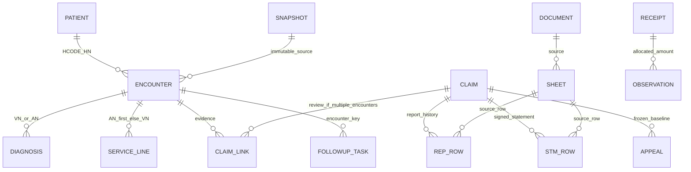

# Data Dictionary — HIS → REP → STM

โรงพยาบาล 10929 · รุ่น 0.1.0 · จัดทำ 1 ตุลาคม 2569 (FY2570)

## ขอบเขตและหลักฐาน

- metadata HOSxP: JSON ที่ผู้ใช้ให้มา 6,109 ตาราง ไม่มี foreign key ที่ยืนยันใน metadata
- Dictionary ต้นทางครอบคลุมเฉพาะ 24 datasets ที่ query registry อ่านในรุ่นแรก ไม่เปิดอ่านตาราง staff, รหัสผ่าน หรือ payload ส่งเบิกทั้งหมด
- schema REP–STM, HIS และ follow-up ตรวจจาก `information_schema` ของฐาน PostgreSQL จริง
- source PK ยืนยันตาม metadata; uniqueness, cardinality, ค่า cost, codebook และเหตุการณ์ส่งจริงใน HIS ยังรอ Session และการตรวจข้อมูลจริงภายในโรงพยาบาล
- หน้าสาธิตใช้ IDs ขึ้นต้น DEMO และไม่เชื่อมฐานข้อมูลจริง

## หน่วยวิเคราะห์และคีย์

| ระดับ | ตัวตั้ง / business key | กติกา |
|---|---|---|
| คนในทะเบียน | patient.hos_guid (PK), HCODE + HN (business key) | เก็บ registry count แยกจากผู้มารับบริการ ตรวจ HN ซ้ำ |
| คนที่มาบริการในช่วง | DISTINCT HN จาก encounter | ไม่ใช้จำนวนทะเบียนทั้งฐานแทนผู้มารับบริการ |
| OPD | ovst.hos_guid; HCODE + VN | VN ว่าง/ซ้ำพักตรวจ; visit ที่เชื่อม AN แสดงแยก |
| IPD | ipt.an; HCODE + AN | ผู้ป่วยยังนอนอยู่มี service_date NULL และแสดงแยกจากจำหน่าย |
| โรค | ovstdiag VN / iptdiag AN | หลายแถวต่อ encounter ไม่ใช้เป็นตัวตั้ง visit/admission |
| บุคคลประกอบ identity | person.person_id; patient_hn + cid | ไม่รวมบุคคลจาก CID อย่างเดียวเมื่อข้อมูลขัดกัน |
| รายการรักษา | opitemrece.hos_guid | มี AN ให้เชื่อม IPD ก่อน; ไม่มี AN ใช้ VN; ไม่มีคู่เก็บเป็น issue |
| เคลม | HCODE + IP/OP + payer_family + TRAN_ID | หนึ่ง encounter มีหลายองค์ประกอบเคลมได้ |
| ฉบับเอกสาร | logical_key + content fingerprint | ประวัติทั้งหมดอยู่; ฉบับล่าสุดที่ไม่ขัดแย้งใช้ในรายงาน |
| รายการ REP/STM | sheet_id + source_row | ลำดับชีต 0-based; Excel row 1-based; unique ป้องกันส่งซ้ำ |

## ความสัมพันธ์: metadata, proposed, verified

PK จาก JSON คือ metadata evidence เท่านั้น ทุก join ด้าน HIS เป็น **ความสัมพันธ์ที่เสนอจาก schema/reference SQL** และต้องตรวจด้วย profile ก่อนรับรอง KPI. FK ที่ระบุในตาราง PostgreSQL เป็นข้อบังคับจริงของระบบปลายทาง และไม่ได้รับรอง FK ใน HIS.

## การแปลงและความหมายกลาง

IDs เป็น text ตั้งแต่ HIS SELECT และ parser; JSON numeric identity ที่เสี่ยงทำศูนย์หายเป็น issue. Money ใช้ Decimal → numeric → API decimal string; UI ปัดสองทศนิยมเฉพาะแสดงผล. ไม่กำหนดยอดเป็นบวก: adjustment ติดลบต้องรวมตามเครื่องหมาย. NULL คือไม่มี/ไม่ทราบ, ศูนย์คือทราบว่าเป็นศูนย์; ตัวหารศูนย์หรือ unknown ให้ `—`.

HIS วันบริการเป็น date ค.ศ.; เวลาที่ไม่มี zone ใช้ Asia/Bangkok ก่อนเก็บ timestamptz. Excel วันที่ พ.ศ./ค.ศ. และ serial แปลงตาม cell type ด้วย parser เดิม. OPD ปีงบประมาณจากวันบริการ IPD จากวันจำหน่าย; ยังนอนหรือวันที่ขาดแสดง “ยังจัดปีไม่ได้”. วัน capture/report ไม่แทนเวลาส่งจริง.

`opitemrece.income` เป็น **รหัสหมวด char(2)**; `an_stat.income`/`vn_stat.income` เป็นยอดสรุป. `cost` ไม่คูณ qty จนกว่าจะมี `ITEM_COST_SEMANTICS=unit|line` พร้อมหลักฐาน review. unitcost ปัจจุบัน × qty เป็น estimated เท่านั้น. paid_money/uc_money/remain_money ไม่ใช่เงินโอน สปสช. โดยอัตโนมัติ.

## การเงินที่ต้องแยก

| ฟิลด์ | ที่มา / สูตร | ข้อจำกัด |
|---|---|---|
| his_charge_amount | SUM lines เมื่อ dataset ครบและยอดแต่ละรายการไม่ขาด; มิฉะนั้นใช้สรุป HIS ที่ระบุ basis | ไม่ใช่ต้นทุน |
| submitted_amount | หลักฐาน reviewed ของรอบล่าสุดต่อ component_key | รอหลักฐานส่งจริง; timestamp เท่ากันหลายรอบเป็น unknown |
| rule_expected_amount | กฎ applicability_verified + source/ฉบับ/ช่วงใช้/ผู้ตรวจ | ยังไม่ติดตั้งอัตราปัจจุบันโดยเดา |
| rep_expected_amount | REP ล่าสุดที่ไม่ tie และยอมรับ | ฐานต้องตรง mapping |
| rep_nhso_amount | ส่วน สปสช. | เทียบ STM บนส่วนผู้จ่ายเดียวกัน |
| stm_net_amount | SUM signed current STM ต่อเคลมก่อนรวม encounter | มี ambiguity ให้ NULL ไม่เอาคู่ที่เดาเข้ายอด |
| cash_received_amount | reviewed CASH_RECEIPT จัดสรรไม่เกิน total receipt | ไม่ใช้ STM เป็นหลักฐานโอน |
| observed_item_cost | raw cost หรือ raw cost×qty ตามนิยามที่ตรวจ | รายงานพร้อม count และ coverage |
| estimated_item_cost | current master unitcost×qty | ไม่ถือเป็น actual ย้อนหลัง |
| cost_coverage_rate | COUNT observed cost / COUNT lines | อัตราตามจำนวนรายการ ไม่ใช่ coverage มูลค่าต้นทุน |
| appeal_incremental_amount | DELTA หรือ REPLACEMENT−frozen baseline | แถวผลต้องใหม่/claim เดียว/ไม่เคยจัดสรรผลซ้ำ |

## เจ้าของนิยามและการตรวจรับ

ทีม HIS/เวชระเบียนรับผิดชอบ identity, encounter, diagnosis, procedures และ codebook; ทีมเรียกเก็บรับผิดชอบสิทธิ กฎ วันส่งและผลอุทธรณ์; ทีมการเงินรับผิดชอบ receipt และ allocation; ผู้ดูแลข้อมูลรับผิดชอบ manifest, mapping, coverage และ backup. เป็นบทบาทที่เสนอ ยังไม่อ้างว่ามีผู้รับผิดชอบรายบุคคลได้รับรองแล้ว. ทุกฟิลด์มี owner-role, privacy, transformation, acceptance และช่วงเวลาใน machine dictionary.

ข้อมูลชื่อ HN AN VN CID การรักษา หมายเหตุและ source payload เป็นข้อมูลภายในที่เชื่อมผู้ป่วยได้ ใช้ session 10929 ตามกติกาที่ตกลง; ห้ามส่ง clinical rows ไป GitHub. ตัวอย่างในคู่มือเป็นข้อมูลจำลองเท่านั้น.
