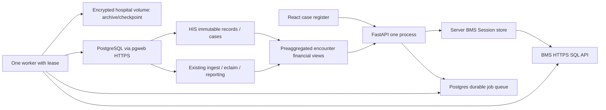

# สถาปัตยกรรม การติดตั้ง และแผนตรวจรับ

## สิ่งที่พัฒนาในรุ่น 0.1.0

| ส่วน | Implementation | สถานะ |
|---|---|---|
| Dictionary | Markdown + JSON จาก source metadata / information_schema | สร้างแล้ว พร้อมหน้า search |
| React/TypeScript | Dashboard, cases/file drawer, sources, peers, task/appeal forms, upload/jobs, HIS, quality, dictionary, scenario | build และทดสอบด้วยข้อมูลจำลอง |
| Session | Backend PasteJSON validation + target allowlist + TTL + PostgreSQL probe; HttpOnly cookie/CSRF | mock tests; รอ active Session จริง |
| HIS ingestion | 24 finite datasets, typed params, keyset pages 1,000, bounded batches, durable pending SQLite, profiles before/after | synthetic tests; รอ HIS จริง |
| SQL | his/followup/analytics extension migration; atomic replay, immutable snapshots, patient checking, line attribution, evidence/appeal guards | ติดตั้งจริงและ synthetic rollback integration |
| REP–STM importer | vendored parser/approved 33 layout registry, Decimal, archive, SHA/content dedup, batches ≤500 / ≤256KiB | ใช้ตัวนำเข้าเดิม; STM ผ่านตรวจเดิม, REP เต็มชุดกำลังนำเข้า |
| Follow-up | team, due date, notes, task history, audit hashed Session | ใช้งาน API/UI ได้ |
| Cost | unverified/unit/line + review reference, estimated master-price cost | observed ยัง NULL จนยืนยันนิยามต้นทุน |
| Instruments | 123 literal items จาก reference SQL ปี 2566, compare actual/REP current quantity | observed catalogue; rate/eligibility ไม่อนุมัติอัตโนมัติ |
| Receipt/appeal | evidence ledger, allocation cap, frozen baseline, signed delta/result attribution | synthetic SQL ตรวจผ่าน; รอ source proof จริง |
| Scenario | deterministic assumption calculation | ใช้งานได้ |
| Forecast | rolling-origin baseline/backtest engine | API gated เพราะยังไม่มี certified monthly series |
| Staff | ไม่อ่าน user/opduser | พักตามแผน |

“พัฒนาแล้ว” ไม่เท่ากับ “รับรองความครบถ้วนทางการเงินแล้ว”. การรับรองต้องตรวจ live HIS, current policy และเงินรับจริงร่วมกับโรงพยาบาล.

## โครงสร้างระบบ



Frontend กับ API ใช้ same origin. Browser ส่ง Session code ไป server แล้วทิ้ง ไม่เก็บ token ใน localStorage/log/export. BMS bearer อยู่ในหน่วยความจำ server; restart ต้องเชื่อม Session ใหม่. รุ่นนี้ใช้ **หนึ่ง API process** เพื่อแชร์ Session กับ worker; ไม่เปิด multi-process uvicorn จนเปลี่ยน Session store ที่เหมาะสม.

Worker มี global transaction advisory lock, owner UUID และ lease 180 วินาที ต่ออายุทุก 30 วินาที. งานเดียวกันไม่เริ่มซ้ำ; crash ทำให้ lease หมดแล้วรับงานต่อ. การนำเข้า REP/STM ที่รับคิวแล้วไม่ต้องมี BMS bearer. HIS หมด Session เป็น waiting_session; เชื่อม Session ใหม่และ resume ผูก actor ใหม่.

งาน HIS ใหม่ตรึง query registry version/fingerprint ใน payload; coverage ของแต่ละ dataset เก็บ query SHA-256 และเวลาเริ่ม/จบอ่าน ใช้ collation `C` ทั้ง keyset และ checkpoint เพื่อให้ลำดับ source key สอดคล้องกัน หาก registry เปลี่ยนระหว่าง resume ต้องสร้างงาน/snapshot ใหม่ ไม่ผสม query ต่างรุ่นใน snapshot เดิม

## ติดตั้งภายในโรงพยาบาลบน Windows

ต้องมี Python 3.11+ และ Node 22.12+ (ใช้ build frontend เท่านั้น) พร้อมช่องทาง HTTPS ไป BMS และ pgweb. ตัวอย่าง port local ใช้ 18729 live / 18730 demo เพื่อเลี่ยงช่วง port ที่เครื่องนี้สงวน.

```powershell
Set-Location C:\Users\KTLho\Documents\STMREP-Dashboard-Financial-Followup-NHSO
python -m venv .venv
.\.venv\Scripts\python.exe -m pip install -e '.[test]'
npm --prefix frontend ci
npm --prefix frontend run build
Copy-Item .env.example .env
# แก้ .env ภายในเครื่อง: PGWEB_URL, BMS_ALLOWED_HOSTS, APP_ORIGINS, DATA_DIR
.\.venv\Scripts\python.exe -m scripts.migrate
.\.venv\Scripts\python.exe -m uvicorn financial.main:app --host 127.0.0.1 --port 18729 --no-access-log
```

ใช้ reverse proxy HTTPS ภายในโรงพยาบาลชี้ localhost:18729, ตั้ง `COOKIE_SECURE=true`, APP_ORIGINS เป็น origin HTTPS จริง และจำกัด payload ไฟล์รวม 300 MiB (proxy 301 MiB เผื่อ multipart overhead). ตัวแอปจำกัด streaming body ด้วยแม้ไม่มี Content-Length และตรวจสิทธิก่อน multipart parsing. `.env.example` ไม่มี credential. ใส่ host BMS ที่ backend คืนจริงแบบ exact ใน BMS_ALLOWED_HOSTS; ไม่ปิด allowlist เพื่อแก้ปัญหา. API ไม่มี SQL endpoint จาก browser.

Database นี้มี REP–STM schema เดิมแล้ว: รัน `scripts.migrate` เฉพาะ extension. ถ้าเป็นฐานใหม่ ให้ติดตั้ง `repstm.cli migrate` **ก่อน** extension; อย่ารัน legacy schema reset/drop-view หลัง extension ที่อ้าง view เดิม. SQL อ่านได้ใน `financial/schema.sql`, `finalize.sql`, `followup.sql`; migration ครอบในหนึ่ง atomic DO transaction.

โหมดสาธิตแยกจาก live:

```powershell
$env:APP_MODE='demo'
$env:COOKIE_SECURE='false'
$env:WORKER_ENABLED='false'
$env:APP_ORIGINS='http://127.0.0.1:18730'
python -m uvicorn financial.main:app --host 127.0.0.1 --port 18730 --no-access-log
```

Demo ไม่ต่อ PostgreSQL/BMS และไม่รับ XLS ผู้ป่วย. รันจริงในอีก shell โดยใช้ `.env` live; ไม่ใช้ demo แทน source validation.

## งานนำเข้า: manifest → inspect → import → verify

### หน้าอัปโหลด

1. รับ 1–20 ไฟล์ ชื่อ STM_10929_ / eclaim_10929_, BIFF OLE magic, นามสกุล xls, ขนาดต่อไฟล์ 100 MiB / รวม 300 MiB
2. สร้าง UUID งานและ SHA manifest; request ID เดิมแต่ชุดไฟล์ต่างปฏิเสธ
3. Worker inspect parser เดิม, ตรวจ approved layout, row counts, financial conversions; files error เป็น blocked
4. งาน awaiting_import; ปุ่ม start นำเฉพาะไฟล์ inspected เข้าระบบ เก็บ unknown mapping ใน quality
5. archive content-addressed SHA, checkpoint durable SQLite, server ledger ingest.batches
6. ขอ timeout หลัง commit ส่ง UUID/payload เดิมซ้ำ ผล replay ไม่เพิ่มรายละเอียด
7. complete_document ตรวจ expected counts/status แล้วฉบับที่ ready/current จึงเข้ารายงาน; refresh claim/month ที่ dirty; verify job files

### นำเข้า corpus จาก CLI

ตัวนำเข้าใน repo ใหม่ตั้ง default incoming dirs กลาง ไม่มี user path ตายตัว. ระบุ directory จริงชัดเจนและอย่าใช้ checkpoint ใหม่เมื่อต้อง resume งานเดิม.

```powershell
python -m repstm.cli inspect --source stm --stm-dir 'C:\Users\KTLho\Downloads\STM' --report reports\stm-inspection.json
python -m repstm.cli import --source stm --stm-dir 'C:\Users\KTLho\Downloads\STM' --dry-run
python -m repstm.cli import --source rep --rep-dir 'C:\Users\KTLho\Downloads\REP Loader\downloads' --no-refresh
python -m repstm.cli resume --source rep --rep-dir 'C:\Users\KTLho\Downloads\REP Loader\downloads' --no-refresh
python -m repstm.cli verify --refresh --report reports\verification.json
```

การนำเข้าเต็มชุดที่เริ่มไว้เดิมใช้ checkpoint/archive ใน `REPSTMDatabaseWebapp`. `scripts.continue_corpus --project <original project>` ทำ retry เฉพาะ gateway unavailable โดยอ่าน UUID เดิมและ verify/refresh เมื่อจบ. Runner เป็น process ของงานนี้ ไม่ใช่ automation scheduler. สร้างไฟล์ `reports/stop_corpus` ใน project เดิมเพื่อให้หยุดก่อน attempt ถัดไป; Ctrl+C ใช้หยุด process ทันทีแล้ว resume ภายหลัง. อย่ารัน bulk runner และ worker import corpus เดียวกันพร้อมกัน.

## API รุ่นแรก

| Method / route | งาน |
|---|---|
| POST/GET/DELETE /api/session | เชื่อม ตรวจสถานะ ออกจาก Session |
| GET /api/snapshots; POST /api/his/sync | ดู coverage และเริ่มอ่าน HIS |
| POST /api/imports/uploads | multipart xls + Idempotency-Key UUID |
| GET /api/jobs[/UUID] | สถานะ manifest/profile/progress |
| POST /api/jobs/UUID/start,pause,resume | นำเข้าที่ผ่านตรวจ / พัก / ทำต่อ |
| GET /api/overview | aggregates, contributors, scope, stale cache |
| GET /api/cases | server pagination 50, max100; care/status/search |
| GET /api/cases/ID; /ID/lines | แฟ้ม หลักฐาน cohort และรายการ page 50 |
| GET /api/orphans | REP/STM ที่ไม่เชื่อม selected HIS |
| GET /api/quality,/rules,/dictionary,/readiness | ปัญหา นิยาม และ gates |
| POST /api/tasks,/observations,/appeals | ติดตาม หลักฐาน อุทธรณ์ |
| POST /api/appeals/UUID/result | ตรวจแถวผลใหม่ claim เดียว/ไม่จัดสรรซ้ำ |
| POST /api/planning/scenario | สมมติฐานและผลแบบ Decimal |
| GET /api/planning/forecast | readiness gate ยังไม่เปิด prediction |

Mutations ต้อง cookie ที่ตรวจ hospital + X-CSRF-Token. Identifiers text, money strings. ปัญหา operational ใช้ code ที่ไม่ส่ง SQL/token/cell payload. รายการ diagnoses/procedures/statements มี bounds และ truncation flag; lines มี next_cursor. งานคุณภาพ/อุทธรณ์ capped ตามหน้า รุ่นถัดไปเพิ่ม paging ประวัติเต็มเมื่อปริมาณถึงเกณฑ์.

## Backup, restore และการทำต่อ

- สำรอง PostgreSQL ทั้ง ingest/eclaim/reporting/his/followup/analytics และ volume DATA_DIR พร้อม archive/checkpoints ของตัวนำเข้าเดิม
- บันทึก parser/mapping version กับ manifest ของทุก job; ทดสอบ restore บนสำเนาฐานก่อนใช้งานจริง
- หลังย้ายเครื่อง ตำแหน่ง archive ใน DB ยังอ้างเดิม ต้องกำหนด mount/path ที่อ่านได้หรือย้ายโดยมี manifest ตรวจ SHA ไม่แอบเปลี่ยน source evidence
- อย่าลบ pending SQLite หลัง timeout; server ledger กัน replay ส่วน client pending รู้ชุด payload ที่ต้องส่งใหม่
- เมื่อ BMS unavailable อย่าสร้าง empty snapshot แทน complete; ตรวจ statuses/unavailable และเริ่มช่วงที่ทำได้
- Secret/cell data ไม่เข้า application access log; service ใช้ no-access-log, reverse proxy หลีกเลี่ยง URL/query/body logging

## ประสิทธิภาพและการวัด

เริ่ม tables ปกติ ไม่ partition ก่อนมีหลักฐาน. Source keys, snapshots/date/care, AN/VN/HN, foreign key ของ items, task statuses และ source-record lookup มี indexes. หน้าภาพรวมอ่าน aggregate; cases ไม่โหลดรายการจนเปิดแฟ้ม; maximum page100. ราคาค่าใช้จ่ายต่างจากต้นทุน ไม่ใช้ float.

`scripts.benchmark` เก็บ EXPLAIN(ANALYZE,BUFFERS) สรุป timing/buffers ของ claim lookup และ query กลุ่ม พร้อม counts ที่ไม่เปิดเผยผู้ป่วย. ต้องวัด HIS 100k+ encounters จริงหลัง sync; synthetic integration ไม่รับรอง latency production. Pgweb request มี latency และ gateway 503 เป็นข้อจำกัดจริง; transport แยกจาก parser เพื่อรองรับ COPY FROM STDIN เมื่อช่องทาง DB พร้อม ตาม [PostgreSQL COPY](https://www.postgresql.org/docs/17/sql-copy.html) และ [แนวทาง multicolumn indexes](https://www.postgresql.org/docs/17/indexes-multicolumn.html).

## เกณฑ์ตรวจรับและสิ่งที่ต้องทำกับโรงพยาบาล

1. HN/VN/AN duplicates/NULL, person CID conflicts, line AN-first ownership, diagnosesไม่เปลี่ยน denominator
2. Profile before/after/actual counts ตรง; session expiry/resume ไม่อ่านข้าม pending; bound UUID/body500/256KiB
3. Cost unit/line/blank/zero และ historical estimate ให้ทีมการเงินยืนยัน; paid/uc/remain codebook แยก
4. REP/STM alllayouts + append sheets, aliases/revisions/ties, signed adjustments; source Summary differences เปิดรายการตรวจ
5. Full corpus verification: STM178 files/649497 physical/645083 canonical/4414 duplicate aliases; REP13936ครบจริงก่อนรับรอง
6. Live HIS–REP sampling OP bridge/IP AN patient verification, ambiguous quarantined, unallocated multi-encounter money ไม่เข้ายอด
7. Capture actual submission/appeal/receipt sources และ current applicability rule อย่างมีหลักฐาน จึงเปิด completeness KPI
8. ทดสอบ visual desktop/mobile, keyboard dialog, state/error/empty, task update/history, simulated timeout
9. ทดสอบ backup/restore, hospital TLS/origins/hostallowlist; ไม่เผยแพร่ credential/patient/archive/checkpoint
10. Forecast ต้อง history/definition certified, backtest/time holdout/error before expose prediction

## GitHub

เตรียม private repository ชื่อ STMREP-Dashboard-Financial-Followup-NHSO. Git เก็บ source, migrations, mapping, docs และ synthetic tests เท่านั้น. `.gitignore` กัน .env/data/archive/state/reports/xls/csv/logs. ตรวจ secret scanner ของ tracked files และทบทวน dictionary ว่าเป็น metadata ก่อน push. การเปิด production และการรับรอง financial KPI ต้องผ่าน live acceptance ข้างต้น; ยังไม่ถือว่าพร้อมเผยแพร่ใช้งานทางการเพียงเพราะ demo build ผ่าน.
